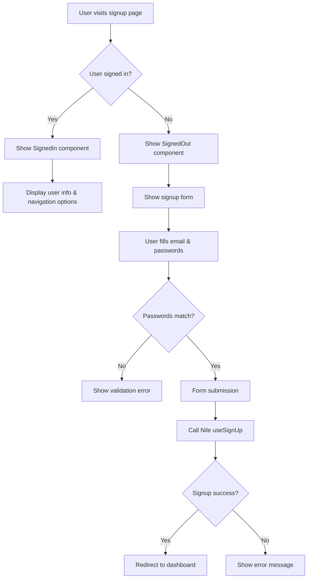

# Design Document

## Overview

The signup page refactoring will transform the current complex signup form into a clean, secure user registration experience. The design focuses on simplicity with only email and password fields, password confirmation, strength validation, and visibility toggles. It follows the same SignedIn/SignedOut pattern as the login page for consistency.

## Architecture

### Component Structure
```
SignUpPage (Main Container)
├── LandingLayout (Wrapper)
└── Card (UI Container)
    ├── SignedIn (Conditional Render)
    │   ├── User Info Display
    │   ├── Sign Out Button
    │   └── Go to Dashboard Button
    └── SignedOut (Conditional Render)
        └── SignUpForm (Core Form Component)
            ├── Email Field
            ├── Password Field (with strength meter & visibility toggle)
            ├── Confirm Password Field (with visibility toggle)
            └── Submit Button
```

### State Management
- **Form State**: Managed by react-hook-form with email, password, confirmPassword
- **Password Visibility**: Local state for password and confirm password fields
- **Password Strength**: Calculated and displayed in real-time
- **Loading/Error States**: Managed by Nile's useSignUp hook

### Authentication Flow


## Components and Interfaces

### Main Component Interfaces
```typescript
interface FormData {
  email: string;
  password: string;
  confirmPassword: string;
}

interface PasswordInputProps {
  label: string;
  name: string;
  value: string;
  onChange: (value: string) => void;
  placeholder?: string;
  required?: boolean;
  showStrengthMeter?: boolean;
  error?: string;
}

interface PasswordStrength {
  score: number; // 0-4
  feedback: string[];
  requirements: {
    length: boolean;
    uppercase: boolean;
    lowercase: boolean;
    number: boolean;
    special: boolean;
  };
}
```

### Password Input Component Design
```typescript
const PasswordInput: React.FC<PasswordInputProps> = ({
  label,
  name,
  value,
  onChange,
  showStrengthMeter = false,
  error,
  ...props
}) => {
  const [showPassword, setShowPassword] = useState(false);
  const [passwordStrength, setPasswordStrength] = useState<PasswordStrength | null>(null);
  
  // Real-time strength calculation with debouncing
  // Visibility toggle functionality
  // Error display
  // Strength meter display (conditional)
};
```

### Nile Integration
```typescript
const signUp = useSignUp({
  onSuccess: (data) => {
    if (data?.ok) {
      router.push("/dashboard");
    } else {
      setError(data?.error?.message || "Signup failed");
    }
  },
  onError: (err) => {
    console.error("Sign-up failed:", err);
    setError(err.message || "Signup failed. Please try again.");
  },
  callbackUrl: "/dashboard",
});
```

## Data Models

### Form Validation Schema
```typescript
const validationRules = {
  email: {
    required: "Email is required",
    pattern: {
      value: /^[^\s@]+@[^\s@]+\.[^\s@]+$/,
      message: "Please enter a valid email address"
    }
  },
  password: {
    required: "Password is required",
    minLength: {
      value: 8,
      message: "Password must be at least 8 characters"
    },
    validate: {
      strength: (value: string) => {
        const strength = calculatePasswordStrength(value);
        return strength.score >= 2 || "Password is too weak";
      }
    }
  },
  confirmPassword: {
    required: "Please confirm your password",
    validate: {
      match: (value: string, { password }: FormData) =>
        value === password || "Passwords do not match"
    }
  }
};
```

### Password Strength Calculation
```typescript
const calculatePasswordStrength = (password: string): PasswordStrength => {
  const requirements = {
    length: password.length >= 8,
    uppercase: /[A-Z]/.test(password),
    lowercase: /[a-z]/.test(password),
    number: /\d/.test(password),
    special: /[!@#$%^&*(),.?":{}|<>]/.test(password)
  };
  
  const score = Object.values(requirements).filter(Boolean).length;
  
  return {
    score,
    requirements,
    feedback: generateFeedback(requirements)
  };
};
```

## Error Handling

### Validation Errors
- **Email Format**: Invalid email pattern validation
- **Password Strength**: Minimum strength requirements not met
- **Password Confirmation**: Passwords don't match
- **Required Fields**: Empty required field validation

### Nile Authentication Errors
- **Network Errors**: Connection issues during signup
- **Duplicate Account**: Email already exists
- **Server Validation**: Server-side validation failures
- **Rate Limiting**: Too many signup attempts

### Error Display Strategy
- **Form Validation**: Inline field-level errors with red text
- **Password Strength**: Visual strength meter with color coding
- **Nile Errors**: Alert component with user-friendly messages
- **Real-time Feedback**: Immediate validation feedback as user types

## Testing Strategy

### Unit Tests
1. **Password Strength Calculation**: Test strength algorithm with various inputs
2. **Form Validation**: Test react-hook-form validation rules
3. **Password Confirmation**: Test matching validation logic
4. **Visibility Toggle**: Test password show/hide functionality

### Integration Tests
1. **Nile Integration**: Test useSignUp hook with success/error scenarios
2. **Form Submission**: Test complete signup flow
3. **SignedIn/SignedOut**: Test conditional rendering based on auth state
4. **Error Handling**: Test various error conditions and recovery

### User Acceptance Tests
1. **New User Signup**: Complete registration flow
2. **Password Requirements**: Ensure strong password creation
3. **Already Signed In**: Test experience for authenticated users
4. **Error Recovery**: User experience during error conditions

## Implementation Notes

### Removed Complexity
- All business/company logic and fields
- Plan selection components
- Multiple signup types (radio buttons)
- URL parameter handling for company codes
- Complex state management for business flows

### New Features Added
- Password confirmation with validation
- Real-time password strength meter
- Password visibility toggles for both fields
- SignedIn/SignedOut conditional rendering
- Consistent UI patterns with login page

### Security Considerations
- Password strength enforcement
- Confirmation validation prevents typos
- Visibility toggles help users verify correct input
- No sensitive data stored in local state
- Proper error handling without exposing system details

### Performance Considerations
- Debounced password strength calculation (300ms)
- Minimal re-renders with proper state management
- Efficient validation with react-hook-form
- Lazy loading of strength calculation only when needed
