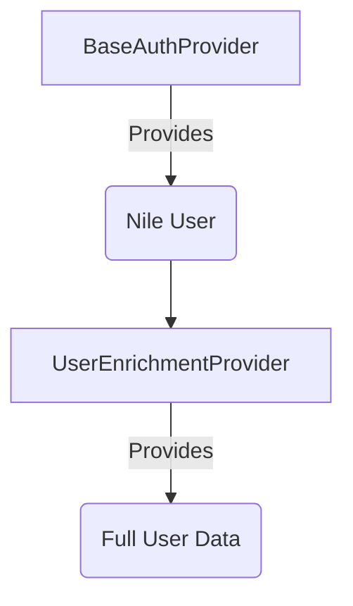
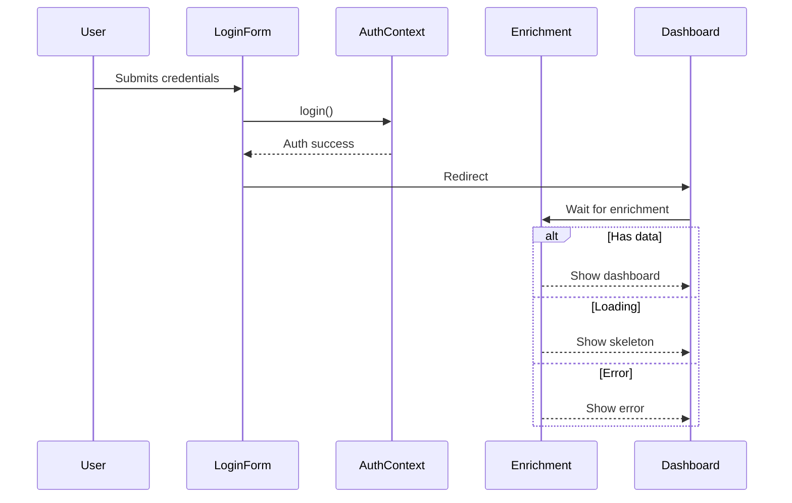

# Auth Context Separation Proposal

## Current Problem
1. Tight coupling between NileDB auth and business logic enrichment
2. Single error state handles both auth and enrichment failures
3. UI components get incomplete user data during loading
4. Error flash during login redirect sequence

## Proposed Solution

## Benefits
- Clear separation of concerns
- Independent error handling
- Parallel loading of core auth + enrichment
- Better TypeScript typing for partial/full user objects

## Challenges
- Context synchronization
- Double provider nesting
- Migration effort for existing components

## Implementation Plan
1. Create `BaseAuthProvider` with NileDB hooks
2. Create `UserEnrichmentProvider` that depends on BaseAuth
3. Update `AUTH_FLOW.md` to reflect new sequence
4. Add loading states per context layer
5. Implement skeleton UI patterns

## Auth Flow Compliance
Changes will adhere to `docs/features/auth/AUTH_FLOW.md` with:
- [ ] Added loading states during enrichment
- [ ] Role-based UI rendering
- [ ] Email verification checks
- [ ] Payment status handling

## Error Handling Improvements
- Add retry logic for session checks
- Implement error boundary for enrichment
- Add transitional loading states

## UI Requirements

## Next Steps
1. Review proposal
2. Approve architecture
3. Implement phase 1: Context separation
4. Implement phase 2: UI loading states