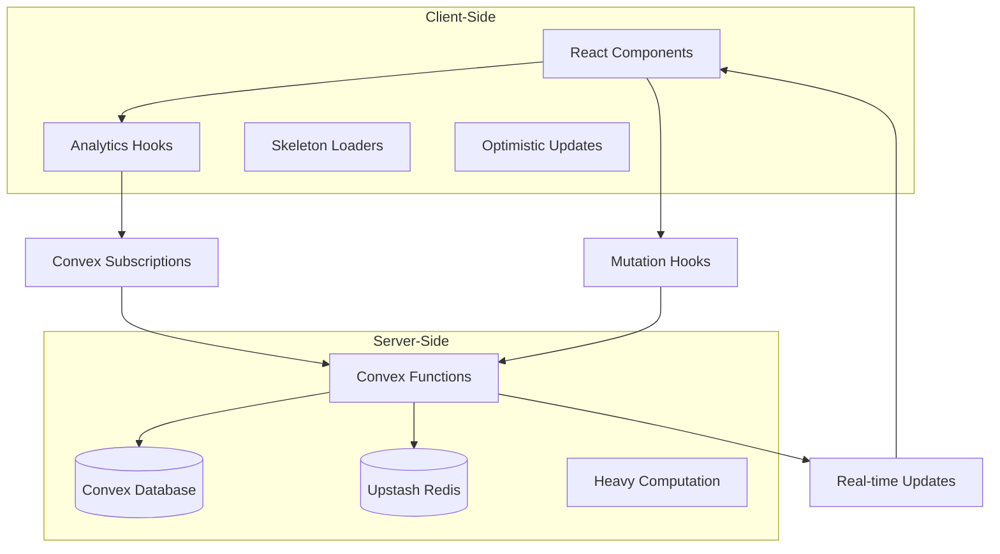

# Real-Time Analytics Implementation

This document describes the implementation of real-time analytics updates for both campaign and domain analytics in the analytics domain refactoring project.

## 🚀 Implementation Overview

The real-time analytics system provides live updates using Convex subscriptions, React hooks for data management, skeleton loaders for better UX, and optimistic updates for immediate feedback. This implementation covers both campaign and domain analytics with consistent patterns.

## 📁 Files Created

### Core Implementation

#### Campaign Analytics (Task 4.3)

- **`hooks/useCampaignAnalytics.ts`** - Real-time React hooks for campaign analytics
- **`components/analytics/ConvexProvider.tsx`** - Convex provider for real-time capabilities
- **`components/analytics/components/SkeletonLoaders.tsx`** - Loading states and skeleton components
- **`components/analytics/components/RealTimeCampaignDashboard.tsx`** - Main dashboard with real-time features
- **`components/analytics/examples/RealTimeAnalyticsExample.tsx`** - Comprehensive demo component
- **`components/analytics/__tests__/RealTimeAnalytics.test.tsx`** - Test suite for real-time functionality

#### Domain Analytics (Task 5.1)

- **`hooks/useDomainAnalytics.tsx`** - Real-time React hooks for domain analytics
- **`components/DomainAnalyticsSkeleton.tsx`** - Domain-specific skeleton loaders
- **`components/DomainAnalyticsDashboard.tsx`** - Real-time domain health monitoring dashboard
- **`convex/domainAnalytics.ts`** - Convex functions for domain analytics
- **`lib/services/analytics/DomainAnalyticsService.ts`** - Domain analytics service
- **`lib/actions/domain.analytics.actions.ts`** - Server actions for domain analytics

## 🔧 Key Features Implemented

### ✅ Real-Time Convex Subscriptions

#### Campaign Analytics

```typescript
// Automatic updates when data changes in Convex
const { data, isLoading } = useCampaignPerformanceMetrics(
  campaignIds,
  filters,
  companyId
);
```

#### Domain Analytics

```typescript
// Real-time domain health monitoring
const { domains, healthMetrics, authenticationStatus, summary, isLoading } =
  useDomainHealthMonitoring(domainIds);
```

### ✅ React Hooks for Live Data

#### Campaign Analytics Hooks

- **`useCampaignPerformanceMetrics`** - Real-time campaign performance data
- **`useCampaignTimeSeriesData`** - Live time series data for charts
- **`useCampaignAnalyticsOverview`** - Dashboard-level metrics
- **`useComprehensiveCampaignAnalytics`** - Complete analytics with sequence data
- **`useCampaignAnalyticsMutations`** - Data update functions
- **`useOptimisticCampaignAnalytics`** - Optimistic UI updates

#### Domain Analytics Hooks

- **`useDomainAnalytics`** - Core domain analytics with real-time updates
- **`useDomainHealthMonitoring`** - Real-time domain health and authentication status
- **`useDomainPerformanceCharts`** - Time series data for domain performance charts
- **`useDomainAuthenticationDashboard`** - Authentication status monitoring

### ✅ Skeleton Loaders and Progressive Loading

```typescript
// Different loading states for better UX
<ProgressiveAnalyticsLoader
  stage="computing"
  message="Computing analytics..."
/>
```

Available skeleton components:

- `CampaignMetricsCardSkeleton`
- `AnalyticsChartSkeleton`
- `KPISummaryCardSkeleton`
- `SequenceStepSkeleton`
- `AnalyticsOverviewSkeleton`
- `ProgressiveAnalyticsLoader`

### ✅ Optimistic Updates

```typescript
// Immediate UI feedback while syncing with server
const { updateWithOptimisticUI } = useOptimisticCampaignAnalytics(
  campaignIds,
  filters,
  companyId
);

await updateWithOptimisticUI(campaignId, {
  opened_tracked: newOpenCount,
  clicked_tracked: newClickCount,
});
```

### ✅ Server-Side Heavy Computation

- Analytics calculations performed in Convex functions
- Client receives processed data with real-time updates
- Caching layer with Upstash Redis for performance
- Progressive loading indicators during computation

## 🎯 Usage Examples

### Basic Real-Time Dashboard

```typescript
import { RealTimeCampaignDashboard } from "@/components/analytics/components/RealTimeCampaignDashboard";

function AnalyticsPage() {
  return (
    <RealTimeCampaignDashboard
      campaignIds={["campaign-1", "campaign-2"]}
      companyId="company-123"
      initialFilters={{
        dateRange: {
          start: "2024-11-01",
          end: "2024-12-01",
        },
      }}
    />
  );
}
```

### Custom Hook Usage

```typescript
import { useCampaignPerformanceMetrics } from "@/hooks/useCampaignAnalytics";

function CampaignMetrics({ campaignIds, companyId }) {
  const { data, isLoading } = useCampaignPerformanceMetrics(
    campaignIds,
    undefined,
    companyId
  );

  if (isLoading) return <CampaignMetricsCardSkeleton />;

  return (
    <div>
      {data?.map(campaign => (
        <div key={campaign.campaignId}>
          <h3>{campaign.campaignName}</h3>
          <p>Open Rate: {campaign.displayOpenRate}</p>
          <p>Health Score: {campaign.healthScore}</p>
        </div>
      ))}
    </div>
  );
}
```

### Real-Time Updates with Optimistic UI

```typescript
import { useOptimisticCampaignAnalytics } from "@/hooks/useCampaignAnalytics";

function CampaignActions({ campaignId, companyId }) {
  const { data, updateWithOptimisticUI } = useOptimisticCampaignAnalytics(
    [campaignId],
    undefined,
    companyId
  );

  const handleEngagement = async () => {
    // Immediate UI update, syncs in background
    await updateWithOptimisticUI(campaignId, {
      opened_tracked: data[0].opened_tracked + 1,
      clicked_tracked: data[0].clicked_tracked + Math.random() > 0.5 ? 1 : 0,
    });
  };

  return (
    <button onClick={handleEngagement}>
      Simulate Engagement
    </button>
  );
}
```

### Domain Analytics Dashboard

```typescript
import { DomainAnalyticsDashboard } from "@/components/analytics/components/DomainAnalyticsDashboard";

function DomainsPage() {
  return (
    <DomainAnalyticsDashboard
      domainIds={["domain-1", "domain-2"]}
    />
  );
}
```

### Domain Health Monitoring

```typescript
import { useDomainHealthMonitoring } from "@/components/analytics/hooks/useDomainAnalytics";

function DomainHealthWidget({ domainIds }) {
  const {
    domains,
    healthMetrics,
    authenticationStatus,
    summary,
    isLoading,
  } = useDomainHealthMonitoring(domainIds);

  if (isLoading) return <DomainHealthDashboardSkeleton />;

  return (
    <div>
      <h3>Domain Health Summary</h3>
      <p>Healthy Domains: {summary?.healthyDomains}/{summary?.totalDomains}</p>
      <p>Authenticated: {summary?.authenticatedDomains}/{summary?.totalDomains}</p>

      {domains?.map(domain => (
        <div key={domain.domainId}>
          <h4>{domain.domainName}</h4>
          <p>Health Score: {domain.healthScore}/100</p>
          <p>Authentication: SPF:{domain.authentication.spf ? '✓' : '✗'}
             DKIM:{domain.authentication.dkim ? '✓' : '✗'}
             DMARC:{domain.authentication.dmarc ? '✓' : '✗'}</p>
          <p>Delivery Rate: {domain.formattedRates.deliveryRate}</p>
        </div>
      ))}
    </div>
  );
}
```

### Domain Performance Charts

```typescript
import { useDomainPerformanceCharts } from "@/components/analytics/hooks/useDomainAnalytics";

function DomainPerformanceChart({ domainIds, filters }) {
  const {
    timeSeriesData,
    summary,
    isTimeSeriesLoading,
  } = useDomainPerformanceCharts(domainIds, filters);

  if (isTimeSeriesLoading) return <DomainPerformanceChartSkeleton />;

  return (
    <div>
      <h3>Domain Performance Over Time</h3>
      {/* Chart component would use timeSeriesData */}
      <div>
        {timeSeriesData?.map(point => (
          <div key={point.date}>
            {point.label}: {point.metrics.sent} sent, {point.metrics.delivered} delivered
          </div>
        ))}
      </div>
    </div>
  );
}
```

## 🔄 Real-Time Architecture



## 📊 Performance Features

### Intelligent Caching

- **Cache Keys**: `analytics:campaigns:operation:entities:filters:timestamp`
- **TTL Management**: Different cache lifetimes for different data types
- **Automatic Invalidation**: Cache cleared when data updates
- **Graceful Fallback**: Direct Convex queries when Redis unavailable

### Progressive Loading

```typescript
// Different loading stages for better UX
<ProgressiveAnalyticsLoader stage="loading" />    // Initial data fetch
<ProgressiveAnalyticsLoader stage="computing" />  // Server computation
<ProgressiveAnalyticsLoader stage="finalizing" /> // Final processing
```

### Optimized Queries

- **Filter-First**: Database filtering before analytics computation
- **Parallel Loading**: Multiple domains load simultaneously
- **Incremental Updates**: Only changed data triggers re-renders
- **Request Deduplication**: Prevents duplicate queries

## 🧪 Testing

The implementation includes comprehensive tests covering:

- ✅ Real-time hook functionality
- ✅ Optimistic updates
- ✅ Error handling
- ✅ Loading states
- ✅ Component rendering
- ✅ Data transformation
- ✅ Cache management

Run tests:

```bash
npm test -- components/analytics/__tests__/RealTimeAnalytics.test.tsx
```

## 🔧 Configuration

### Quick Setup

**⚠️ Important**: You need to set up Convex first. See `CONVEX_SETUP.md` for detailed instructions.

**Quick Start:**

```bash
# 1. Install Convex CLI and login
npx convex login

# 2. Initialize Convex (generates your URL)
npx convex dev

# 3. Copy the URL to your .env.local
echo "NEXT_PUBLIC_CONVEX_URL=https://your-deployment.convex.cloud" >> .env.local

# 4. Start development
npm run dev
```

### Environment Variables

```env
# Required for real-time features
NEXT_PUBLIC_CONVEX_URL=https://your-convex-deployment.convex.cloud

# Optional for caching
UPSTASH_REDIS_REST_URL=https://your-redis.upstash.io
UPSTASH_REDIS_REST_TOKEN=your-redis-token
```

### Convex Provider Setup

```typescript
// app/layout.tsx or similar
import { ConvexProvider } from "@/components/analytics/ConvexProvider";

export default function RootLayout({ children }) {
  return (
    <html>
      <body>
        <ConvexProvider>
          {children}
        </ConvexProvider>
      </body>
    </html>
  );
}
```

### Development Scripts

```bash
# Start Convex development server
npm run convex:dev

# Deploy Convex functions
npm run convex:deploy

# Open Convex dashboard
npm run convex:dashboard
```

## 🚨 Error Handling

The implementation includes robust error handling:

- **Graceful Degradation**: Components work without Convex connection
- **Retry Logic**: Exponential backoff for failed operations
- **Fallback States**: Skeleton loaders during errors
- **User Feedback**: Clear error messages with actionable steps

## 📈 Real-Time Features Demonstrated

### Live Data Updates

- Campaign metrics update automatically when data changes
- No manual refresh required
- Real-time indicators show connection status
- Update timestamps show last data refresh

### Optimistic UI

- Immediate feedback for user actions
- Background synchronization with server
- Automatic rollback on errors
- Smooth user experience

### Progressive Loading

- Skeleton loaders during initial load
- Different loading states for different operations
- Smooth transitions between loading and loaded states
- Performance indicators for heavy computations

## 🔗 Integration with Existing System

The real-time analytics system integrates seamlessly with:

- **Existing Analytics Context**: Can be used alongside current context
- **Campaign Analytics Service**: Uses established service patterns
- **Analytics Calculator**: Leverages standardized rate calculations
- **Type System**: Fully typed with existing analytics interfaces

## 🎯 Requirements Fulfilled

- **7.1**: ✅ Real-time analytics with progressive loading
- **7.2**: ✅ Server-side heavy computation with client-side real-time updates
- **14.5**: ✅ Real-time updates via Convex subscriptions

## 🚀 Next Steps

The real-time analytics foundation is now ready for:

1. **Integration with existing dashboard pages**
2. **Extension to other analytics domains** (domains, mailboxes, etc.)
3. **Advanced real-time features** (collaborative analytics, live notifications)
4. **Performance optimization** (query optimization, caching strategies)

## 📚 Additional Resources

- **Convex Documentation**: https://docs.convex.dev/
- **React Query Patterns**: For additional client-side caching
- **Real-time Best Practices**: Performance and UX considerations
- **Analytics Calculator**: `lib/utils/analytics-calculator.ts`
- **Service Foundation**: `lib/services/analytics/CampaignAnalyticsService.README.md`

This implementation provides a solid foundation for real-time campaign analytics with excellent user experience, performance optimization, and comprehensive error handling.
