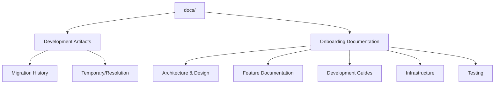

# Documentation Analysis Summary

## Overview
This document summarizes the analysis of the `docs/` folder, separating content into **Development Artifacts** (past-related information) and **Onboarding Documentation** (current situation and new dev guidance). It includes detailed checklists, recommendations, and additional places to check for documentation integration.

## Documentation Structure

## Detailed Documentation Checklist

### Development Artifacts (Archive Candidates)

#### Migration History
- [ ] `docs/fsd-migration-strategy.md` - Migration roadmap with phases (historical)
- [ ] `docs/fsd-migration-completion-guide.md` - Post-migration cleanup (completed)
- [ ] `docs/fsd-violations-resolution.md` - Violation resolution steps (historical)
- [ ] `docs/FSD_VIOLATIONS_FIX_INSTRUCTIONS.md` - Step-by-step fix instructions (historical)
- [ ] `docs/fsd-validation-test-exclusion.md` - Test exclusion guidelines (historical)
- [ ] `docs/architecture/component-migration-summary.md` - Detailed migration results (historical)
- [ ] `docs/architecture/migration-strategy-and-continuation.md` - Phase-by-phase plan (historical)
- [ ] `docs/migration/` - All migration summary reports and validation files
- [ ] `docs/guides/actions-migration-lessons.md` - Actions migration lessons (historical)
- [ ] `docs/guides/migration-patterns.md` - Migration patterns used (historical)
- [ ] `docs/guides/settings-integration-lessons.md` - Settings integration lessons (historical)
- [ ] `docs/guides/team-migration-guide.md` - Team migration guide (historical)
- [ ] `docs/features/analytics/MIGRATION.md` - Analytics feature migration (historical)

#### Temporary/Resolution Artifacts
- [ ] `docs/fsd-layer-detection-fix.md` - FSD layer detection fix (temporary issue)
- [ ] `docs/fsd-import-path-validation.md` - Import path validation (temporary issue)
- [ ] `docs/ui-primitive-detection-fix.md` - UI primitive detection fix (temporary issue)
- [ ] `docs/import-path-validation.md` - Import path validation (temporary issue)
- [ ] `docs/eslint-and-ci-optimizations.md` - ESLint and CI optimization history (historical)
- [ ] `docs/architectural-boundary-testing.md` - Architectural boundary testing (historical)
- [ ] `docs/guides/lint-cleanup.md` - Lint cleanup instructions (historical)
- [ ] `docs/guides/typescript-fixes.md` - TypeScript fix instructions (historical)
- [ ] `docs/troubleshooting/chunk-load-error-fix.md` - Chunk load error fix (temporary issue)

### Onboarding Documentation (Keep Current)

#### Architecture & Design
- [ ] `docs/architecture/README.md` - Architecture documentation index (update to focus on current state)
- [ ] `docs/architecture/fsd-migration-guide.md` - FSD implementation guide (current)
- [ ] `docs/architecture/import-path-conventions.md` - Import path patterns (current)
- [ ] `docs/architecture/build-validation-and-deployment.md` - Production build validation (current)
- [ ] `docs/architecture/semantic-tokens.md` - Design system token usage (current)
- [ ] `docs/architecture/TYPE_SYSTEM.md` - Type system documentation (current)
- [ ] `docs/database-architecture.md` - Database architecture (current)
- [ ] `docs/styling-guidelines.md` - Styling guidelines (current)
- [ ] `docs/team-guidelines.md` - Team guidelines post-migration (current)

#### Feature Documentation
- [ ] `docs/features/auth/` - Complete authentication system documentation (review for updates)
- [ ] `docs/features/analytics/` - Analytics feature documentation (excluding MIGRATION.md)
- [ ] `docs/features/billing/` - Billing feature documentation (review for updates)

#### Development Guides
- [ ] `docs/guides/development-workflow.md` - Development process and patterns (current)
- [ ] `docs/guides/actions-api.md` - Actions API reference (current)
- [ ] `docs/guides/actions-best-practices.md` - Actions best practices (current)
- [ ] `docs/guides/fsd-quick-reference.md` - FSD quick reference (current)
- [ ] `docs/guides/internationalization.md` - i18n guidelines (current)
- [ ] `docs/guides/feature-flags.md` - Feature flag usage (current)
- [ ] `docs/guides/performance-monitoring.md` - Performance monitoring (current)
- [ ] `docs/guides/domain-conflict-resolution.md` - Domain conflict resolution (current)
- [ ] `docs/guides/documentation-maintenance.md` - Documentation maintenance (current)
- [ ] `docs/guides/documentation-ownership.md` - Documentation ownership (current)
- [ ] `docs/guides/testing-general.md` - Testing strategies (current)
- [ ] `docs/guides/testing-legacy.md` - Legacy testing (current)
- [ ] `docs/guides/things-to-avoid.md` - Development anti-patterns (current)
- [ ] `docs/guides/troubleshooting.md` - Troubleshooting guide (current)
- [ ] `docs/guides/type-analysis.md` - Type analysis (current)
- [ ] `docs/guides/type-documentation.md` - Type documentation (current)

#### Infrastructure & Testing
- [ ] `docs/infrastructure/` - Infrastructure setup and configuration (review for updates)
- [ ] `docs/testing/` - Testing documentation (review for updates)
- [ ] `docs/api-routes.md` - API routes documentation (review for updates)
- [ ] `docs/feature-api-contracts.md` - Feature API contracts (review for updates)
- [ ] `docs/loop-integration.md` - Loop integration (review for updates)

## Recommendations for Each Category

### Development Artifacts
1. **Archive Location**: Create `docs/archive/migration/` and `docs/archive/temporary/` directories
2. **Process**: 
   - Move all artifacts to appropriate archive subdirectories
   - Add a README.md in each archive folder explaining the content purpose
   - Add archive notes to main architecture README
3. **Benefits**: Reduces clutter, improves discoverability of current documentation

### Onboarding Documentation
1. **Update Architecture README**: Rewrite to focus on current state, not migration history
2. **Create Getting Started Guide**: Compile key resources for new developers
3. **Review and Update**: 
   - Check for broken links
   - Verify content is still accurate
   - Remove outdated references to migration phases
4. **Co-location Check**: Ensure documentation matches current code structure

## Additional Places to Check for Documentation Integration

### Co-located Documentation

#### lib/ Directory
- `lib/SHARED_LAYER_AUDIT_REPORT.md` - Shared layer audit report
- `lib/test-utils/testing-best-practices.md` - Testing best practices
- `lib/test-utils/README-monitoring.md` - Monitoring documentation
- `lib/test-utils/final-validation-report.md` - Validation report
- `lib/mocks/README.md` - Mocks library documentation
- `lib/mocks/AUDIT_RESULTS.md` - Audit results for mocks
- `lib/services/profile/README.md` - Profile service documentation (your VSCode tab)
- `lib/services/analytics/migration-lessons.md` - Analytics service migration lessons (your VSCode tab)

#### features/ Directory
- `features/analytics/ui/components/dashboard/README.md` - Dashboard component documentation
- `features/analytics/types/README.md` - Analytics types documentation
- `features/analytics/types/USAGE_EXAMPLES.md` - Analytics types usage examples
- `features/settings/ui/components/common/README.md` - Settings common components documentation

#### types/ Directory
- `types/domains/README.md` - Domain types documentation (your VSCode tab)
- `types/DOMAINS_TYPES_DOCS.md` - Comprehensive domain types documentation

#### components/ Directory
- `components/README-system-health.md` - System health component documentation
- `components/README-health-monitor-retry.md` - Health monitor retry documentation
- `components/unified/UnifiedLoadingSpinner.md` - UnifiedLoadingSpinner component documentation
- `components/unified/UnifiedButton.md` - UnifiedButton component documentation
- `components/unified/UnifiedErrorBoundary.md` - UnifiedErrorBoundary component documentation
- `components/unified/UnifiedSkeleton.md` - UnifiedSkeleton component documentation
- `components/unified/UnifiedCard.md` - UnifiedCard component documentation
- `components/unified/UnifiedModal.md` - UnifiedModal component documentation

### Codebase Integration
- `package.json` scripts - Documentation for build/test commands
- `eslint-plugin-fsd-compliance.js` - FSD compliance rules documentation
- `eslint.fsd.config.mjs` - ESLint configuration documentation
- `.storybook/` - Storybook documentation
- `__tests__/` - Test files and examples

### External Documentation
- `.github/` - GitHub workflows and CI/CD documentation
- `app/` - Page-level documentation in comments
- `components/design-system/` - Design system documentation

## Brainstorming: Documentation Improvements

### New Documentation Needs
- **Getting Started Guide**: Step-by-step setup and onboarding for new developers
- **API Reference**: Comprehensive API documentation with examples
- **Troubleshooting Guide**: Common issues and solutions
- **Architecture Decision Records (ADRs)**: Document key architectural decisions
- **Glossary**: Common terms and definitions
- **Release Notes**: Version-specific changes and updates

### Documentation Maintenance
- **Ownership**: Assign documentation owners to each feature
- **Review Process**: Include documentation in code reviews
- **Automation**: Set up scheduled checks for broken links
- **Templates**: Create documentation templates for consistency

### Integration Opportunities
- **Storybook Integration**: Link documentation to UI components
- **API Documentation**: Generate from code comments using tools like Typedoc
- **Git Hooks**: Add documentation checks to pre-commit hooks
- **CI/CD**: Include documentation validation in build process

## Summary

The documentation contains a significant amount of historical migration information that is no longer relevant to current development. By archiving these artifacts and focusing on current documentation, we can improve the onboarding experience for new developers and make the documentation more maintainable. Regular reviews and updates will ensure the documentation remains accurate and useful.
