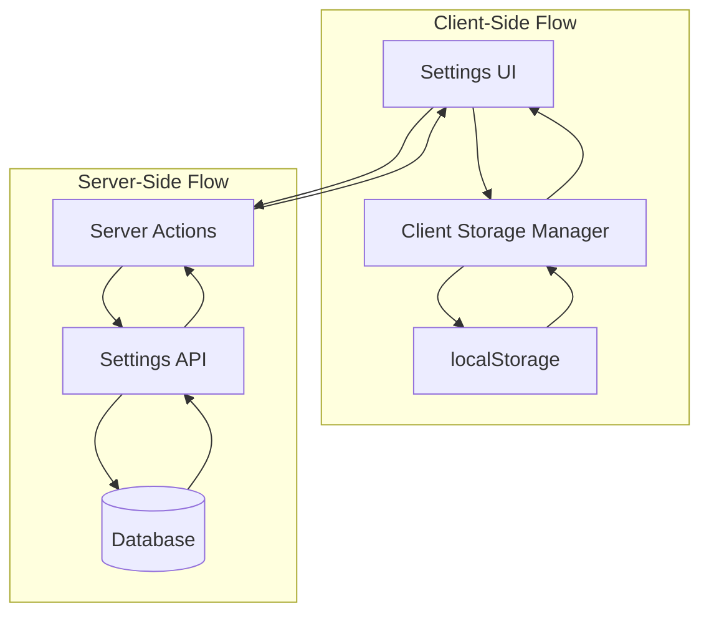

# Settings Integration Lessons Learned

## Overview

This document captures key lessons learned from centralizing settings data management, including the separation of server-side persistent data from client-side preferences, mock data organization, and user experience optimization patterns.

## Architecture Separation Lessons

### Server vs Client Data Separation

**Challenge**: Determining what data should be stored server-side vs client-side for optimal user experience.

**Solution**: Clear separation based on data persistence requirements and user expectations.

**Server-Side Data (Persistent across devices)**:

```typescript
interface ServerSettings {
  // User profile and company information
  userProfile: {
    timezone: string;
    companyInfo: CompanyInfo;
    notificationPreferences: NotificationPreferences;
  };

  // Billing and subscription data
  billing: {
    currentPlan: SubscriptionPlan;
    paymentMethod: PaymentMethod;
    usage: UsageMetrics;
  };

  // Team and collaboration settings
  team: {
    members: TeamMember[];
    permissieamPermissions;
    invitations: TeamInvitation[];
  };

  // Security and compliance settings
  security: {
    twoFactorEnabled: boolean;
    sessionTimeout: number;
    ipWhitelist: string[];
  };
}
```

**Client-Side Data (Device-specific preferences)**:

```typescript
interface ClientPreferences {
  // UI appearance preferences
  theme: "light" | "dark" | "system";
  sidebarView: "expanded" | "collapsed";

  // Localization preferences
  language: string;
  dateFormat: string;
  timeFormat: "12h" | "24h";

  // Workflow preferences
  defaultView: string;
  autoSave: boolean;
  confirmations: boolean;
}
```

**Key Decision Criteria**:

1. **Cross-device sync needed?** → Server-side
2. **Device-specific preference?** → Client-side
3. **Affects billing or security?** → Server-side
4. **UI/UX preference only?** → Client-side

### Data Flow Architecture

**Lesson**: Implement clear data flow patterns for different types of settings.



**Implementation Pattern**:

```typescript
// Unified settings hook
export function useSettings() {
  // Server-side settings
  const { data: serverSettings, mutate: updateServerSettings } = useSWR(
    "/api/settings",
    fetchServerSettings
  );

  // Client-side preferences
  const [clientPreferences, setClientPreferences] = useClientStorage();

  return {
    // Combined settings interface
    settings: {
      ...serverSettings,
      ...clientPreferences,
    },

    // Update methods
    updateServerSetting: async (key: string, value: any) => {
      await updateServerSettings({ [key]: value });
    },

    updateClientPreference: (key: string, value: any) => {
      setClientPreferences((prev) => ({ ...prev, [key]: value }));
    },
  };
}
```

## Mock Data Organization Lessons

### Centralized Mock Data Strategy

**Challenge**: Settings data was scattered across components as hardcoded values, making it difficult to maintain consistency.

**Before**: Hardcoded data in components

```typescript
// In BillingTab.tsx
const companyInfo = {
  name: "Acme Corporation",
  industry: "Technology Services",
  // ... hardcoded values
};

// In UsageTab.tsx
const usageData = {
  emailsSent: 12450,
  contactsReached: 8230,
  // ... different hardcoded values
};

// In TeamMembers.tsx
const teamMembers = [
  { name: "John Doe", role: "Admin" },
  // ... more hardcoded data
];
```

**After**: Centralized mock data structure

```typescript
// lib/data/settings.mock.ts
export const mockSettingsData = {
  userProfile: {
    timezone: "America/New_York",
    companyInfo: {
      name: "Acme Corporation",
      industry: "Technology
      size: "51-200 employees",
      address: {
        street: "123 Business Street",
        city: "San Francisco",
        state: "CA",
        zipCode: "94105",
        country: "United States",
      },
    },
  },

  billing: {
    currentPlan: {
      name: "Growth",
      price: 55,
      contacts: 10000,
      storage: 2,
    },
    usage: {
      emailsSent: 12450,
      contactsReached: 8230,
      storageUsed: 1.7,
      resetDate: "2024-02-25",
    },
  },

  team: {
    members: [
      {
        id: "member-1",
        name: "John Doe",
        email: "john@acme.com",
        role: "Admin",
        status: "active",
        lastActive: new Date("2024-01-15T10:30:00Z"),
        permissions: ["all"],
      },
      // ... more members
    ],
  },
};
```

**Benefits Realized**:

- **Consistency**: All components use the same data source
- **Maintainability**: Single location to update mock data
- **Reusability**: Mock data can be shared across components and tests
- **Type Safety**: Centralized types ensure consistency

### Mock Data Evolution Strategy

**Lesson**: Design mock data to evolve into real data seamlessly.

```typescript
// Mock data with realistic structure
export const mockBillingInfo: BillingInfo = {
  id: "billing-1", // Include IDs for future database integration
  userId: "user-1",
  currentPlan: {
    id: "plan-growth",
    name: "Growth",
    price: 55,
    currency: "USD",
    interval: "monthly",
    features: [
      "10,000 contacts",
      "2GB storage",
      "Advanced analytics",
      "Priority support",
    ],
  },
  paymentMethod: {
    id: "pm-1",
    type: "visa",
    last4: "4242",
    expiryMonth: 12,
    expiryYear: 2025,
    isDefault: true,
  },
  usage: {
    period: "2024-01",
    emailsSent: 12450,
    contactsReached: 8230,
    storageUsed: 1.7,
    resetDate: "2024-02-25",
    limits: {
      emails: 50000,
      contacts: 10000,
      storage: 2,
    },
  },
  createdAt: new Date("2024-01-01T00:00:00Z"),
  updatedAt: new Date("2024-01-15T10:30:00Z"),
};

// Server action that can switch between mock and real data
export async function getBillingInfo(
  userId: string
): Promise<ActionResult<BillingInfo>> {
  const useMockData =
    process.env.NODE_ENV === "development" ||
    (await getFeatureFlag("use-mock-billing", true));

  if (useMockData) {
    // Return mock data with realistic delay
    await new Promise((resolve) => setTimeout(resolve, 200));
    return { success: true, data: mockBillingInfo };
  } else {
    // Real API call
    return await fetchRealBillingInfo(userId);
  }
}
```

## Server Action Patterns

### Consistent Action Structure

**Lesson**: Standardize server action patterns across all settings domains.

```typescript
// Standard server action pattern for settings
export async function updateUserSettings(
  userId: string,
  updates: Partial<UserSettings>
): Promise<ActionResult<UserSettings>> {
  try {
    // 1. Authentication check
    const currentUser = await getCurrentUser();
    if (!currentUser || currentUser.id !== userId) {
      return {
        success: false,
        error: {
          type: "auth",
          message: "Unauthorized access",
          code: "UNAUTHORIZED",
        },
      };
    }

    // 2. Input validation
    const validationResult = validateSettingsUpdate(updates);
    if (!validationResult.valid) {
      return {
        success: false,
        error: {
          type: "validation",
          message: "Invalid settings data",
          code: "VALIDATION_ERROR",
          details: validationResult.errors,
        },
      };
    }

    // 3. Business logic
    const updatedSettings = await performSettingsUpdate(userId, updates);

    // 4. Success response
    return {
      success: true,
      data: updatedSettings,
    };
  } catch (error) {
    // 5. Error handling
    console.error("Settings update failed:", error);

    return {
      success: false,
      error: {
        type: "server",
        message: "Failed to update settings",
        code: "SETTINGS_UPDATE_ERROR",
        details: { originalError: error.message },
      },
    };
  }
}
```

### Validation Patterns

**Lesson**: Implement comprehensive validation for settings data.

```typescript
// Settings validation utilities
export class SettingsValidator {
  static validateTimezone(timezone: string): ValidationResult {
    const validTimezones = Intl.supportedValuesOf("timeZone");

    if (!validTimezones.includes(timezone)) {
      return {
        valid: false,
        errors: [`Invalid timezone: ${timezone}`],
      };
    }

    return { valid: true, errors: [] };
  }

  static validateCompanyInfo(
    companyInfo: Partial<CompanyInfo>
  ): ValidationResult {
    const errors: string[] = [];

    if (companyInfo.name && companyInfo.name.length > 100) {
      errors.push("Company name must be less than 100 characters");
    }

    if (
      companyInfo.industry &&
      !VALID_INDUSTRIES.includes(companyInfo.industry)
    ) {
      errors.push("Invalid industry selection");
    }

    if (companyInfo.vatId && !this.isValidVatId(companyInfo.vatId)) {
      errors.push("Invalid VAT ID format");
    }

    return {
      valid: errors.length === 0,
      errors,
    };
  }

  static validateNotificationPreferences(
    prefs: Partial<NotificationPreferences>
  ): ValidationResult {
    // Notification preferences are mostly boolean flags
    // Validate any complex preferences here
    return { valid: true, errors: [] };
  }

  private static isValidVatId(vatId: string): boolean {
    // Implement VAT ID validation logic
    const vatRegex = /^[A-Z]{2}[0-9A-Z]{2,12}$/;
    return vatRegex.test(vatId);
  }
}
```

## Client Storage Management

### localStorage Utilities

**Lesson**: Create robust utilities for client-side storage with proper error handling.

```typescript
// lib/utils/clientStorage.ts
export class ClientStorageManager {
  private static readonly STORAGE_PREFIX = "penguinmails_";

  static get<T>(key: string, defaultValue: T): T {
    try {
      const item = localStorage.getItem(this.STORAGE_PREFIX + key);
      if (item === null) return defaultValue;

      return JSON.parse(item);
    } catch (error) {
      console.warn(`Failed to read from localStorage: ${key}`, error);
      return defaultValue;
    }
  }

  static set<T>(key: string, value: T): void {
    try {
      localStorage.setItem(this.STORAGE_PREFIX + key, JSON.stringify(value));
    } catch (error) {
      console.warn(`Failed to write to localStorage: ${key}`, error);

      // Handle quota exceeded error
      if (error.name === "QuotaExceededError") {
        this.clearOldEntries();
        // Retry once
        try {
          localStorage.setItem(
            this.STORAGE_PREFIX + key,
            JSON.stringify(value)
          );
        } catch (retryError) {
          console.error(
            "Failed to write to localStorage after cleanup",
            retryError
          );
        }
      }
    }
  }

  static remove(key: string): void {
    try {
      localStorage.removeItem(this.STORAGE_PREFIX + key);
    } catch (error) {
      console.warn(`Failed to remove from localStorage: ${key}`, error);
    }
  }

  private static clearOldEntries(): void {
    // Implement cleanup logic for old entries
    const keys = Object.keys(localStorage);
    const prefixedKeys = keys.filter((key) =>
      key.startsWith(this.STORAGE_PREFIX)
    );

    // Remove oldest entries (implement based on your needs)
    prefixedKeys.slice(0, 5).forEach((key) => {
      localStorage.removeItem(key);
    });
  }
}

// React hook for client preferences
export function useClientPreferences<T>(
  key: string,
  defaultValue: T
): [T, (value: T) => void] {
  const [value, setValue] = useState<T>(() =>
    ClientStorageManager.get(key, defaultValue)
  );

  const updateValue = useCallback(
    (newValue: T) => {
      setValue(newValue);
      ClientStorageManager.set(key, newValue);
    },
    [key]
  );

  return [value, updateValue];
}
```

### Theme Management Pattern

**Lesson**: Implement comprehensive theme management with system preference detection.

```typescript
// hooks/useTheme.ts
export function useTheme() {
  const [theme, setTheme] = useClientPreferences<ThemePreference>(
    "theme",
    "system"
  );
  const [systemTheme, setSystemTheme] = useState<"light" | "dark">("light");

  // Detect system theme preference
  useEffect(() => {
    const mediaQuery = window.matchMedia("(prefers-color-scheme: dark)");

    const handleChange = (e: MediaQueryListEvent) => {
      setSystemTheme(e.matches ? "dark" : "light");
    };

    setSystemTheme(mediaQuery.matches ? "dark" : "light");
    mediaQuery.addEventListener("change", handleChange);

    return () => mediaQuery.removeEventListener("change", handleChange);
  }, []);

  // Calculate effective theme
  const effectiveTheme = theme === "system" ? systemTheme : theme;

  // Apply theme to document
  useEffect(() => {
    document.documentElement.classList.remove("light", "dark");
    document.documentElement.classList.add(effectiveTheme);
  }, [effectiveTheme]);

  return {
    theme,
    effectiveTheme,
    setTheme,
    isSystemTheme: theme === "system",
  };
}
```

## Error Handling and User Experience

### Progressive Enhancement

**Lesson**: Design settings to work even when server actions fail.

```typescript
export function SettingsPage() {
  const [serverSettings, setServerSettings] = useState<ServerSettings | null>(null);
  const [clientPreferences] = useClientPreferences('preferences', defaultPreferences);
  const [isLoading, setIsLoading] = useState(true);
  const [error, setError] = useState<string | null>(null);

  useEffect(() => {
    const loadSettings = async () => {
      try {
        const result = await getUserSettings();

        if (result.success) {
          setServerSettings(result.data);
        } else {
          setError(result.error?.message || 'Failed to load settings');
          // Use fallback data
          setServerSettings(getFallbackSettings());
        }
      } catch (error) {
        setError('Network error loading settings');
        setServerSettings(getFallbackSettings());
      } finally {
        setIsLoading(false);
      }
    };

    loadSettings();
  }, []);

  // Settings work even with fallback data
  const effectiveSettings = {
    ...getFallbackSettings(),
    ...serverSettings,
    ...clientPreferences
  };

  if (isLoading) {
    return <SettingsPageSkeleton />;
  }

  return (
    <div className="settings-page">
      {error && (
        <ErrorBanner
          message={error}
          action={
            <button onClick={() => window.location.reload()}>
              Retry
            </button>
          }
        />
      )}

      <SettingsForm
        settings={effectiveSettings}
        onServerSettingChange={updateServerSetting}
        onClientPreferenceChange={updateClientPreference}
      />
    </div>
  );
}
```

### Optimistic Updates

**Lesson**: Implement optimistic updates for better perceived performance.

```typescript
export function useOptimisticSettings() {
  const [serverSettings, setServerSettings] = useState<ServerSettings | null>(
    null
  );
  const [optimisticUpdates, setOptimisticUpdates] = useState<
    Partial<ServerSettings>
  >({});

  const updateSetting = async (key: string, value: any) => {
    // Apply optimistic update immediately
    setOptimisticUpdates((prev) => ({ ...prev, [key]: value }));

    try {
      const result = await updateServerSetting(key, value);

      if (result.success) {
        // Update actual data and clear optimistic update
        setServerSettings(result.data);
        setOptimisticUpdates((prev) => {
          const { [key]: removed, ...rest } = prev;
          return rest;
        });

        toast.success("Settings updated successfully");
      } else {
        // Revert optimistic update on failure
        setOptimisticUpdates((prev) => {
          const { [key]: removed, ...rest } = prev;
          return rest;
        });

        toast.error(result.error?.message || "Failed to update setting");
      }
    } catch (error) {
      // Revert optimistic update on error
      setOptimisticUpdates((prev) => {
        const { [key]: removed, ...rest } = prev;
        return rest;
      });

      toast.error("Network error updating setting");
    }
  };

  // Combine actual data with optimistic updates
  const effectiveSettings = {
    ...serverSettings,
    ...optimisticUpdates,
  };

  return {
    settings: effectiveSettings,
    updateSetting,
    hasOptimisticUpdates: Object.keys(optimisticUpdates).length > 0,
  };
}
```

## Testing Strategies

### Mock Data Testing

**Lesson**: Test with realistic mock data that matches production data structures.

```typescript
// __tests__/settings.test.ts
import { mockSettingsData } from "../lib/data/settings.mock";
import { validateSettingsUpdate } from "../lib/utils/settingsValidation";

describe("Settings Data Validation", () => {
  it("should validate mock data structure", () => {
    // Ensure mock data matches expected interfaces
    expect(mockSettingsData.userProfile).toMatchObject({
      timezone: expect.any(String),
      companyInfo: expect.objectContaining({
        name: expect.any(String),
        industry: expect.any(String),
      }),
    });
  });

  it("should validate settings updates", () => {
    const validUpdate = {
      timezone: "America/Los_Angeles",
      companyInfo: {
        name: "Updated Company Name",
      },
    };

    const result = validateSettingsUpdate(validUpdate);
    expect(result.valid).toBe(true);
  });

  it("should reject invalid settings updates", () => {
    const invalidUpdate = {
      timezone: "Invalid/Timezone",
      companyInfo: {
        name: "A".repeat(101), // Too long
      },
    };

    const result = validateSettingsUpdate(invalidUpdate);
    expect(result.valid).toBe(false);
    expect(result.errors).toContain("Invalid timezone: Invalid/Timezone");
  });
});
```

### Integration Testing

**Lesson**: Test the complete settings flow from UI to storage.

```typescript
// __tests__/SettingsIntegration.test.tsx
import { render, screen, fireEvent, waitFor } from '@testing-library/react';
import { SettingsPage } from '../SettingsPage';
import * as settingsActions from '../lib/actions/settingsActions';

jest.mock('../lib/actions/settingsActions');

describe('Settings Integration', () => {
  it('should load and update settings', async () => {
    // Mock server settings
    (settingsActions.getUserSettings as jest.Mock).mockResolvedValue({
      success: true,
      data: mockSettingsData
    });

    (settingsActions.updateUserSettings as jest.Mock).mockResolvedValue({
      success: true,
      data: { ...mockSettingsData, timezone: 'America/Los_Angeles' }
    });

    render(<SettingsPage />);

    // Wait for settings to load
    await waitFor(() => {
      expect(screen.getByDisplayValue('America/New_York')).toBeInTheDocument();
    });

    // Update timezone
    const timezoneSelect = screen.getByLabelText('Timezone');
    fireEvent.change(timezoneSelect, { target: { value: 'America/Los_Angeles' } });

    // Save changes
    fireEvent.click(screen.getByText('Save Changes'));

    await waitFor(() => {
      expect(settingsActions.updateUserSettings).toHaveBeenCalledWith(
        expect.any(String),
        expect.objectContaining({
          timezone: 'America/Los_Angeles'
        })
      );
    });
  });
});
```

## Key Takeaways

1. **Clear Data Separation**: Separate server-side persistent data from client-side preferences based on sync requirements and user expectations

2. **Centralized Mock Data**: Organize mock data in centralized files with realistic structure that can evolve into real data

3. **Consistent Server Actions**: Standardize server action patterns with proper authentication, validation, and error handling

4. **Robust Client Storage**: Implement error-resistant localStorage utilities with quota management and fallback handling

5. **Progressive Enhancement**: Design settings to work even when server actions fail, using fallback data and graceful degradation

6. **Optimistic Updates**: Implement optimistic updates for better perceived performance, with proper rollback on failure

7. **Comprehensive Validation**: Validate settings data at both client and server levels with specific error messages

8. **Theme Management**: Implement comprehensive theme management with system preference detection and proper CSS class application

9. **Error Recovery**: Provide clear error messages and retry mechanisms for failed settings operations

10. **Testing Strategy**: Test with realistic mock data and comprehensive integration tests covering the complete settings flow

These lessons provide a solid foundation for building robust, user-friendly settings systems that scale from development through production deployment.
