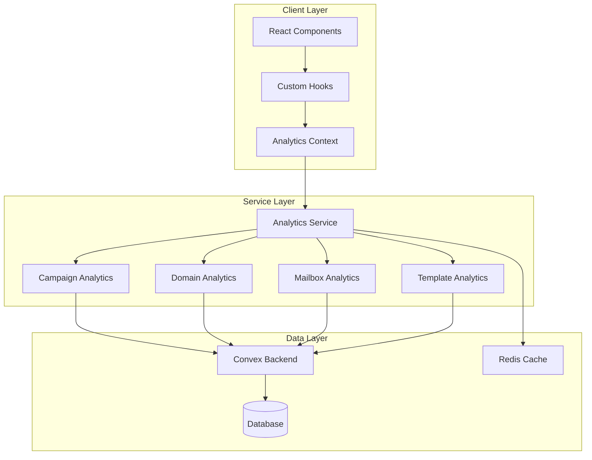

# Analytics System Architecture

## System Overview

The analytics system is built on a domain-driven architecture that provides comprehensive tracking and reporting across campaigns, domains, mailboxes, and templates. The system emphasizes data integrity, performance, and maintainability through clear separation of concerns.

## High-Level Architecture



## Core Architectural Principles

### 1. Domain-Driven Design

The system is organized around business domains rather than technical layers:

- **Campaign Analytics**: Performance tracking for email campaigns
- **Domain Analytics**: Reputation and deliverability metrics
- **Mailbox Analytics**: Individual mailbox health and performance
- **Template Analytics**: Template usage and effectiveness metrics

### 2. Single Source of Truth

Each metric has one authoritative calculation method:

```typescript
// Centralized calculation in AnalyticsCalculator
const openRate = AnalyticsCalculator.calculateOpenRate(opens, delivered);
```

### 3. Data vs. UI Separation

Clear boundaries between data processing and presentation:

- **Data Layer**: Raw metrics and calculations
- **Service Layer**: Business logic and transformations
- **UI Layer**: Formatting and display logic

### 4. Performance-First Design

Optimized for high-volume analytics processing:

- Intelligent caching with Redis
- Index-optimized Convex queries
- Batch processing for aggregations
- Progressive loading for large datasets

## Service Architecture

### Analytics Service Coordinator

Central orchestrator that manages all domain-specific services:

```typescript
class AnalyticsService {
  private services: Map<string, BaseAnalyticsService>;

  async getOverviewMetrics(): Promise<OverviewMetrics> {
    // Aggregate metrics from all domains
  }

  async refreshDomain(domain: string): Promise<void> {
    // Refresh specific domain data
  }
}
```

### Base Analytics Service

Abstract foundation for all domain services:

```typescript
abstract class BaseAnalyticsService {
  protected domain: string;
  protected cache: AnalyticsCache;

  protected async executeWithCache<T>(
    operation: string,
    entityIds: string[],
    filters: any,
    executor: () => Promise<T>
  ): Promise<T> {
    // Caching and error handling logic
  }
}
```

### Domain-Specific Services

Each domain extends the base service with specific functionality:

```typescript
class CampaignAnalyticsService extends BaseAnalyticsService {
  async getPerformanceMetrics(
    campaignIds: string[]
  ): Promise<CampaignMetrics[]> {
    return this.executeWithCache("performance", campaignIds, {}, async () => {
      return await convex.query(api.analytics.getCampaignPerformance, {
        campaignIds,
      });
    });
  }
}
```

## Data Architecture

### Convex Schema Design

Optimized for analytics queries with proper indexing:

```typescript
// Campaign analytics table
const campaignAnalytics = defineTable({
  campaignId: v.string(),
  companyId: v.string(),
  metrics: v.object({
    sent: v.number(),
    delivered: v.number(),
    opened_tracked: v.number(),
    clicked_tracked: v.number(),
    // ... other metrics
  }),
  timestamp: v.number(),
})
  .index("by_campaign", ["campaignId"])
  .index("by_company", ["companyId"])
  .index("by_timestamp", ["timestamp"]);
```

### Caching Strategy

Multi-level caching for optimal performance:

```typescript
// Cache key structure
analytics:{domain}:{operation}:{entityIds}:{filters}:{timestamp}

// TTL configuration
CACHE_TTL = {
  REAL_TIME: 60,      // 1 minute
  RECENT: 300,        // 5 minutes
  HOURLY: 900,        // 15 minutes
  DAILY: 3600,        // 1 hour
  HISTORICAL: 86400   // 24 hours
}
```

## Integration Patterns

### Convex Integration

Standardized patterns for backend integration:

```typescript
// Query pattern
export const getCampaignAnalytics = query({
  args: { campaignIds: v.array(v.string()) },
  handler: async (ctx, args) => {
    // Company-scoped query with proper indexing
    return await ctx.db
      .query("campaignAnalytics")
      .withIndex("by_campaign")
      .filter((q) =>
        q.or(...args.campaignIds.map((id) => q.eq(q.field("campaignId"), id)))
      )
      .collect();
  },
});
```

### React Integration

Consistent patterns for UI integration:

```typescript
// Custom hook pattern
function useAnalyticsData<T>(domain: string, operation: string, args: any) {
  const [data, setData] = useState<T | null>(null);
  const [loading, setLoading] = useState(true);
  const [error, setError] = useState<string | null>(null);

  // Implementation with error handling and caching
}
```

## Error Handling Architecture

### Graceful Degradation

System continues operating when individual domains fail:

```typescript
// Domain isolation
try {
  const campaignMetrics = await campaignService.getMetrics(ids);
} catch (error) {
  // Log error but continue with other domains
  console.error("Campaign analytics unavailable:", error);
  return { campaigns: null, domains: await domainService.getMetrics() };
}
```

### Retry Logic

Exponential backoff for transient failures:

```typescript
const retryConfig = {
  maxRetries: 3,
  baseDelay: 1000,
  maxDelay: 10000,
  backoffMultiplier: 2,
};
```

### Cached Fallback

Automatic fallback to cached data when services are unavailable:

```typescript
// Service automatically uses cached data when Convex is down
const metrics = await service.getMetrics(ids);
// Returns cached data if service unavailable
```

## Performance Optimization

### Query Optimization

- **Compound Indexes**: Optimized for common query patterns
- **Selective Fields**: Only fetch required data
- **Batch Operations**: Process multiple entities together
- **Pagination**: Handle large result sets efficiently

### Caching Optimization

- **Intelligent TTL**: Different cache durations based on data freshness needs
- **Hierarchical Keys**: Efficient cache invalidation
- **Compression**: Reduce memory usage for large datasets
- **Preloading**: Cache frequently accessed data

### Memory Management

- **Efficient Data Structures**: Minimize memory footprint
- **Garbage Collection**: Automatic cleanup of unused data
- **Resource Limits**: Prevent memory leaks with reasonable limits
- **Streaming**: Handle large datasets without loading everything into memory

## Security Architecture

### Data Access Control

- **Company Scoping**: All queries include companyId filter
- **User-Based Filtering**: Respect user permissions
- **Audit Logging**: Track sensitive operations
- **Input Validation**: Prevent injection attacks

### Authentication Integration

```typescript
// All analytics operations require authentication
const analytics = await analyticsService.getMetrics(campaignIds, {
  userId: ctx.auth.userId,
  companyId: ctx.auth.companyId,
});
```

## Monitoring and Observability

### Health Monitoring

```typescript
// System health checks
const health = await analyticsService.getDetailedHealthCheck();
// Returns: { status, services, cache, errors, performance }
```

### Performance Metrics

- Cache hit/miss ratios
- Query execution times
- Error rates by domain
- Memory usage patterns
- Request volume and latency

### Alerting

- Service availability monitoring
- Performance threshold alerts
- Error rate monitoring
- Cache performance tracking

## Evolution and Scalability

### Horizontal Scaling

- **Domain Isolation**: Services can be scaled independently
- **Stateless Design**: Services don't maintain state between requests
- **Cache Distribution**: Redis clustering for high availability
- **Load Balancing**: Distribute requests across service instances

### Vertical Scaling

- **Query Optimization**: Improve individual query performance
- **Index Tuning**: Optimize database indexes for query patterns
- **Caching Layers**: Add additional caching levels
- **Data Partitioning**: Partition large datasets by time or company

### Future Enhancements

1. **Real-time Analytics**: WebSocket-based live updates
2. **Machine Learning**: Predictive analytics and insights
3. **Custom Metrics**: User-defined KPIs and calculations
4. **Data Export**: Bulk export capabilities for external analysis
5. **Advanced Visualization**: Interactive charts and dashboards

## Migration and Deployment

### Database Migrations

```typescript
// Schema evolution pattern
export const migrateAnalyticsSchema = mutation({
  handler: async (ctx) => {
    // Safe schema migration with backward compatibility
  },
});
```

### Deployment Strategy

- **Blue-Green Deployment**: Zero-downtime deployments
- **Feature Flags**: Gradual rollout of new features
- **Rollback Capability**: Quick rollback for issues
- **Health Checks**: Automated deployment validation

### Backward Compatibility

- **API Versioning**: Maintain compatibility during transitions
- **Deprecation Warnings**: Clear migration paths for breaking changes
- **Legacy Support**: Temporary support for old interfaces during migration

## Related Documentation

- [Service Implementation](../../lib/services/analytics/README.md)
- [Component Architecture](../../components/analytics/README.md)
- [Type System](../../types/analytics/README.md)
- [Convex Setup](../../lib/services/analytics/convex-setup.md)
- [Performance Optimization](../development/convex-limitations.md#analytics-performance)
- [Troubleshooting Guide](../../lib/services/analytics/troubleshooting.md)
