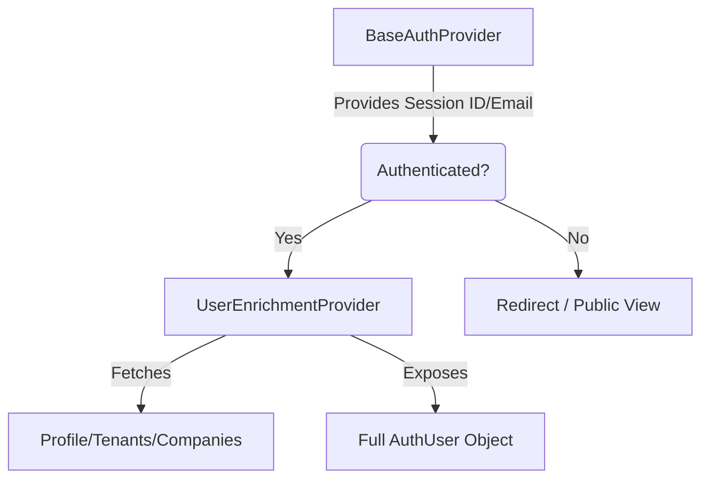

# Authorization Architecture: Context Separation

**Separation of Concerns between Session Management & Data Enrichment**

## Problem
Initially, checking authentication and fetching user data were tightly coupled. This caused:
1.  **Race Conditions**: "User not found" errors when components tried to fetch data before the session was fully established.
2.  **Perceived Lag**: The UI would block until *all* user data (profile, tenants, companies) was loaded, even if just the user ID was needed.
3.  **Complex Error Handling**: A failure in data enrichment (e.g., DB down) would be indistinguishable from a session failure (e.g., cookie expired).

## Solution: Dual-Context Model

We separated the authentication flow into two distinct layers using nested React Contexts.

### Layer 1: BaseAuthProvider (`BaseAuthContext`)
**Responsibility**: "Hard" Authentication.
-   Manages the NileDB session (`useSignIn`, `useSignUp`).
-   Provides `user.id`, `user.email`, and `isAuthenticated`.
-   Handles login/logout redirects.
-   **Source of Truth**: NileDB Cookie.

### Layer 2: UserEnrichmentProvider (`UserEnrichmentContext`)
**Responsibility**: Business Logic & Data.
-   **Depends on**: `BaseAuthProvider` (waits for `isAuthenticated` to be true).
-   Fetches "Enriched" data:
    -   User Profile (Name, Photo, Preferences)
    -   Tenant Memberships
    -   Company Access Lists
    -   User Roles/Permissions
-   Provides `enrichedUser` and granular loading states (`isLoadingEnrichment`).

## Architecture Diagram



## Usage

### Legacy / Unified Hook
`useAuth()` is a composite hook that merges both contexts for backward compatibility. It allows existing components to work without refactoring, but under the hood, it sources data from the two separate providers.

### Optimization Strategy
For performance-critical code (e.g., Middleware, Layout Roots), prefer checking `useBaseAuth()` to avoid waiting for full data enrichment. Use `useEnrichment()` only when business data is strictly required.

## Historical Refactor Context
*Captured from legacy `INSTRUCTIONS.md` during FSD Phase 2 Migration*

### Login Error Fix Strategy
The previous login flow caused error flashes. The new architecture solves this by enforcing a session check retry loop:

```ts
// Legacy Strategy
await signInHook();
redirect(); ❌ // Failed if cookies weren't ready

// New Strategy (Implemented in BaseAuthProvider)
await signInHook();
await checkSessionWithRetry(3); // ✅ Waits for NileDB session
await enrichUser();             // ✅ Fetches business data
safeRedirect();
```

### Original Implementation Checklist
- [x] Create BaseAuthContext
- [x] Create UserEnrichmentContext
- [x] Add session check retries
- [x] Implement dashboard skeleton loading
- [x] Navbar role-based states
- [x] Payment/verification banners
