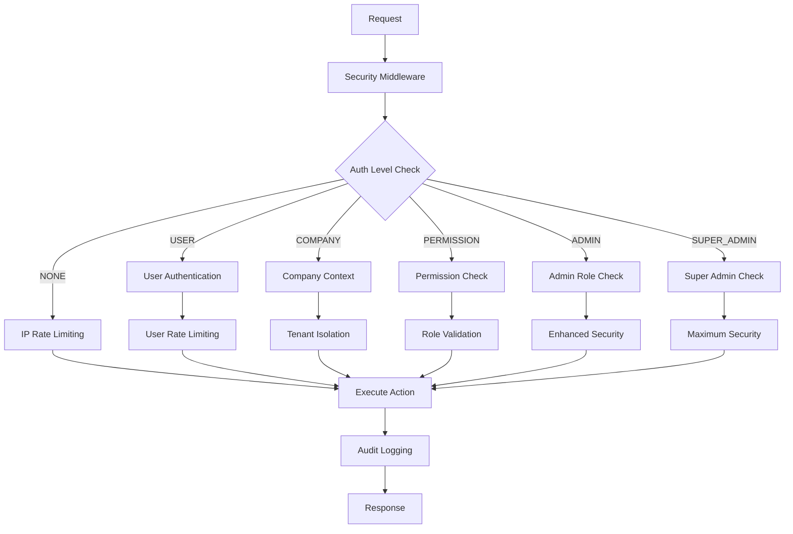

# Authentication Development Guide

## Overview

This guide provides comprehensive information about the authentication and authorization system for developers working on the application. It covers patterns, best practices, and implementation details for secure development.

## Authentication Architecture

### Core Components

The authentication system consists of several key components:

1. **Authentication Middleware** (`lib/actions/core/auth-middleware.ts`)
2. **Authentication Utilities** (`lib/actions/core/auth.ts`)
3. **Security Configurations** (Predefined security patterns)
4. **Rate Limiting System** (Built-in rate limiting)
5. **Audit Logging** (Security event tracking)

### Authentication Flow



## Authentication Levels

### Level Definitions

| Level         | Description                | Use Cases                  | Security Features                       |
| ------------- | -------------------------- | -------------------------- | --------------------------------------- |
| `NONE`        | Public access              | Public APIs, health checks | IP rate limiting, request tracking      |
| `USER`        | Basic user auth            | User profile, preferences  | User context, user rate limiting        |
| `COMPANY`     | Company context required   | Business operations        | Tenant isolation, company rate limiting |
| `PERMISSION`  | Specific permission needed | Protected features         | Permission validation, audit logging    |
| `ADMIN`       | Admin role required        | Administrative tasks       | Role validation, enhanced security      |
| `SUPER_ADMIN` | Super admin only           | System operations          | Maximum security, full audit trail      |

### Choosing the Right Level

```typescript
// Public endpoint - no authentication needed
export async function getPublicStats(): Promise<ActionResult<PublicStats>> {
  return withSecurity(
    "get_public_stats",
    SecurityConfigs.PUBLIC_READ,
    async (context: ActionContext) => {
      // Public logic here
    }
  );
}

// User-specific operation
export async function getUserProfile(): Promise<ActionResult<UserProfile>> {
  return withSecurity(
    "get_user_profile",
    SecurityConfigs.USER_READ,
    async (context: ActionContext) => {
      // User-specific logic here
    }
  );
}

// Company-scoped operation
export async function getCompanyData(): Promise<ActionResult<CompanyData>> {
  return withSecurity(
    "get_company_data",
    SecurityConfigs.COMPANY_READ,
    async (context: ActionContext) => {
      // Ensure company context exists
      if (!context.companyId) {
        return ErrorFactory.unauthorized("Company context required");
      }
      // Company-specific logic here
    }
  );
}

// Permission-based operation
export async function deleteUser(userId: string): Promise<ActionResult<void>> {
  return withSecurity(
    "delete_user",
    {
      authLevel: AuthLevel.PERMISSION,
      requiredPermission: Permission.DELETE_USER,
      rateLimitType: RateLimitType.USER,
      rateLimit: RateLimits.SENSITIVE_ACTION,
      auditLevel: AuditLevel.HIGH,
    },
    async (context: ActionContext) => {
      // Permission-protected logic here
    }
  );
}
```

## Security Configurations

### Predefined Configurations

The system provides several predefined security configurations for common patterns:

```typescript
// Available security configurations
SecurityConfigs.PUBLIC_READ; // Public endpoints with IP rate limiting
SecurityConfigs.USER_READ; // User-authenticated read operations
SecurityConfigs.COMPANY_READ; // Company-scoped read operations
SecurityConfigs.USER_WRITE; // User write operations with audit logging
SecurityConfigs.COMPANY_WRITE; // Company write operations with full security
SecurityConfigs.SENSITIVE_OPERATION; // High-security operations
SecurityConfigs.BILLING_OPERATION; // Billing operations with permission checks
SecurityConfigs.ADMIN_OPERATION; // Administrative operations
SecurityConfigs.ANALYTICS_READ; // Analytics operations with permissions
SecurityConfigs.BULK_OPERATION; // Bulk operations with strict rate limiting
```

### Custom Security Configuration

```typescript
// Create custom security configuration
const customSecurityConfig: SecurityConfig = {
  authLevel: AuthLevel.COMPANY,
  requiredPermission: Permission.CUSTOM_OPERATION,
  rateLimitType: RateLimitType.COMPANY,
  rateLimit: { limit: 10, windowMs: 60000 },
  requireHttps: true,
  auditLevel: AuditLevel.MEDIUM,
  validateOrigin: true,
};

export async function customOperation(): Promise<ActionResult<CustomData>> {
  return withSecurity(
    "custom_operation",
    customSecurityConfig,
    async (context: ActionContext) => {
      // Custom operation logic
    }
  );
}
```

## Rate Limiting

### Rate Limit Types

The system supports multiple rate limiting scopes:

```typescript
enum RateLimitType {
  USER = "user", // Per-user rate limiting
  COMPANY = "company", // Per-company rate limiting
  IP = "ip", // Per-IP rate limiting
  GLOBAL = "global", // Global rate limiting
}
```

### Predefined Rate Limits

```typescript
const RateLimits = {
  // Authentication operations
  AUTH_LOGIN: { limit: 5, windowMs: 300000 }, // 5 per 5 minutes
  AUTH_SIGNUP: { limit: 3, windowMs: 3600000 }, // 3 per hour

  // General operations
  GENERAL_READ: { limit: 1000, windowMs: 60000 }, // 1000 per minute
  GENERAL_WRITE: { limit: 100, windowMs: 60000 }, // 100 per minute

  // Sensitive operations
  SENSITIVE_ACTION: { limit: 5, windowMs: 60000 }, // 5 per minute
  BULK_OPERATION: { limit: 10, windowMs: 300000 }, // 10 per 5 minutes

  // Feature-specific limits
  ANALYTICS_QUERY: { limit: 200, windowMs: 60000 }, // 200 per minute
  ANALYTICS_EXPORT: { limit: 10, windowMs: 3600000 }, // 10 per hour
  BILLING_UPDATE: { limit: 5, windowMs: 300000 }, // 5 per 5 minutes
};
```

### Custom Rate Limiting

```typescript
// Custom rate limit for specific operation
const customRateLimit = { limit: 20, windowMs: 120000 }; // 20 per 2 minutes

export async function customRateLimitedOperation(): Promise<
  ActionResult<Data>
> {
  return withSecurity(
    "custom_rate_limited_operation",
    {
      authLevel: AuthLevel.USER,
      rateLimitType: RateLimitType.USER,
      rateLimit: customRateLimit,
      auditLevel: AuditLevel.LOW,
    },
    async (context: ActionContext) => {
      // Operation logic
    }
  );
}
```

## Company/Tenant Isolation

### Automatic Isolation

When using `AuthLevel.COMPANY` or higher, the system automatically enforces tenant isolation:

```typescript
export async function getCompanyAnalytics(): Promise<ActionResult<Analytics>> {
  return withSecurity(
    "get_company_analytics",
    SecurityConfigs.COMPANY_READ,
    async (context: ActionContext) => {
      // Company context is automatically validated
      // context.companyId is guaranteed to be present and valid

      const analytics = await fetchAnalytics({
        companyId: context.companyId, // Safe to use
      });

      return { success: true, data: analytics };
    }
  );
}
```

### Manual Isolation Validation

For additional security, you can add manual validation:

```typescript
export async function sensitiveCompanyOperation(
  resourceId: string
): Promise<ActionResult<Resource>> {
  return withSecurity(
    "sensitive_company_operation",
    SecurityConfigs.COMPANY_WRITE,
    async (context: ActionContext) => {
      // Automatic company context validation is already done

      // Additional resource ownership validation
      const resource = await getResource(resourceId);
      if (!resource) {
        return ErrorFactory.notFound("Resource not found");
      }

      if (resource.companyId !== context.companyId) {
        return ErrorFactory.forbidden("Access denied to resource");
      }

      // Safe to proceed with operation
      return { success: true, data: resource };
    }
  );
}
```

## Permission System

### Permission Definitions

```typescript
enum Permission {
  // User management
  CREATE_USER = "create_user",
  UPDATE_USER = "update_user",
  DELETE_USER = "delete_user",
  VIEW_USERS = "view_users",

  // Campaign management
  CREATE_CAMPAIGN = "create_campaign",
  UPDATE_CAMPAIGN = "update_campaign",
  DELETE_CAMPAIGN = "delete_campaign",
  VIEW_CAMPAIGNS = "view_campaigns",

  // Domain and mailbox management
  CREATE_DOMAIN = "create_domain",
  UPDATE_DOMAIN = "update_domain",
  DELETE_DOMAIN = "delete_domain",
  VIEW_DOMAINS = "view_domains",

  CREATE_MAILBOX = "create_mailbox",
  UPDATE_MAILBOX = "update_mailbox",
  DELETE_MAILBOX = "delete_mailbox",
  VIEW_MAILBOXES = "view_mailboxes",

  // Analytics and reporting
  VIEW_ANALYTICS = "view_analytics",
  EXPORT_DATA = "export_data",

  // Settings and billing
  UPDATE_SETTINGS = "update_settings",
  VIEW_SETTINGS = "view_settings",
  VIEW_BILLING = "view_billing",
  UPDATE_BILLING = "update_billing",
  MANAGE_SUBSCRIPTIONS = "manage_subscriptions",
}
```

### Role-Based Permissions

```typescript
const RolePermissions = {
  SUPER_ADMIN: [
    // All permissions
    ...Object.values(Permission),
  ],

  ADMIN: [
    Permission.CREATE_USER,
    Permission.UPDATE_USER,
    Permission.VIEW_USERS,
    Permission.CREATE_CAMPAIGN,
    Permission.UPDATE_CAMPAIGN,
    Permission.DELETE_CAMPAIGN,
    Permission.VIEW_CAMPAIGNS,
    Permission.VIEW_ANALYTICS,
    Permission.EXPORT_DATA,
    Permission.UPDATE_SETTINGS,
    Permission.VIEW_SETTINGS,
  ],

  MANAGER: [
    Permission.CREATE_CAMPAIGN,
    Permission.UPDATE_CAMPAIGN,
    Permission.VIEW_CAMPAIGNS,
    Permission.VIEW_ANALYTICS,
    Permission.VIEW_SETTINGS,
  ],

  USER: [Permission.VIEW_CAMPAIGNS, Permission.VIEW_SETTINGS],

  GUEST: [Permission.VIEW_SETTINGS],
};
```

### Using Permissions

```typescript
export async function deleteUser(userId: string): Promise<ActionResult<void>> {
  return withSecurity(
    "delete_user",
    {
      authLevel: AuthLevel.PERMISSION,
      requiredPermission: Permission.DELETE_USER,
      rateLimitType: RateLimitType.USER,
      rateLimit: RateLimits.SENSITIVE_ACTION,
      auditLevel: AuditLevel.HIGH,
    },
    async (context: ActionContext) => {
      // Permission is automatically validated
      // User is guaranteed to have DELETE_USER permission

      await deleteUserFromDatabase(userId);

      return { success: true, data: undefined };
    }
  );
}
```

## Error Handling

### Standardized Error Responses

The system uses `ErrorFactory` for consistent error handling:

```typescript
// Authentication errors
return ErrorFactory.authRequired("Authentication required");
return ErrorFactory.unauthorized("Access denied");
return ErrorFactory.forbidden("Insufficient permissions");

// Validation errors
return ErrorFactory.validation("Invalid input", validationErrors);
return ErrorFactory.badRequest("Invalid request format");

// Rate limiting errors
return ErrorFactory.rateLimit("Too many requests", remainingTime);

// Resource errors
return ErrorFactory.notFound("Resource not found");
return ErrorFactory.conflict("Resource already exists");

// Server errors
return ErrorFactory.internal("Internal server error");
return ErrorFactory.serviceUnavailable("Service temporarily unavailable");
```

### Error Context

Errors include contextual information for debugging:

```typescript
interface ActionError {
  type: string;
  message: string;
  code?: string;
  field?: string;
  details?: Record<string, unknown>;
  timestamp?: number;
  requestId?: string;
}
```

## Audit Logging

### Audit Levels

```typescript
enum AuditLevel {
  NONE = "none", // No audit logging
  LOW = "low", // Basic operation logging
  MEDIUM = "medium", // Detailed operation logging
  HIGH = "high", // Comprehensive logging with metadata
}
```

### Audit Log Structure

```typescript
interface AuditLogEntry {
  timestamp: number;
  userId?: string;
  companyId?: string;
  action: string;
  resource?: string;
  resourceId?: string;
  ipAddress?: string;
  userAgent?: string;
  success: boolean;
  error?: string;
  metadata?: Record<string, unknown>;
}
```

### Custom Audit Logging

```typescript
export async function sensitiveOperation(): Promise<ActionResult<Data>> {
  return withSecurity(
    "sensitive_operation",
    {
      authLevel: AuthLevel.COMPANY,
      auditLevel: AuditLevel.HIGH,
    },
    async (context: ActionContext) => {
      // Operation logic
      const result = await performOperation();

      // Additional custom audit logging
      await auditLog({
        userId: context.userId,
        companyId: context.companyId,
        action: "sensitive_operation_completed",
        metadata: {
          operationType: "data_export",
          recordCount: result.recordCount,
        },
      });

      return { success: true, data: result };
    }
  );
}
```

## Development Best Practices

### 1. Always Use Security Middleware

```typescript
// ✅ Correct - Always use withSecurity
export async function myAction(): Promise<ActionResult<Data>> {
  return withSecurity(
    "my_action",
    SecurityConfigs.USER_READ,
    async (context: ActionContext) => {
      // Action logic
    }
  );
}

// ❌ Incorrect - Direct implementation without security
export async function myAction(): Promise<ActionResult<Data>> {
  // No security middleware - vulnerable
  const data = await fetchData();
  return { success: true, data };
}
```

### 2. Choose Appropriate Security Configuration

```typescript
// ✅ Correct - Choose based on operation sensitivity
export async function getUserProfile(): Promise<ActionResult<UserProfile>> {
  return withSecurity(
    "get_user_profile",
    SecurityConfigs.USER_READ, // Appropriate for user data
    async (context: ActionContext) => {
      // Logic here
    }
  );
}

export async function deleteAllData(): Promise<ActionResult<void>> {
  return withSecurity(
    "delete_all_data",
    SecurityConfigs.ADMIN_OPERATION, // High security for destructive operation
    async (context: ActionContext) => {
      // Logic here
    }
  );
}
```

### 3. Validate Company Context When Required

```typescript
// ✅ Correct - Always validate company context
export async function getCompanyData(): Promise<ActionResult<CompanyData>> {
  return withSecurity(
    "get_company_data",
    SecurityConfigs.COMPANY_READ,
    async (context: ActionContext) => {
      if (!context.companyId) {
        return ErrorFactory.unauthorized("Company context required");
      }

      // Safe to use context.companyId
      const data = await fetchCompanyData(context.companyId);
      return { success: true, data };
    }
  );
}
```

### 4. Handle Errors Consistently

```typescript
// ✅ Correct - Use ErrorFactory for consistent errors
export async function myAction(): Promise<ActionResult<Data>> {
  return withSecurity(
    "my_action",
    SecurityConfigs.USER_READ,
    async (context: ActionContext) => {
      try {
        const data = await fetchData();
        return { success: true, data };
      } catch (error) {
        if (error instanceof ValidationError) {
          return ErrorFactory.validation("Invalid data", error.details);
        }
        return ErrorFactory.internal("Operation failed");
      }
    }
  );
}
```

### 5. Test Security Configurations

```typescript
// Test authentication requirements
describe("myAction security", () => {
  it("should require authentication", async () => {
    // Mock unauthenticated request
    mockRequireAuth.mockRejectedValue(new Error("Not authenticated"));

    const result = await myAction();

    expect(result.success).toBe(false);
    expect(result.error?.type).toBe("internal");
  });

  it("should enforce rate limiting", async () => {
    // Test rate limiting
    const requests = Array(20)
      .fill(null)
      .map(() => myAction());
    const results = await Promise.all(requests);

    const rateLimitedCount = results.filter(
      (r) => !r.success && r.error?.type === "rate_limit"
    ).length;

    expect(rateLimitedCount).toBeGreaterThan(0);
  });
});
```

## Migration from Legacy Patterns

### Before (Legacy Pattern)

```typescript
// Old pattern - manual auth and rate limiting
export async function legacyAction(): Promise<ActionResult<Data>> {
  return withContextualRateLimit(
    "legacy_action",
    "user",
    RateLimits.GENERAL_READ,
    () =>
      withAuthAndCompany(
        async (context: ActionContext & { companyId: string }) => {
          // Action logic
          return { success: true, data: result };
        }
      )
  );
}
```

### After (New Pattern)

```typescript
// New pattern - security middleware
export async function modernAction(): Promise<ActionResult<Data>> {
  return withSecurity(
    "modern_action",
    SecurityConfigs.COMPANY_READ,
    async (context: ActionContext) => {
      if (!context.companyId) {
        return ErrorFactory.unauthorized("Company context required");
      }

      // Action logic
      return { success: true, data: result };
    }
  );
}
```

### Migration Steps

1. **Identify legacy patterns** in existing code
2. **Choose appropriate security configuration** based on operation requirements
3. **Replace legacy helpers** with `withSecurity` middleware
4. **Add proper error handling** using `ErrorFactory`
5. **Test security requirements** thoroughly
6. **Update documentation** and examples

## Testing Authentication

### Unit Testing

```typescript
describe("Authentication Tests", () => {
  beforeEach(() => {
    jest.clearAllMocks();
  });

  it("should authenticate user successfully", async () => {
    mockRequireAuth.mockResolvedValue(undefined);
    mockGetCurrentUserId.mockResolvedValue("user123");

    const result = await myAction();

    expect(result.success).toBe(true);
    expect(mockRequireAuth).toHaveBeenCalledTimes(1);
  });

  it("should handle authentication failure", async () => {
    mockRequireAuth.mockRejectedValue(new Error("Not authenticated"));

    const result = await myAction();

    expect(result.success).toBe(false);
    expect(result.error?.type).toBe("internal");
  });

  it("should enforce company isolation", async () => {
    mockRequireAuth.mockResolvedValue(undefined);
    mockGetCurrentUserId.mockResolvedValue("user123");
    mockGetCompanyId.mockResolvedValue("company456");

    const result = await companyAction();

    expect(result.success).toBe(true);
    // Verify company context was used
  });
});
```

### Integration Testing

```typescript
describe("Authentication Integration", () => {
  it("should complete authenticated flow", async () => {
    // Set up authenticated user
    await authenticateUser("user123");

    // Test protected operation
    const result = await protectedAction();

    expect(result.success).toBe(true);
  });

  it("should prevent cross-tenant access", async () => {
    // Set up user in company A
    await authenticateUser("user123", "companyA");

    // Try to access company B data
    const result = await getCompanyData("companyB");

    expect(result.success).toBe(false);
    expect(result.error?.type).toBe("forbidden");
  });
});
```

This authentication development guide provides comprehensive information for implementing secure, consistent authentication patterns throughout the application.

## Related Documentation

- **[Authentication Implementation Guide](docs/architecture/authentication.md)** - Detailed implementation patterns and migration strategies
- **[Troubleshooting](docs/guides/troubleshooting.md)** - Common issues and solutions
