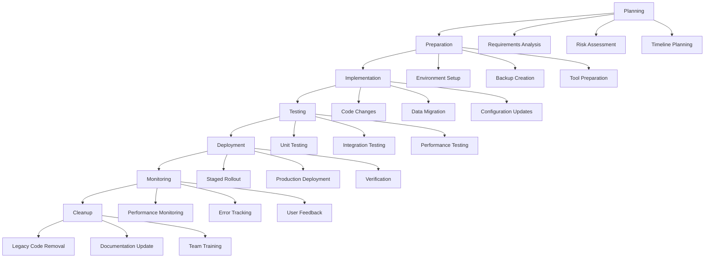

# Migration Patterns Guide

## Overview

This guide documents proven migration patterns and methodologies used in the application, providing reusable strategies for future migrations and refactoring efforts.

## Migration Methodology

### Core Principles

1. **Incremental Migration** - Break large migrations into smaller, manageable chunks
2. **Backward Compatibility** - Maintain compatibility during transition periods
3. **Rollback Capability** - Always have a rollback plan
4. **Data Integrity** - Ensure no data loss during migrations
5. **Performance Monitoring** - Monitor performance impact throughout migration
6. **Team Communication** - Keep team informed of migration progress and impacts

### Migration Phases



## Authentication Migration Pattern

### Background

The authentication system was migrated from inconsistent manual patterns to a unified security middleware system.

### Migration Strategy

#### Phase 1: Foundation Setup

```typescript
// 1. Create core authentication infrastructure
// lib/actions/core/auth-middleware.ts
export function withSecurity<T>(
  actionName: string,
  config: SecurityConfig,
  action: (context: ActionContext) => Promise<ActionResult<T>>
): Promise<ActionResult<T>> {
  // Unified security middleware implementation
}

// 2. Define security configurations
export const SecurityConfigs = {
  PUBLIC_READ: { authLevel: AuthLevel.NONE, rateLimitType: RateLimitType.IP },
  USER_READ: { authLevel: AuthLevel.USER, rateLimitType: RateLimitType.USER },
  COMPANY_READ: {
    authLevel: AuthLevel.COMPANY,
    rateLimitType: RateLimitType.COMPANY,
  },
  // ... more configurations
};
```

#### Phase 2: Automated Migration Script

```typescript
// scripts/migrate-auth-patterns.ts
export class AuthPatternMigrator {
  async migrateFile(filePath: string): Promise<MigrationResult> {
    const content = await fs.readFile(filePath, "utf-8");

    // Detect legacy patterns
    const legacyPatterns = this.detectLegacyPatterns(content);

    // Apply transformations
    let migratedContent = content;
    for (const pattern of legacyPatterns) {
      migratedContent = this.applyTransformation(migratedContent, pattern);
    }

    // Validate migration
    const validation = await this.validateMigration(migratedContent);

    return {
      filePath,
      success: validation.success,
      changes: legacyPatterns.length,
      errors: validation.errors,
    };
  }

  private detectLegacyPatterns(content: string): LegacyPattern[] {
    const patterns: LegacyPattern[] = [];

    // Detect withContextualRateLimit usage
    const rateLimitMatches = content.match(/withContextualRateLimit\(/g);
    if (rateLimitMatches) {
      patterns.push({
        type: "rate_limit",
        count: rateLimitMatches.length,
        replacement: "withSecurity",
      });
    }

    // Detect withAuthAndCompany usage
    const authMatches = content.match(/withAuthAndCompany\(/g);
    if (authMatches) {
      patterns.push({
        type: "auth_company",
        count: authMatches.length,
        replacement: "withSecurity",
      });
    }

    return patterns;
  }
}
```

#### Phase 3: Gradual File Migration

```typescript
// Migration order based on complexity and dependencies
const MIGRATION_ORDER = [
  // 1. Simple files with minimal dependencies
  "lib/actions/analytics/template-analytics.ts",

  // 2. Files with moderate complexity
  "lib/actions/campaignActions.ts",

  // 3. Complex files with multiple dependencies
  "lib/actions/mailboxActions.ts",
];

// Example migration transformation
// Before:
export async function getTemplateAnalytics(): Promise<
  ActionResult<TemplateAnalytics[]>
> {
  return withContextualRateLimit(
    "template_analytics_query",
    "company",
    RateLimits.ANALYTICS_QUERY,
    () =>
      withAuthAndCompany(
        async (context: ActionContext & { companyId: string }) => {
          // Action logic
        }
      )
  );
}

// After:
export async function getTemplateAnalytics(): Promise<
  ActionResult<TemplateAnalytics[]>
> {
  return withSecurity(
    "get_template_analytics",
    SecurityConfigs.ANALYTICS_READ,
    async (context: ActionContext) => {
      if (!context.companyId) {
        return ErrorFactory.unauthorized("Company context required");
      }
      // Action logic
    }
  );
}
```

### Success Metrics

- **100% authentication consistency** across all actions
- **Zero security vulnerabilities** in authentication layer
- **Complete tenant isolation** with automatic enforcement
- **80% reduction** in authentication-related code duplication

## Type System Migration Pattern

### Background

Migration from multiple conflicting `ActionResult` type definitions to a single, standardized type system.

### Migration Strategy

#### Phase 1: Type Standardization

```typescript
// 1. Establish single source of truth
// lib/actions/core/types.ts
export interface ActionResult<T = unknown> {
  success: boolean;
  data?: T;
  error?: ActionError;
}

export interface ActionError {
  type: string;
  message: string;
  code?: string;
  field?: string;
  details?: Record<string, unknown>;
}
```

#### Phase 2: Hook Migration

```typescript
// Before: Multiple conflicting types
export type ActionResult<T> =
  | { success: true; data: T }
  | { success: false; error: string; code?: string };

// After: Standardized type with backward compatibility
import { ActionResult, ActionError } from "@/lib/actions/core/types";

export function useServerAction<T>(action: () => Promise<ActionResult<T>>) {
  const [state, setState] = useState<{
    data: T | null;
    loading: boolean;
    error: string | null; // Keep string for UI compatibility
  }>({
    data: null,
    loading: false,
    error: null,
  });

  const execute = useCallback(async () => {
    try {
      const result = await action();

      if (result.success) {
        setState({ data: result.data || null, loading: false, error: null });
      } else {
        // Extract message from ActionError for backward compatibility
        setState({
          data: null,
          loading: false,
          error: result.error?.message || "An error occurred",
        });
      }
    } catch (error) {
      setState({
        data: null,
        loading: false,
        error: error instanceof Error ? error.message : "Unexpected error",
      });
    }
  }, [action]);

  return { ...state, execute };
}
```

#### Phase 3: Component Migration

```typescript
// Migration pattern for components
// Before:
const { data, error } = useServerAction(getBillingInfo);
if (error) {
  return <div className="error">{error}</div>; // error was string
}

// After: (No change needed - backward compatible)
const { data, error } = useServerAction(getBillingInfo);
if (error) {
  return <div className="error">{error}</div>; // error is still string
}
```

### Migration Tools

```typescript
// Automated type migration script
export class TypeMigrator {
  async migrateTypes(projectPath: string): Promise<MigrationReport> {
    const files = await this.findTypeScriptFiles(projectPath);
    const results: FileMigrationResult[] = [];

    for (const file of files) {
      const result = await this.migrateFile(file);
      results.push(result);
    }

    return {
      totalFiles: files.length,
      migratedFiles: results.filter((r) => r.migrated).length,
      errors: results.filter((r) => r.errors.length > 0),
      summary: this.generateSummary(results),
    };
  }

  private async migrateFile(filePath: string): Promise<FileMigrationResult> {
    const content = await fs.readFile(filePath, "utf-8");

    // Remove duplicate ActionResult definitions
    const withoutDuplicates = this.removeDuplicateTypes(content);

    // Add proper imports
    const withImports = this.addTypeImports(withoutDuplicates);

    // Update error handling
    const withErrorHandling = this.updateErrorHandling(withImports);

    // Validate TypeScript compilation
    const validation = await this.validateTypeScript(withErrorHandling);

    if (validation.success) {
      await fs.writeFile(filePath, withErrorHandling);
    }

    return {
      filePath,
      migrated: validation.success,
      errors: validation.errors,
      changes: this.countChanges(content, withErrorHandling),
    };
  }
}
```

## Modular Refactoring Pattern

### Background

Migration from monolithic action files to modular, focused modules.

### Migration Strategy

#### Phase 1: Analysis and Planning

```typescript
// Analyze existing monolithic file
export class ModularMigrator {
  analyzeMonolithicFile(filePath: string): AnalysisResult {
    const content = fs.readFileSync(filePath, "utf-8");
    const ast = parseTypeScript(content);

    const functions = this.extractFunctions(ast);
    const dependencies = this.analyzeDependencies(functions);
    const groupings = this.suggestGroupings(functions, dependencies);

    return {
      totalFunctions: functions.length,
      suggestedModules: groupings,
      complexity: this.calculateComplexity(functions),
      migrationPlan: this.createMigrationPlan(groupings),
    };
  }

  private suggestGroupings(
    functions: FunctionInfo[],
    dependencies: DependencyMap
  ): ModuleGrouping[] {
    // Group by functionality
    const groups: ModuleGrouping[] = [];

    // Billing functions
    const billingFunctions = functions.filter(
      (f) =>
        f.name.includes("billing") ||
        f.name.includes("payment") ||
        f.name.includes("subscription")
    );

    if (billingFunctions.length > 0) {
      groups.push({
        name: "billing",
        functions: billingFunctions,
        suggestedFiles: [
          "lib/actions/billing/index.ts",
          "lib/actions/billing/subscriptions.ts",
          "lib/actions/billing/payment-methods.ts",
        ],
      });
    }

    return groups;
  }
}
```

#### Phase 2: Module Creation

```typescript
// Create focused modules
// lib/actions/billing/index.ts - Core billing functions
export async function getBillingInfo(): Promise<ActionResult<BillingInfo>> {
  return withSecurity(
    "get_billing_info",
    SecurityConfigs.USER_READ,
    async (context: ActionContext) => {
      // Core billing logic
    }
  );
}

// lib/actions/billing/subscriptions.ts - Subscription management
export async function updateSubscriptionPlan(
  planId: string
): Promise<ActionResult<Subscription>> {
  return withSecurity(
    "update_subscription_plan",
    SecurityConfigs.BILLING_OPERATION,
    async (context: ActionContext) => {
      // Subscription logic
    }
  );
}

// lib/actions/billing/payment-methods.ts - Payment method management
export async function addPaymentMethod(
  data: PaymentMethodData
): Promise<ActionResult<PaymentMethod>> {
  return withSecurity(
    "add_payment_method",
    SecurityConfigs.BILLING_OPERATION,
    async (context: ActionContext) => {
      // Payment method logic
    }
  );
}
```

#### Phase 3: Backward Compatibility Layer

```typescript
// lib/actions/billingActions.ts - Backward compatibility
// Re-export all functions from modular structure
export {
  getBillingInfo,
  updateBillingInfo,
  cancelSubscription,
  reactivateSubscription,
} from "./billing/index";

export {
  updateSubscriptionPlan,
  scheduleSubscriptionChange,
  cancelScheduledSubscriptionChange,
} from "./billing/subscriptions";

export {
  addPaymentMethod,
  removePaymentMethod,
  getPaymentMethods,
  updatePaymentMethod,
  verifyPaymentMethod,
} from "./billing/payment-methods";

// Maintain existing exports for compatibility
export type { ActionResult } from "./core/types";
```

### Benefits Achieved

- **Improved maintainability** - Focused, single-responsibility modules
- **Better testability** - Isolated functionality easier to test
- **Enhanced readability** - Clear organization and structure
- **Reduced complexity** - Smaller, more manageable files
- **Team productivity** - Easier for multiple developers to work simultaneously

## Database Migration Pattern

### Schema Migration Strategy

```typescript
// Database migration with zero downtime
export class DatabaseMigrator {
  async migrateSchema(migration: SchemaMigration): Promise<MigrationResult> {
    // Phase 1: Add new columns/tables (backward compatible)
    await this.addNewStructures(migration.additions);

    // Phase 2: Dual-write to old and new structures
    await this.enableDualWrite(migration.mappings);

    // Phase 3: Backfill existing data
    await this.backfillData(migration.backfillRules);

    // Phase 4: Switch reads to new structure
    await this.switchReads(migration.readMappings);

    // Phase 5: Remove old structures (after validation period)
    await this.removeOldStructures(migration.removals);

    return {
      success: true,
      phases: 5,
      duration: Date.now() - migration.startTime,
    };
  }
}
```

### Data Migration Pattern

```typescript
// Safe data migration with validation
export class DataMigrator {
  async migrateData<T, U>(
    source: DataSource<T>,
    target: DataTarget<U>,
    transformer: (data: T) => U,
    options: MigrationOptions = {}
  ): Promise<DataMigrationResult> {
    const batchSize = options.batchSize || 1000;
    const validateData = options.validate || true;

    let processed = 0;
    let errors: MigrationError[] = [];

    while (true) {
      const batch = await source.getBatch(processed, batchSize);
      if (batch.length === 0) break;

      for (const item of batch) {
        try {
          const transformed = transformer(item);

          if (validateData) {
            const validation = await this.validateItem(transformed);
            if (!validation.valid) {
              errors.push({
                item: item.id,
                error: validation.error,
                phase: "validation",
              });
              continue;
            }
          }

          await target.save(transformed);
          processed++;
        } catch (error) {
          errors.push({
            item: item.id,
            error: error.message,
            phase: "transformation",
          });
        }
      }

      // Progress reporting
      if (options.onProgress) {
        options.onProgress(processed, errors.length);
      }
    }

    return {
      totalProcessed: processed,
      errors,
      success: errors.length === 0,
    };
  }
}
```

## Performance Migration Pattern

### Query Optimization Migration

```typescript
// Before: N+1 query problem
export async function getUsersWithProfiles(): Promise<User[]> {
  const users = await db.user.findMany();

  for (const user of users) {
    user.profile = await db.profile.findUnique({
      where: { userId: user.id },
    });
  }

  return users;
}

// After: Optimized with joins
export async function getUsersWithProfiles(): Promise<User[]> {
  return await db.user.findMany({
    include: {
      profile: true,
    },
  });
}
```

### Caching Migration Pattern

```typescript
// Add caching layer gradually
export class CachingMigrator {
  async addCaching<T>(
    operation: () => Promise<T>,
    cacheKey: string,
    ttl: number = 300000 // 5 minutes
  ): Promise<T> {
    // Check cache first
    const cached = await this.cache.get(cacheKey);
    if (cached) {
      return cached;
    }

    // Execute operation
    const result = await operation();

    // Cache result
    await this.cache.set(cacheKey, result, ttl);

    return result;
  }
}

// Usage in migration
// Before:
export async function getAnalytics(): Promise<Analytics> {
  return await calculateAnalytics();
}

// After:
export async function getAnalytics(): Promise<Analytics> {
  return await cachingMigrator.addCaching(
    () => calculateAnalytics(),
    "analytics_data",
    300000 // 5 minutes
  );
}
```

## Testing Migration Pattern

### Test Migration Strategy

```typescript
// Comprehensive test migration
export class TestMigrator {
  async migrateTests(
    oldTestPath: string,
    newTestPath: string,
    migrationMap: TestMigrationMap
  ): Promise<TestMigrationResult> {
    const oldTests = await this.parseTests(oldTestPath);
    const newTests: TestCase[] = [];

    for (const oldTest of oldTests) {
      const mapping = migrationMap[oldTest.name];
      if (mapping) {
        const newTest = await this.transformTest(oldTest, mapping);
        newTests.push(newTest);
      }
    }

    // Add new tests for new functionality
    const additionalTests = await this.generateNewTests(
      migrationMap.newFeatures
    );
    newTests.push(...additionalTests);

    await this.writeTests(newTestPath, newTests);

    return {
      migratedTests: newTests.length,
      newTests: additionalTests.length,
      coverage: await this.calculateCoverage(newTests),
    };
  }
}
```

## Migration Success Criteria

### Quantitative Metrics

- **Code Quality**: Reduced complexity, improved maintainability scores
- **Performance**: Response time improvements, reduced resource usage
- **Test Coverage**: Maintained or improved test coverage
- **Error Rates**: Reduced error rates post-migration
- **Team Velocity**: Improved development speed

### Qualitative Metrics

- **Developer Experience**: Easier to understand and modify code
- **System Reliability**: More stable and predictable behavior
- **Maintainability**: Easier to add new features and fix bugs
- **Documentation**: Better documented patterns and practices

## Migration Checklist Template

### Pre-Migration

- [ ] Requirements analysis completed
- [ ] Risk assessment documented
- [ ] Migration plan approved
- [ ] Backup strategy in place
- [ ] Rollback plan documented
- [ ] Team training completed

### During Migration

- [ ] Incremental changes implemented
- [ ] Tests updated and passing
- [ ] Performance monitoring active
- [ ] Error tracking enabled
- [ ] Team communication maintained
- [ ] Progress tracking updated

### Post-Migration

- [ ] Functionality verified
- [ ] Performance validated
- [ ] Error rates monitored
- [ ] User feedback collected
- [ ] Documentation updated
- [ ] Legacy code cleaned up

## Lessons Learned

### What Works Well

1. **Incremental Approach** - Small, manageable changes reduce risk
2. **Automated Tools** - Scripts and automation reduce manual errors
3. **Backward Compatibility** - Maintains system stability during transition
4. **Comprehensive Testing** - Catches issues early in the process
5. **Team Communication** - Keeps everyone aligned and informed

### Common Pitfalls

1. **Big Bang Migrations** - Large changes increase risk of failure
2. **Insufficient Testing** - Leads to production issues
3. **Poor Communication** - Team confusion and conflicts
4. **Inadequate Rollback Plans** - Difficult recovery from issues
5. **Ignoring Performance** - Migration impacts system performance

### Best Practices

1. **Plan Thoroughly** - Invest time in planning and analysis
2. **Test Extensively** - Test at every level (unit, integration, e2e)
3. **Monitor Continuously** - Watch for issues throughout migration
4. **Communicate Regularly** - Keep stakeholders informed
5. **Document Everything** - Maintain comprehensive documentation

This migration patterns guide provides proven strategies and methodologies for successful migrations, ensuring minimal risk and maximum benefit from refactoring efforts.
