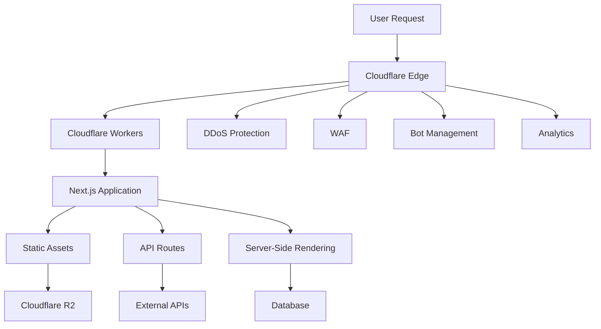

# Cloudflare Infrastructure Guide

## Overview

This guide provides comprehensive information about the Cloudflare infrastructure setup, configuration, and deployment processes for the application. The application is optimized for deployment on Cloudflare Workers using the OpenNext adapter.

## Architecture Overview

### Cloudflare Stack



### Key Components

1. **Cloudflare Workers** - Serverless compute platform
2. **Cloudflare R2** - Object storage for static assets
3. **Cloudflare Pages** - Static site hosting (if needed)
4. **Cloudflare Analytics** - Performance and usage monitoring
5. **Cloudflare Security** - DDoS protection, WAF, bot management

## Project Configuration

### OpenNext Configuration

The application uses OpenNext for Cloudflare Workers compatibility:

```typescript
// open-next.config.ts
import type { OpenNextConfig } from "open-next/types";

const config: OpenNextConfig = {
  default: {
    override: {
      wrapper: "cloudflare-node",
      converter: "edge",
      incrementalCache: "cloudflare-kv",
      tagCache: "cloudflare-kv",
      queue: "cloudflare-queue",
    },
  },
  buildCommand: "npm run build",
  packageJsonPath: "./package.json",
};

export default config;
```

### Next.js Configuration

```typescript
// next.config.ts
import type { NextConfig } from "next";

const nextConfig: NextConfig = {
  // Cloudflare Workers compatibility
  experimental: {
    runtime: "edge",
  },

  // Asset optimization
  images: {
    unoptimized: true, // Cloudflare handles image optimization
    domains: ["your-domain.com"],
  },

  // Output configuration for static export
  output: "export",
  trailingSlash: true,

  // Environment variables
  env: {
    CLOUDFLARE_ACCOUNT_ID: process.env.CLOUDFLARE_ACCOUNT_ID,
    CLOUDFLARE_API_TOKEN: process.env.CLOUDFLARE_API_TOKEN,
  },

  // Headers for security
  async headers() {
    return [
      {
        source: "/(.*)",
        headers: [
          {
            key: "X-Frame-Options",
            value: "DENY",
          },
          {
            key: "X-Content-Type-Options",
            value: "nosniff",
          },
          {
            key: "Referrer-Policy",
            value: "origin-when-cross-origin",
          },
        ],
      },
    ];
  },
};

export default nextConfig;
```

### Wrangler Configuration

```toml
# wrangler.toml
name = "penguin-mails"
main = ".open-next/worker.js"
compatibility_date = "2024-01-01"
compatibility_flags = ["nodejs_compat"]

[env.production]
name = "penguin-mails-production"
route = "mailspenguin.com/*"

[env.staging]
name = "penguin-mails-staging"
route = "staging.mailspenguin.com/*"

[env.development]
name = "penguin-mails-dev"

# KV Namespaces for caching
[[kv_namespaces]]
binding = "CACHE"
id = "your-kv-namespace-id"
preview_id = "your-preview-kv-namespace-id"

# R2 Buckets for asset storage
[[r2_buckets]]
binding = "ASSETS"
bucket_name = "penguin-mails-assets"

# Environment variables
[vars]
NODE_ENV = "production"
NEXT_PUBLIC_APP_URL = "https://mailspenguin.com"

# Secrets (set via wrangler secret put)
# DATABASE_URL
# STRIPE_SECRET_KEY
# JWT_SECRET
```

## Deployment Process

### Build Process

```json
{
  "scripts": {
    "build": "next build",
    "build:open-next": "open-next build",
    "build:dry": "npm run build && npm run build:open-next",
    "preview": "wrangler pages dev .open-next/assets --compatibility-date=2024-01-01",
    "deploy": "npm run build:dry && wrangler deploy",
    "upload": "wrangler deploy --dry-run=false"
  }
}
```

### Deployment Steps

1. **Build Next.js Application**

   ```bash
   npm run build
   ```

2. **Build OpenNext Worker**

   ```bash
   npm run build:open-next
   ```

3. **Deploy to Cloudflare**
   ```bash
   wrangler deploy
   ```

### CI/CD Pipeline

```yaml
# .github/workflows/deploy.yml
name: Deploy to Cloudflare

on:
  push:
    branches: [main]
  pull_request:
    branches: [main]

jobs:
  deploy:
    runs-on: ubuntu-latest

    steps:
      - name: Checkout
        uses: actions/checkout@v4

      - name: Setup Node.js
        uses: actions/setup-node@v4
        with:
          node-version: "18"
          cache: "npm"

      - name: Install dependencies
        run: npm ci

      - name: Build application
        run: npm run build:dry

      - name: Deploy to Cloudflare Workers
        uses: cloudflare/wrangler-action@v3
        with:
          apiToken: ${{ secrets.CLOUDFLARE_API_TOKEN }}
          accountId: ${{ secrets.CLOUDFLARE_ACCOUNT_ID }}
          command: deploy

      - name: Deploy preview for PRs
        if: github.event_name == 'pull_request'
        uses: cloudflare/wrangler-action@v3
        with:
          apiToken: ${{ secrets.CLOUDFLARE_API_TOKEN }}
          accountId: ${{ secrets.CLOUDFLARE_ACCOUNT_ID }}
          command: deploy --env preview
```

## Environment Configuration

### Environment Variables

```bash
# Production environment variables
NODE_ENV=production
NEXT_PUBLIC_APP_URL=https://mailspenguin.com
CLOUDFLARE_ACCOUNT_ID=your-account-id
CLOUDFLARE_API_TOKEN=your-api-token

# Database
DATABASE_URL=your-database-url

# Authentication
JWT_SECRET=your-jwt-secret
NEXTAUTH_SECRET=your-nextauth-secret
NEXTAUTH_URL=https://mailspenguin.com

# External services
STRIPE_SECRET_KEY=your-stripe-secret
STRIPE_PUBLISHABLE_KEY=your-stripe-publishable
RESEND_API_KEY=your-resend-api-key

# Analytics
GOOGLE_ANALYTICS_ID=your-ga-id
POSTHOG_KEY=your-posthog-key
```

### Secrets Management

```bash
# Set secrets using Wrangler CLI
wrangler secret put DATABASE_URL
wrangler secret put JWT_SECRET
wrangler secret put STRIPE_SECRET_KEY
wrangler secret put NEXTAUTH_SECRET

# List secrets
wrangler secret list

# Delete secrets
wrangler secret delete SECRET_NAME
```

## Performance Optimization

### Caching Strategy

```typescript
// lib/cache/cloudflare.ts
export class CloudflareCache {
  private kv: KVNamespace;

  constructor(kvNamespace: KVNamespace) {
    this.kv = kvNamespace;
  }

  async get<T>(key: string): Promise<T | null> {
    try {
      const value = await this.kv.get(key, "json");
      return value as T;
    } catch (error) {
      console.error("Cache get error:", error);
      return null;
    }
  }

  async set<T>(key: string, value: T, ttl: number = 300): Promise<void> {
    try {
      await this.kv.put(key, JSON.stringify(value), {
        expirationTtl: ttl,
      });
    } catch (error) {
      console.error("Cache set error:", error);
    }
  }

  async delete(key: string): Promise<void> {
    try {
      await this.kv.delete(key);
    } catch (error) {
      console.error("Cache delete error:", error);
    }
  }
}

// Usage in API routes
export default async function handler(request: Request, env: Env) {
  const cache = new CloudflareCache(env.CACHE);

  const cacheKey = `api_response_${request.url}`;
  const cached = await cache.get(cacheKey);

  if (cached) {
    return new Response(JSON.stringify(cached), {
      headers: { "Content-Type": "application/json" },
    });
  }

  const data = await fetchData();
  await cache.set(cacheKey, data, 300); // 5 minutes

  return new Response(JSON.stringify(data), {
    headers: { "Content-Type": "application/json" },
  });
}
```

### Asset Optimization

```typescript
// Asset handling with R2
export class AssetManager {
  private r2: R2Bucket;

  constructor(r2Bucket: R2Bucket) {
    this.r2 = r2Bucket;
  }

  async uploadAsset(
    key: string,
    data: ArrayBuffer,
    contentType: string
  ): Promise<void> {
    await this.r2.put(key, data, {
      httpMetadata: {
        contentType,
        cacheControl: "public, max-age=31536000", // 1 year
      },
    });
  }

  async getAsset(key: string): Promise<R2Object | null> {
    return await this.r2.get(key);
  }

  async deleteAsset(key: string): Promise<void> {
    await this.r2.delete(key);
  }
}
```

### Edge-Side Includes (ESI)

```typescript
// Edge-side rendering optimization
export async function handleRequest(
  request: Request,
  env: Env
): Promise<Response> {
  const url = new URL(request.url);

  // Cache static pages at edge
  if (url.pathname.startsWith("/static/")) {
    const cacheKey = `static_${url.pathname}`;
    const cached = await env.CACHE.get(cacheKey);

    if (cached) {
      return new Response(cached, {
        headers: {
          "Content-Type": "text/html",
          "Cache-Control": "public, max-age=3600",
        },
      });
    }
  }

  // Dynamic content with edge caching
  const response = await fetch(request);

  if (response.ok && url.pathname.startsWith("/api/")) {
    const clone = response.clone();
    const data = await clone.text();

    // Cache API responses
    await env.CACHE.put(`api_${url.pathname}`, data, {
      expirationTtl: 300, // 5 minutes
    });
  }

  return response;
}
```

## Security Configuration

### Web Application Firewall (WAF)

```typescript
// WAF rules configuration
const wafRules = [
  {
    description: "Block SQL injection attempts",
    expression:
      '(http.request.uri.query contains "union select" or http.request.uri.query contains "drop table")',
    action: "block",
  },
  {
    description: "Rate limit API endpoints",
    expression: 'http.request.uri.path matches "^/api/"',
    action: "challenge",
    rateLimit: {
      threshold: 100,
      period: 60,
    },
  },
  {
    description: "Block known bad IPs",
    expression: "ip.src in $bad_ips",
    action: "block",
  },
];
```

### DDoS Protection

```typescript
// DDoS protection configuration
const ddosConfig = {
  // L3/L4 protection (automatic)
  networkLayer: {
    enabled: true,
    sensitivity: "high",
  },

  // L7 protection
  applicationLayer: {
    enabled: true,
    rules: [
      {
        name: "Rate limit login attempts",
        pattern: "/api/auth/login",
        threshold: 5,
        period: 300, // 5 minutes
        action: "challenge",
      },
      {
        name: "Protect admin endpoints",
        pattern: "/api/admin/*",
        threshold: 10,
        period: 60,
        action: "block",
      },
    ],
  },
};
```

### Bot Management

```typescript
// Bot management configuration
export async function handleBotProtection(
  request: Request
): Promise<Response | null> {
  const botScore = request.cf?.botManagement?.score || 0;
  const isBot = botScore < 30; // Cloudflare bot score (0-100, lower = more likely bot)

  if (isBot) {
    const url = new URL(request.url);

    // Allow bots for certain endpoints
    const allowedPaths = ["/api/health", "/robots.txt", "/sitemap.xml"];
    if (allowedPaths.includes(url.pathname)) {
      return null; // Continue processing
    }

    // Challenge suspicious bots
    if (botScore < 10) {
      return new Response("Bot detected", { status: 403 });
    }

    // Rate limit other bots
    return new Response("Rate limited", { status: 429 });
  }

  return null; // Continue processing
}
```

## Monitoring and Analytics

### Performance Monitoring

```typescript
// Performance monitoring
export class PerformanceMonitor {
  private analytics: AnalyticsEngine;

  constructor(analytics: AnalyticsEngine) {
    this.analytics = analytics;
  }

  async trackRequest(
    request: Request,
    response: Response,
    duration: number
  ): Promise<void> {
    const url = new URL(request.url);

    await this.analytics.writeDataPoint({
      blobs: [
        url.pathname,
        request.method,
        response.status.toString(),
        request.cf?.country || "unknown",
      ],
      doubles: [duration],
      indexes: [url.pathname],
    });
  }

  async trackError(error: Error, request: Request): Promise<void> {
    await this.analytics.writeDataPoint({
      blobs: [
        "error",
        error.name,
        error.message,
        new URL(request.url).pathname,
      ],
      doubles: [Date.now()],
      indexes: ["error"],
    });
  }
}
```

### Custom Analytics

```typescript
// Custom analytics implementation
export async function trackEvent(
  event: string,
  properties: Record<string, any>,
  env: Env
): Promise<void> {
  const dataPoint = {
    blobs: [event, JSON.stringify(properties), new Date().toISOString()],
    doubles: [Date.now()],
    indexes: [event],
  };

  await env.ANALYTICS.writeDataPoint(dataPoint);
}

// Usage in API routes
export default async function handler(request: Request, env: Env) {
  const startTime = Date.now();

  try {
    const result = await processRequest(request);

    // Track successful request
    await trackEvent(
      "api_request",
      {
        endpoint: new URL(request.url).pathname,
        method: request.method,
        duration: Date.now() - startTime,
        status: "success",
      },
      env
    );

    return result;
  } catch (error) {
    // Track error
    await trackEvent(
      "api_error",
      {
        endpoint: new URL(request.url).pathname,
        error: error.message,
        duration: Date.now() - startTime,
      },
      env
    );

    throw error;
  }
}
```

## Troubleshooting

### Common Issues

#### 1. Worker Size Limits

```typescript
// Issue: Worker bundle too large
// Solution: Code splitting and dynamic imports

// Before: Large bundle
import { heavyLibrary } from "heavy-library";

export default async function handler(request: Request) {
  return heavyLibrary.process(request);
}

// After: Dynamic import
export default async function handler(request: Request) {
  const { heavyLibrary } = await import("heavy-library");
  return heavyLibrary.process(request);
}
```

#### 2. Cold Start Performance

```typescript
// Optimize cold starts
export class WarmupManager {
  private static instance: WarmupManager;
  private initialized = false;

  static getInstance(): WarmupManager {
    if (!WarmupManager.instance) {
      WarmupManager.instance = new WarmupManager();
    }
    return WarmupManager.instance;
  }

  async initialize(): Promise<void> {
    if (this.initialized) return;

    // Pre-initialize expensive operations
    await this.preloadDependencies();
    await this.establishConnections();

    this.initialized = true;
  }

  private async preloadDependencies(): Promise<void> {
    // Preload critical modules
    await Promise.all([
      import("./critical-module-1"),
      import("./critical-module-2"),
    ]);
  }
}
```

#### 3. Memory Limits

```typescript
// Memory optimization
export class MemoryManager {
  private cache = new Map<string, any>();
  private maxCacheSize = 100;

  set(key: string, value: any): void {
    if (this.cache.size >= this.maxCacheSize) {
      // Remove oldest entries
      const firstKey = this.cache.keys().next().value;
      this.cache.delete(firstKey);
    }

    this.cache.set(key, value);
  }

  get(key: string): any {
    return this.cache.get(key);
  }

  clear(): void {
    this.cache.clear();
  }
}
```

### Debugging Tools

```typescript
// Debug logging for Cloudflare Workers
export class Logger {
  private env: string;

  constructor(env: string = "production") {
    this.env = env;
  }

  debug(message: string, data?: any): void {
    if (this.env === "development") {
      console.log(`[DEBUG] ${message}`, data);
    }
  }

  info(message: string, data?: any): void {
    console.log(`[INFO] ${message}`, data);
  }

  error(message: string, error?: Error): void {
    console.error(`[ERROR] ${message}`, error);

    // Send to external logging service in production
    if (this.env === "production") {
      this.sendToLoggingService(message, error);
    }
  }

  private async sendToLoggingService(
    message: string,
    error?: Error
  ): Promise<void> {
    // Implementation for external logging
  }
}
```

## Best Practices

### Development

1. **Use TypeScript** - Full type safety for Worker development
2. **Optimize Bundle Size** - Keep worker bundles small for fast cold starts
3. **Handle Errors Gracefully** - Implement comprehensive error handling
4. **Cache Strategically** - Use KV storage for appropriate caching
5. **Monitor Performance** - Track response times and error rates

### Security

1. **Validate Input** - Always validate and sanitize user input
2. **Use HTTPS** - Enforce HTTPS for all communications
3. **Implement Rate Limiting** - Protect against abuse and DoS attacks
4. **Monitor Bot Traffic** - Use Cloudflare Bot Management
5. **Regular Security Audits** - Periodic security reviews and updates

### Performance

1. **Minimize Cold Starts** - Optimize initialization code
2. **Use Edge Caching** - Cache responses at Cloudflare edge
3. **Optimize Database Queries** - Use connection pooling and query optimization
4. **Compress Responses** - Enable compression for better performance
5. **Monitor Metrics** - Track performance metrics and optimize accordingly

This Cloudflare infrastructure guide provides comprehensive information for deploying, configuring, and maintaining the application on Cloudflare's platform.
