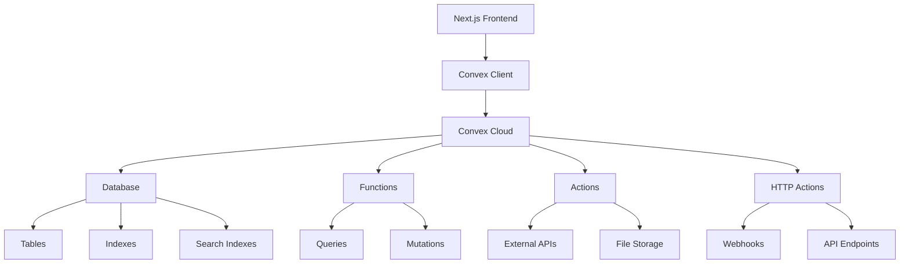

# Convex Infrastructure Guide

## Overview

This guide provides comprehensive information about the Convex backend infrastructure, including setup, configuration, schema management, and best practices for development and deployment.

## Architecture Overview

### Convex Stack



### Key Components

1. **Database** - Document-based database with ACID transactions
2. **Functions** - Server-side functions (queries and mutations)
3. **Actions** - Functions that can call external APIs
4. **HTTP Actions** - HTTP endpoints for webhooks and API integration
5. **File Storage** - Built-in file storage system
6. **Real-time Subscriptions** - Live data updates

## Project Setup

### Installation and Configuration

```bash
# Install Convex CLI
npm install -g convex

# Initialize Convex in your project
npx convex dev

# Install Convex client
npm install convex
```

### Convex Configuration

```json
// convex.json
{
  "functions": "convex/",
  "generateCommonJSApi": false,
  "node": {
    "version": "18"
  }
}
```

### Environment Setup

```typescript
// convex/_generated/api.d.ts (auto-generated)
export declare const api: {
  analytics: {
    getAnalytics: FunctionReference<"query", "public", {}, AnalyticsData>;
    updateAnalytics: FunctionReference<
      "mutation",
      "public",
      { data: AnalyticsUpdate },
      void
    >;
  };
  // ... other functions
};
```

## Schema Definition

### Database Schema

```typescript
// convex/schema.ts
import { defineSchema, defineTable } from "convex/server";
import { v } from "convex/values";

export default defineSchema({
  // User management
  users: defineTable({
    email: v.string(),
    name: v.string(),
    role: v.union(v.literal("admin"), v.literal("user"), v.literal("guest")),
    companyId: v.optional(v.id("companies")),
    createdAt: v.number(),
    updatedAt: v.number(),
  })
    .index("by_email", ["email"])
    .index("by_company", ["companyId"])
    .index("by_role", ["role"]),

  // Company/tenant management
  companies: defineTable({
    name: v.string(),
    domain: v.optional(v.string()),
    settings: v.object({
      timezone: v.string(),
      currency: v.string(),
      features: v.array(v.string()),
    }),
    createdAt: v.number(),
    updatedAt: v.number(),
  })
    .index("by_domain", ["domain"])
    .index("by_name", ["name"]),

  // Analytics data
  analytics: defineTable({
    companyId: v.id("companies"),
    type: v.union(
      v.literal("campaign"),
      v.literal("template"),
      v.literal("mailbox"),
      v.literal("domain")
    ),
    resourceId: v.string(),
    metrics: v.object({
      sent: v.number(),
      delivered: v.number(),
      opened: v.number(),
      clicked: v.number(),
      replied: v.number(),
      bounced: v.number(),
    }),
    date: v.string(), // YYYY-MM-DD format
    createdAt: v.number(),
    updatedAt: v.number(),
  })
    .index("by_company", ["companyId"])
    .index("by_type", ["type"])
    .index("by_resource", ["resourceId"])
    .index("by_date", ["date"])
    .index("by_company_type", ["companyId", "type"])
    .index("by_company_date", ["companyId", "date"]),

  // Campaign management
  campaigns: defineTable({
    companyId: v.id("companies"),
    name: v.string(),
    status: v.union(
      v.literal("draft"),
      v.literal("active"),
      v.literal("paused"),
      v.literal("completed")
    ),
    settings: v.object({
      dailyLimit: v.number(),
      timezone: v.string(),
      trackOpens: v.boolean(),
      trackClicks: v.boolean(),
    }),
    createdAt: v.number(),
    updatedAt: v.number(),
  })
    .index("by_company", ["companyId"])
    .index("by_status", ["status"])
    .index("by_company_status", ["companyId", "status"]),

  // Template management
  templates: defineTable({
    companyId: v.id("companies"),
    name: v.string(),
    subject: v.string(),
    content: v.string(),
    variables: v.array(v.string()),
    category: v.optional(v.string()),
    isActive: v.boolean(),
    createdAt: v.number(),
    updatedAt: v.number(),
  })
    .index("by_company", ["companyId"])
    .index("by_category", ["category"])
    .index("by_active", ["isActive"])
    .index("by_company_active", ["companyId", "isActive"]),

  // Domain and mailbox management
  domains: defineTable({
    companyId: v.id("companies"),
    domain: v.string(),
    status: v.union(
      v.literal("pending"),
      v.literal("verified"),
      v.literal("failed")
    ),
    dnsRecords: v.array(
      v.object({
        type: v.string(),
        name: v.string(),
        value: v.string(),
        verified: v.boolean(),
      })
    ),
    createdAt: v.number(),
    updatedAt: v.number(),
  })
    .index("by_company", ["companyId"])
    .index("by_domain", ["domain"])
    .index("by_status", ["status"]),

  mailboxes: defineTable({
    companyId: v.id("companies"),
    domainId: v.id("domains"),
    email: v.string(),
    name: v.string(),
    status: v.union(
      v.literal("active"),
      v.literal("inactive"),
      v.literal("suspended")
    ),
    settings: v.object({
      dailyLimit: v.number(),
      warmupEnabled: v.boolean(),
      replyTracking: v.boolean(),
    }),
    createdAt: v.number(),
    updatedAt: v.number(),
  })
    .index("by_company", ["companyId"])
    .index("by_domain", ["domainId"])
    .index("by_email", ["email"])
    .index("by_status", ["status"]),

  // File storage
  files: defineTable({
    companyId: v.id("companies"),
    name: v.string(),
    type: v.string(),
    size: v.number(),
    storageId: v.id("_storage"),
    uploadedBy: v.id("users"),
    createdAt: v.number(),
  })
    .index("by_company", ["companyId"])
    .index("by_type", ["type"])
    .index("by_uploader", ["uploadedBy"]),
});
```

### Search Indexes

```typescript
// convex/schema.ts (continued)
import { defineSchema, defineTable, defineSearchIndex } from "convex/server";

export default defineSchema({
  // ... table definitions

  // Search indexes
  searchIndexes: {
    searchTemplates: defineSearchIndex("templates", {
      searchField: "name",
      filterFields: ["companyId", "category", "isActive"],
    }),

    searchCampaigns: defineSearchIndex("campaigns", {
      searchField: "name",
      filterFields: ["companyId", "status"],
    }),

    searchUsers: defineSearchIndex("users", {
      searchField: "name",
      filterFields: ["companyId", "role"],
    }),
  },
});
```

## Function Development

### Query Functions

```typescript
// convex/analytics/queries.ts
import { query } from "../_generated/server";
import { v } from "convex/values";

// Get analytics data for a company
export const getAnalytics = query({
  args: {
    companyId: v.id("companies"),
    type: v.optional(
      v.union(
        v.literal("campaign"),
        v.literal("template"),
        v.literal("mailbox"),
        v.literal("domain")
      )
    ),
    startDate: v.optional(v.string()),
    endDate: v.optional(v.string()),
  },
  handler: async (ctx, args) => {
    // Verify user has access to company data
    const identity = await ctx.auth.getUserIdentity();
    if (!identity) {
      throw new Error("Authentication required");
    }

    const user = await ctx.db
      .query("users")
      .withIndex("by_email", (q) => q.eq("email", identity.email))
      .first();

    if (!user || user.companyId !== args.companyId) {
      throw new Error("Access denied");
    }

    // Build query
    let analyticsQuery = ctx.db
      .query("analytics")
      .withIndex("by_company", (q) => q.eq("companyId", args.companyId));

    // Apply filters
    if (args.type) {
      analyticsQuery = analyticsQuery.filter((q) =>
        q.eq(q.field("type"), args.type)
      );
    }

    if (args.startDate) {
      analyticsQuery = analyticsQuery.filter((q) =>
        q.gte(q.field("date"), args.startDate)
      );
    }

    if (args.endDate) {
      analyticsQuery = analyticsQuery.filter((q) =>
        q.lte(q.field("date"), args.endDate)
      );
    }

    const analytics = await analyticsQuery.collect();

    // Aggregate metrics
    const aggregated = analytics.reduce(
      (acc, item) => {
        acc.sent += item.metrics.sent;
        acc.delivered += item.metrics.delivered;
        acc.opened += item.metrics.opened;
        acc.clicked += item.metrics.clicked;
        acc.replied += item.metrics.replied;
        acc.bounced += item.metrics.bounced;
        return acc;
      },
      {
        sent: 0,
        delivered: 0,
        opened: 0,
        clicked: 0,
        replied: 0,
        bounced: 0,
      }
    );

    return {
      aggregated,
      details: analytics,
      period: {
        startDate: args.startDate,
        endDate: args.endDate,
      },
    };
  },
});

// Get campaign analytics
export const getCampaignAnalytics = query({
  args: {
    companyId: v.id("companies"),
    campaignId: v.optional(v.string()),
  },
  handler: async (ctx, args) => {
    // Authentication and authorization
    const user = await authenticateUser(ctx, args.companyId);

    let query = ctx.db
      .query("analytics")
      .withIndex("by_company_type", (q) =>
        q.eq("companyId", args.companyId).eq("type", "campaign")
      );

    if (args.campaignId) {
      query = query.filter((q) => q.eq(q.field("resourceId"), args.campaignId));
    }

    const analytics = await query.collect();

    // Group by campaign
    const campaignMetrics = analytics.reduce(
      (acc, item) => {
        if (!acc[item.resourceId]) {
          acc[item.resourceId] = {
            campaignId: item.resourceId,
            metrics: {
              sent: 0,
              delivered: 0,
              opened: 0,
              clicked: 0,
              replied: 0,
              bounced: 0,
            },
            dates: [],
          };
        }

        const campaign = acc[item.resourceId];
        campaign.metrics.sent += item.metrics.sent;
        campaign.metrics.delivered += item.metrics.delivered;
        campaign.metrics.opened += item.metrics.opened;
        campaign.metrics.clicked += item.metrics.clicked;
        campaign.metrics.replied += item.metrics.replied;
        campaign.metrics.bounced += item.metrics.bounced;
        campaign.dates.push(item.date);

        return acc;
      },
      {} as Record<string, any>
    );

    return Object.values(campaignMetrics);
  },
});

// Helper function for authentication
async function authenticateUser(ctx: any, companyId: string) {
  const identity = await ctx.auth.getUserIdentity();
  if (!identity) {
    throw new Error("Authentication required");
  }

  const user = await ctx.db
    .query("users")
    .withIndex("by_email", (q) => q.eq("email", identity.email))
    .first();

  if (!user || user.companyId !== companyId) {
    throw new Error("Access denied");
  }

  return user;
}
```

### Mutation Functions

```typescript
// convex/analytics/mutations.ts
import { mutation } from "../_generated/server";
import { v } from "convex/values";

// Update analytics data
export const updateAnalytics = mutation({
  args: {
    companyId: v.id("companies"),
    type: v.union(
      v.literal("campaign"),
      v.literal("template"),
      v.literal("mailbox"),
      v.literal("domain")
    ),
    resourceId: v.string(),
    metrics: v.object({
      sent: v.number(),
      delivered: v.number(),
      opened: v.number(),
      clicked: v.number(),
      replied: v.number(),
      bounced: v.number(),
    }),
    date: v.string(),
  },
  handler: async (ctx, args) => {
    // Authentication
    const user = await authenticateUser(ctx, args.companyId);

    const now = Date.now();
    const today = new Date().toISOString().split("T")[0];

    // Check if analytics record exists for today
    const existing = await ctx.db
      .query("analytics")
      .withIndex("by_company_date", (q) =>
        q.eq("companyId", args.companyId).eq("date", args.date)
      )
      .filter((q) =>
        q.and(
          q.eq(q.field("type"), args.type),
          q.eq(q.field("resourceId"), args.resourceId)
        )
      )
      .first();

    if (existing) {
      // Update existing record
      await ctx.db.patch(existing._id, {
        metrics: args.metrics,
        updatedAt: now,
      });
      return existing._id;
    } else {
      // Create new record
      return await ctx.db.insert("analytics", {
        companyId: args.companyId,
        type: args.type,
        resourceId: args.resourceId,
        metrics: args.metrics,
        date: args.date,
        createdAt: now,
        updatedAt: now,
      });
    }
  },
});

// Batch update analytics
export const batchUpdateAnalytics = mutation({
  args: {
    companyId: v.id("companies"),
    updates: v.array(
      v.object({
        type: v.union(
          v.literal("campaign"),
          v.literal("template"),
          v.literal("mailbox"),
          v.literal("domain")
        ),
        resourceId: v.string(),
        metrics: v.object({
          sent: v.number(),
          delivered: v.number(),
          opened: v.number(),
          clicked: v.number(),
          replied: v.number(),
          bounced: v.number(),
        }),
        date: v.string(),
      })
    ),
  },
  handler: async (ctx, args) => {
    // Authentication
    const user = await authenticateUser(ctx, args.companyId);

    const results = [];
    const now = Date.now();

    for (const update of args.updates) {
      // Check if record exists
      const existing = await ctx.db
        .query("analytics")
        .withIndex("by_company_date", (q) =>
          q.eq("companyId", args.companyId).eq("date", update.date)
        )
        .filter((q) =>
          q.and(
            q.eq(q.field("type"), update.type),
            q.eq(q.field("resourceId"), update.resourceId)
          )
        )
        .first();

      if (existing) {
        await ctx.db.patch(existing._id, {
          metrics: update.metrics,
          updatedAt: now,
        });
        results.push({ id: existing._id, action: "updated" });
      } else {
        const id = await ctx.db.insert("analytics", {
          companyId: args.companyId,
          type: update.type,
          resourceId: update.resourceId,
          metrics: update.metrics,
          date: update.date,
          createdAt: now,
          updatedAt: now,
        });
        results.push({ id, action: "created" });
      }
    }

    return results;
  },
});
```

### Action Functions

```typescript
// convex/analytics/actions.ts
import { action } from "../_generated/server";
import { v } from "convex/values";
import { api } from "../_generated/api";

// Export analytics data
export const exportAnalytics = action({
  args: {
    companyId: v.id("companies"),
    format: v.union(v.literal("csv"), v.literal("json")),
    startDate: v.optional(v.string()),
    endDate: v.optional(v.string()),
  },
  handler: async (ctx, args) => {
    // Get analytics data
    const analytics = await ctx.runQuery(api.analytics.queries.getAnalytics, {
      companyId: args.companyId,
      startDate: args.startDate,
      endDate: args.endDate,
    });

    if (args.format === "csv") {
      return generateCSV(analytics.details);
    } else {
      return JSON.stringify(analytics, null, 2);
    }
  },
});

// Sync analytics from external source
export const syncAnalytics = action({
  args: {
    companyId: v.id("companies"),
    source: v.string(),
    apiKey: v.string(),
  },
  handler: async (ctx, args) => {
    // Fetch data from external API
    const response = await fetch(`https://api.${args.source}.com/analytics`, {
      headers: {
        Authorization: `Bearer ${args.apiKey}`,
        "Content-Type": "application/json",
      },
    });

    if (!response.ok) {
      throw new Error(`Failed to fetch analytics: ${response.statusText}`);
    }

    const externalData = await response.json();

    // Transform and batch update
    const updates = externalData.map((item: any) => ({
      type: item.type,
      resourceId: item.resourceId,
      metrics: {
        sent: item.sent || 0,
        delivered: item.delivered || 0,
        opened: item.opened || 0,
        clicked: item.clicked || 0,
        replied: item.replied || 0,
        bounced: item.bounced || 0,
      },
      date: item.date,
    }));

    return await ctx.runMutation(api.analytics.mutations.batchUpdateAnalytics, {
      companyId: args.companyId,
      updates,
    });
  },
});

function generateCSV(data: any[]): string {
  if (data.length === 0) return "";

  const headers = [
    "Date",
    "Type",
    "Resource ID",
    "Sent",
    "Delivered",
    "Opened",
    "Clicked",
    "Replied",
    "Bounced",
  ];
  const rows = data.map((item) => [
    item.date,
    item.type,
    item.resourceId,
    item.metrics.sent,
    item.metrics.delivered,
    item.metrics.opened,
    item.metrics.clicked,
    item.metrics.replied,
    item.metrics.bounced,
  ]);

  return [headers, ...rows].map((row) => row.join(",")).join("\n");
}
```

### HTTP Actions

```typescript
// convex/http.ts
import { httpRouter } from "convex/server";
import { httpAction } from "./_generated/server";
import { api } from "./_generated/api";

const http = httpRouter();

// Webhook endpoint for analytics updates
http.route({
  path: "/webhook/analytics",
  method: "POST",
  handler: httpAction(async (ctx, request) => {
    // Verify webhook signature
    const signature = request.headers.get("x-webhook-signature");
    const body = await request.text();

    if (!verifyWebhookSignature(body, signature)) {
      return new Response("Invalid signature", { status: 401 });
    }

    const data = JSON.parse(body);

    try {
      // Process webhook data
      await ctx.runMutation(api.analytics.mutations.updateAnalytics, {
        companyId: data.companyId,
        type: data.type,
        resourceId: data.resourceId,
        metrics: data.metrics,
        date: data.date,
      });

      return new Response("OK", { status: 200 });
    } catch (error) {
      console.error("Webhook processing error:", error);
      return new Response("Internal Server Error", { status: 500 });
    }
  }),
});

// API endpoint for external integrations
http.route({
  path: "/api/analytics",
  method: "GET",
  handler: httpAction(async (ctx, request) => {
    const url = new URL(request.url);
    const companyId = url.searchParams.get("companyId");
    const apiKey = request.headers.get("x-api-key");

    // Verify API key
    if (!apiKey || !verifyApiKey(apiKey, companyId)) {
      return new Response("Unauthorized", { status: 401 });
    }

    try {
      const analytics = await ctx.runQuery(api.analytics.queries.getAnalytics, {
        companyId: companyId as any,
        startDate: url.searchParams.get("startDate") || undefined,
        endDate: url.searchParams.get("endDate") || undefined,
      });

      return new Response(JSON.stringify(analytics), {
        headers: { "Content-Type": "application/json" },
      });
    } catch (error) {
      console.error("API error:", error);
      return new Response("Internal Server Error", { status: 500 });
    }
  }),
});

function verifyWebhookSignature(
  body: string,
  signature: string | null
): boolean {
  // Implement webhook signature verification
  // This is a placeholder - implement actual verification logic
  return signature === "valid-signature";
}

function verifyApiKey(apiKey: string, companyId: string | null): boolean {
  // Implement API key verification
  // This is a placeholder - implement actual verification logic
  return apiKey === "valid-api-key";
}

export default http;
```

## Client Integration

### React Integration

```typescript
// lib/convex.ts
import { ConvexProvider, ConvexReactClient } from "convex/react";
import { ConvexProviderWithClerk } from "convex/react-clerk";

const convex = new ConvexReactClient(process.env.NEXT_PUBLIC_CONVEX_URL!);

// Provider setup
export function ConvexClientProvider({ children }: { children: React.ReactNode }) {
  return (
    <ConvexProviderWithClerk client={convex} useAuth={useAuth}>
      {children}
    </ConvexProviderWithClerk>
  );
}
```

### Using Queries and Mutations

```typescript
// components/analytics/AnalyticsDashboard.tsx
import { useQuery, useMutation } from "convex/react";
import { api } from "../../convex/_generated/api";

export function AnalyticsDashboard({ companyId }: { companyId: string }) {
  // Query analytics data
  const analytics = useQuery(api.analytics.queries.getAnalytics, {
    companyId: companyId as any,
    startDate: "2024-01-01",
    endDate: "2024-12-31",
  });

  // Mutation for updating analytics
  const updateAnalytics = useMutation(api.analytics.mutations.updateAnalytics);

  const handleUpdateAnalytics = async (metrics: any) => {
    try {
      await updateAnalytics({
        companyId: companyId as any,
        type: "campaign",
        resourceId: "campaign-123",
        metrics,
        date: new Date().toISOString().split('T')[0],
      });
    } catch (error) {
      console.error("Failed to update analytics:", error);
    }
  };

  if (analytics === undefined) {
    return <div>Loading analytics...</div>;
  }

  return (
    <div className="analytics-dashboard">
      <h2>Analytics Dashboard</h2>

      <div className="metrics-grid">
        <div className="metric-card">
          <h3>Sent</h3>
          <p>{analytics.aggregated.sent.toLocaleString()}</p>
        </div>

        <div className="metric-card">
          <h3>Delivered</h3>
          <p>{analytics.aggregated.delivered.toLocaleString()}</p>
        </div>

        <div className="metric-card">
          <h3>Opened</h3>
          <p>{analytics.aggregated.opened.toLocaleString()}</p>
        </div>

        <div className="metric-card">
          <h3>Clicked</h3>
          <p>{analytics.aggregated.clicked.toLocaleString()}</p>
        </div>
      </div>

      <div className="analytics-details">
        {analytics.details.map((item) => (
          <div key={`${item.type}-${item.resourceId}-${item.date}`} className="analytics-item">
            <span>{item.date}</span>
            <span>{item.type}</span>
            <span>{item.resourceId}</span>
            <span>{item.metrics.sent}</span>
          </div>
        ))}
      </div>
    </div>
  );
}
```

### Real-time Subscriptions

```typescript
// components/analytics/RealTimeAnalytics.tsx
import { useQuery } from "convex/react";
import { api } from "../../convex/_generated/api";
import { useEffect, useState } from "react";

export function RealTimeAnalytics({ companyId }: { companyId: string }) {
  const [lastUpdate, setLastUpdate] = useState<Date>(new Date());

  // This query will automatically update when data changes
  const analytics = useQuery(api.analytics.queries.getAnalytics, {
    companyId: companyId as any,
  });

  useEffect(() => {
    if (analytics) {
      setLastUpdate(new Date());
    }
  }, [analytics]);

  return (
    <div className="real-time-analytics">
      <div className="update-indicator">
        Last updated: {lastUpdate.toLocaleTimeString()}
      </div>

      {analytics && (
        <div className="live-metrics">
          <div className="live-metric">
            <span className="metric-label">Live Sent:</span>
            <span className="metric-value">{analytics.aggregated.sent}</span>
          </div>

          <div className="live-metric">
            <span className="metric-label">Live Delivered:</span>
            <span className="metric-value">{analytics.aggregated.delivered}</span>
          </div>
        </div>
      )}
    </div>
  );
}
```

## Performance Optimization

### Query Optimization

```typescript
// Optimized queries with proper indexing
export const getOptimizedAnalytics = query({
  args: {
    companyId: v.id("companies"),
    limit: v.optional(v.number()),
  },
  handler: async (ctx, args) => {
    // Use compound index for better performance
    const analytics = await ctx.db
      .query("analytics")
      .withIndex("by_company_date", (q) => q.eq("companyId", args.companyId))
      .order("desc") // Get most recent first
      .take(args.limit || 100); // Limit results

    return analytics;
  },
});

// Paginated queries
export const getPaginatedAnalytics = query({
  args: {
    companyId: v.id("companies"),
    paginationOpts: paginationOptsValidator,
  },
  handler: async (ctx, args) => {
    return await ctx.db
      .query("analytics")
      .withIndex("by_company", (q) => q.eq("companyId", args.companyId))
      .paginate(args.paginationOpts);
  },
});
```

### Caching Strategies

```typescript
// Client-side caching with React Query
import { useQuery as useReactQuery } from "@tanstack/react-query";
import { useQuery as useConvexQuery } from "convex/react";

export function useCachedAnalytics(companyId: string) {
  const convexQuery = useConvexQuery(api.analytics.queries.getAnalytics, {
    companyId: companyId as any,
  });

  return useReactQuery({
    queryKey: ["analytics", companyId],
    queryFn: () => convexQuery,
    staleTime: 5 * 60 * 1000, // 5 minutes
    cacheTime: 10 * 60 * 1000, // 10 minutes
    enabled: !!convexQuery,
  });
}
```

## Security Best Practices

### Authentication and Authorization

```typescript
// Robust authentication helper
export async function authenticateAndAuthorize(
  ctx: any,
  companyId: string,
  requiredRole?: string
) {
  const identity = await ctx.auth.getUserIdentity();
  if (!identity) {
    throw new Error("Authentication required");
  }

  const user = await ctx.db
    .query("users")
    .withIndex("by_email", (q) => q.eq("email", identity.email))
    .first();

  if (!user) {
    throw new Error("User not found");
  }

  if (user.companyId !== companyId) {
    throw new Error("Access denied: Company mismatch");
  }

  if (requiredRole && user.role !== requiredRole && user.role !== "admin") {
    throw new Error(`Access denied: ${requiredRole} role required`);
  }

  return user;
}
```

### Input Validation

```typescript
// Comprehensive input validation
import { v } from "convex/values";

const analyticsMetricsValidator = v.object({
  sent: v.number(),
  delivered: v.number(),
  opened: v.number(),
  clicked: v.number(),
  replied: v.number(),
  bounced: v.number(),
});

// Custom validators
const emailValidator = v.string(); // Add email regex validation
const dateValidator = v.string(); // Add date format validation

export const createCampaign = mutation({
  args: {
    companyId: v.id("companies"),
    name: v.string(),
    settings: v.object({
      dailyLimit: v.number(),
      timezone: v.string(),
      trackOpens: v.boolean(),
      trackClicks: v.boolean(),
    }),
  },
  handler: async (ctx, args) => {
    // Validate input
    if (args.name.length < 1 || args.name.length > 100) {
      throw new Error("Campaign name must be 1-100 characters");
    }

    if (args.settings.dailyLimit < 1 || args.settings.dailyLimit > 10000) {
      throw new Error("Daily limit must be between 1 and 10,000");
    }

    // Continue with mutation...
  },
});
```

## Deployment and Environment Management

### Environment Configuration

```bash
# Development environment
npx convex dev

# Production deployment
npx convex deploy --prod

# Environment variables
npx convex env set STRIPE_SECRET_KEY sk_live_...
npx convex env set DATABASE_URL postgres://...
```

### Deployment Pipeline

```yaml
# .github/workflows/convex-deploy.yml
name: Deploy Convex

on:
  push:
    branches: [main]
    paths: ["convex/**"]

jobs:
  deploy:
    runs-on: ubuntu-latest

    steps:
      - uses: actions/checkout@v4

      - name: Setup Node.js
        uses: actions/setup-node@v4
        with:
          node-version: "18"

      - name: Install dependencies
        run: npm ci

      - name: Deploy to Convex
        run: npx convex deploy --prod
        env:
          CONVEX_DEPLOY_KEY: ${{ secrets.CONVEX_DEPLOY_KEY }}
```

## Monitoring and Debugging

### Logging and Error Tracking

```typescript
// Enhanced logging
export const loggedQuery = query({
  args: {
    /* args */
  },
  handler: async (ctx, args) => {
    const startTime = Date.now();

    try {
      const result = await actualQueryLogic(ctx, args);

      console.log(`Query completed in ${Date.now() - startTime}ms`);
      return result;
    } catch (error) {
      console.error(`Query failed after ${Date.now() - startTime}ms:`, error);
      throw error;
    }
  },
});
```

### Performance Monitoring

```typescript
// Performance tracking
export const performanceTrackedMutation = mutation({
  args: {
    /* args */
  },
  handler: async (ctx, args) => {
    const metrics = {
      startTime: Date.now(),
      dbQueries: 0,
      dbWrites: 0,
    };

    // Track database operations
    const originalQuery = ctx.db.query;
    ctx.db.query = (...args) => {
      metrics.dbQueries++;
      return originalQuery.apply(ctx.db, args);
    };

    try {
      const result = await actualMutationLogic(ctx, args);

      // Log performance metrics
      console.log("Performance metrics:", {
        duration: Date.now() - metrics.startTime,
        dbQueries: metrics.dbQueries,
        dbWrites: metrics.dbWrites,
      });

      return result;
    } catch (error) {
      console.error("Mutation failed:", error);
      throw error;
    }
  },
});
```

This Convex infrastructure guide provides comprehensive information for developing, deploying, and maintaining the Convex backend, ensuring scalable and secure data management for the application.
