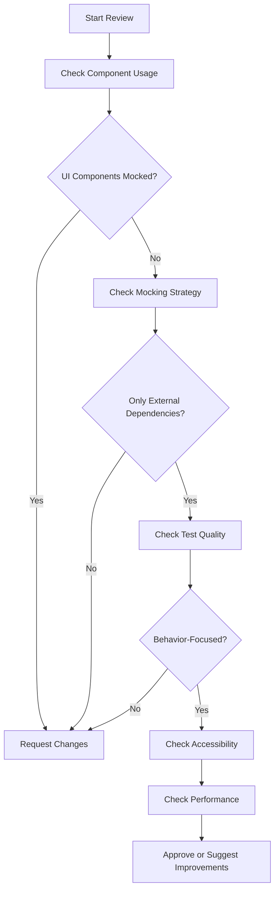

# Code Review Guidelines for Testing

This document provides specific guidelines for reviewing test code to ensure adherence to real component testing principles and strategic external dependency mocking.

## Table of Contents

1. [Review Process Overview](docs/guides/actions-api.md#review-process-overview)
2. [Pre-Review Checklist](docs/guides/actions-api.md#pre-review-checklist)
3. [Component Usage Review](docs/guides/actions-api.md#component-usage-review)
4. [Mocking Strategy Review](docs/guides/actions-api.md#mocking-strategy-review)
5. [Test Quality Assessment](docs/guides/actions-api.md#test-quality-assessment)
6. [Performance Review](docs/guides/actions-api.md#performance-review)
7. [Accessibility Review](docs/guides/actions-api.md#accessibility-review)
8. [Review Comment Templates](docs/guides/actions-api.md#review-comment-templates)
9. [Approval Criteria](docs/guides/actions-api.md#approval-criteria)
10. [Common Review Scenarios](docs/guides/actions-api.md#common-review-scenarios)

## Review Process Overview

### Review Priorities

1. **Blocking Issues** (Request Changes)
   - UI components are mocked
   - Internal components are mocked
   - Tests focus on implementation details
   - Missing required providers

2. **Improvement Suggestions** (Approve with Comments)
   - Suboptimal setup helper usage
   - Missing performance testing
   - Incomplete accessibility testing
   - Code organization issues

3. **Nice-to-Have** (Optional Comments)
   - Additional test coverage
   - Code style improvements
   - Documentation enhancements

### Review Workflow



## Pre-Review Checklist

### Quick Scan Items

Before diving into detailed review, quickly scan for these common issues:

- [ ] **No UI component mocks**: Search for `jest.mock('@/components/ui/`
- [ ] **No internal component mocks**: Search for `jest.mock('@/components/`
- [ ] **Uses setup helpers**: Look for `setupUIComponentTest`, `setupDashboardTest`, etc.
- [ ] **Imports real components**: Check for actual component imports
- [ ] **Strategic external mocking**: Look for API/context/hook mocks only

### Automated Checks

```bash
# Run these commands to quickly identify issues
grep -r "jest.mock.*@/components/ui" --include="*.test.*" .
grep -r "toHaveClass.*bg-primary" --include="*.test.*" .
grep -r "setupUIComponentTest\|setupDashboardTest" --include="*.test.*" .
```

## Component Usage Review

### ✅ Approve: Real Component Usage

```typescript
// ✅ GOOD - Uses real components
import { Button } from '@/components/ui/button/button';
import { Card, CardContent, CardHeader, CardTitle } from '@/components/ui/card';
import { setupUIComponentTest } from '@/lib/test-utils';

describe('UserProfile', () => {
  const componentTest = setupUIComponentTest(UserProfile, defaultProps);

  it('renders user information', () => {
    componentTest.render();
    expect(screen.getByText('John Doe')).toBeInTheDocument();
  });
});
```

**Review Comment:** ✅ Excellent use of real components with appropriate setup helper.

### ❌ Request Changes: Mocked UI Components

```typescript
// ❌ BAD - Mocks UI components
jest.mock('@/components/ui/button', () => ({
  Button: ({ children, onClick }) => (
    <button onClick={onClick}>{children}</button>
  ),
}));

jest.mock('@/components/ui/card', () => ({
  Card: ({ children }) => <div>{children}</div>,
}));
```

**Review Comment:** 
```markdown
**❌ Request Changes: Remove UI Component Mocks**

This test is mocking UI components from the design system. Please update to use real components:

```typescript
// Remove these mocks:
jest.mock('@/components/ui/button', () => ({ ... }));
jest.mock('@/components/ui/card', () => ({ ... }));

// Use real components instead:
import { Button } from '@/components/ui/button/button';
import { Card, CardContent } from '@/components/ui/card';
import { setupUIComponentTest } from '@/lib/test-utils';

const componentTest = setupUIComponentTest(YourComponent, defaultProps);
```

This will provide better test confidence and catch real integration issues.
```

### ❌ Request Changes: Mocked Internal Components

```typescript
// ❌ BAD - Mocks internal business components
jest.mock('@/components/forms/ContactForm', () => ({
  ContactForm: () => <div>Mocked Form</div>,
}));
```

**Review Comment:**
```markdown
**❌ Request Changes: Don't Mock Internal Components**

This test is mocking internal business components. Please mock only external dependencies:

```typescript
// Instead of mocking the component:
jest.mock('@/components/forms/ContactForm', () => ({ ... }));

// Mock external dependencies:
jest.mock('@/lib/actions/contactActions', () => ({
  submitContact: jest.fn().mockResolvedValue({ success: true }),
}));

// Use the real ContactForm component
import { ContactForm } from '@/components/forms/ContactForm';
```

This ensures tests verify real component interactions and catch integration issues.
```

## Mocking Strategy Review

### ✅ Approve: Strategic External Mocking

```typescript
// ✅ GOOD - Mocks external dependencies only
jest.mock('@/lib/api/userService', () => ({
  fetchUser: jest.fn().mockResolvedValue({
    id: 'user-1',
    name: 'Test User',
    email: 'test@example.com',
  }),
}));

jest.mock('next/navigation', () => ({
  useRouter: () => ({ push: jest.fn() }),
  usePathname: () => '/test-path',
}));

jest.mock('@features/auth/ui/context/auth-context', () => ({
  useAuth: () => ({
    user: { id: 'test-user', name: 'Test User' },
    isAuthenticated: true,
  }),
}));
```

**Review Comment:** ✅ Excellent strategic mocking of external dependencies only.

### 💡 Suggest Improvement: Incomplete Mock Data

```typescript
// 💡 COULD BE BETTER - Incomplete mock data
jest.mock('@features/auth/ui/context/auth-context', () => ({
  useAuth: () => ({
    user: { id: 'test-user' }, // Missing required fields
    isAuthenticated: true,
  }),
}));
```

**Review Comment:**
```markdown
**💡 Suggestion: Complete Mock Data Structure**

The AuthContext mock is missing some fields that might be required. Consider using complete mock data:

```typescript
jest.mock('@features/auth/ui/context/auth-context', () => ({
  useAuth: () => ({
    user: {
      id: 'test-user',
      email: 'test@example.com',
      name: 'Test User',
      profile: {
        role: 'user',
        preferences: { theme: 'light' },
      },
    },
    isAuthenticated: true,
    loading: false,
    error: null,
    login: jest.fn(),
    logout: jest.fn(),
  }),
}));
```

This prevents potential issues if the component expects additional fields.
```

## Test Quality Assessment

### ✅ Approve: Behavior-Focused Testing

```typescript
// ✅ GOOD - Tests user behavior
test('handles form submission', async () => {
  const formTest = setupFormTest(ContactForm);
  formTest.render();

  await fillForm({
    'Name': 'John Doe',
    'Email': 'john@example.com',
  });

  await clickButton('Submit');

  expect(formTest.mockSubmit).toHaveBeenCalledWith({
    name: 'John Doe',
    email: 'john@example.com',
  });
});
```

**Review Comment:** ✅ Excellent behavior-focused testing using enhanced helpers.

### ❌ Request Changes: Implementation Detail Testing

```typescript
// ❌ BAD - Tests implementation details
test('has correct CSS classes', () => {
  render(<Button variant="primary">Test</Button>);
  const button = screen.getByRole('button');
  expect(button).toHaveClass('bg-primary', 'text-white');
});
```

**Review Comment:**
```markdown
**❌ Request Changes: Focus on Behavior, Not Implementation**

This test is checking implementation details (CSS classes). Please update to test user behavior:

```typescript
// Instead of testing CSS classes:
expect(button).toHaveClass('bg-primary', 'text-white');

// Test user interactions:
const handleClick = jest.fn();
const buttonTest = setupUIComponentTest(Button, { 
  children: 'Test',
  onClick: handleClick 
});
buttonTest.render({ variant: 'primary' });

const button = testSelectors.button('Test');
fireEvent.click(button);
expect(handleClick).toHaveBeenCalled();
```

This makes tests more resilient to styling changes and focuses on actual functionality.
```

### 💡 Suggest Improvement: Missing Error Handling

```typescript
// 💡 COULD BE BETTER - Missing error handling tests
test('submits form successfully', async () => {
  // Only tests success case
});
```

**Review Comment:**
```markdown
**💡 Suggestion: Add Error Handling Tests**

Consider adding tests for error scenarios:

```typescript
test('handles form submission errors', async () => {
  // Mock API to return error
  jest.mocked(submitContact).mockRejectedValue(new Error('Network error'));
  
  const formTest = setupFormTest(ContactForm);
  formTest.render();

  await fillForm({ 'Name': 'John Doe' });
  await clickButton('Submit');

  expect(screen.getByText(/error occurred/i)).toBeInTheDocument();
});
```

This ensures the component handles errors gracefully.
```

## Performance Review

### ✅ Approve: Appropriate Performance Testing

```typescript
// ✅ GOOD - Includes performance testing for complex components
test('renders within performance threshold', () => {
  const dashboardTest = setupDashboardTest(ComplexDashboard);
  const averageTime = dashboardTest.testRenderPerformance();
  
  expect(averageTime).toBeLessThan(performanceThresholds.DASHBOARD_RENDER_TIME);
});
```

**Review Comment:** ✅ Good inclusion of performance testing for complex component.

### 💡 Suggest Improvement: Missing Performance Considerations

```typescript
// 💡 COULD BE BETTER - Complex component without performance testing
describe('ComplexDataTable', () => {
  // Many tests but no performance considerations
});
```

**Review Comment:**
```markdown
**💡 Suggestion: Add Performance Testing**

This appears to be a complex component that could benefit from performance testing:

```typescript
test('renders large dataset efficiently', () => {
  const tableTest = setupUIComponentTest(ComplexDataTable, {
    data: Array.from({ length: 1000 }, (_, i) => ({ id: i, name: `Item ${i}` }))
  });
  
  const averageTime = tableTest.testRenderPerformance();
  expect(averageTime).toBeLessThan(performanceThresholds.COMPONENT_RENDER_TIME);
});
```

This helps catch performance regressions early.
```

## Accessibility Review

### ✅ Approve: Comprehensive Accessibility Testing

```typescript
// ✅ GOOD - Uses realistic accessibility testing
test('meets accessibility standards', () => {
  const accessibilityTest = setupAccessibilityTest(NavigationMenu);
  const { overallPassed } = accessibilityTest.testBasicAccessibility();
  
  expect(overallPassed).toBe(true);
});

test('supports keyboard navigation', () => {
  const { allAccessible } = accessibilityTest.testKeyboardNavigation();
  expect(allAccessible).toBe(true);
});
```

**Review Comment:** ✅ Excellent comprehensive accessibility testing.

### ❌ Request Changes: Unrealistic Accessibility Expectations

```typescript
// ❌ BAD - Unrealistic accessibility expectations
test('has proper ARIA attributes', () => {
  render(<Button>Click me</Button>);
  const button = screen.getByRole('button');
  expect(button).toHaveAttribute('aria-label'); // Not needed for buttons with text
});
```

**Review Comment:**
```markdown
**❌ Request Changes: Use Realistic Accessibility Testing**

This test expects ARIA attributes that aren't necessary. Buttons with text content don't need aria-label. Please use realistic accessibility validation:

```typescript
// Instead of checking specific attributes:
expect(button).toHaveAttribute('aria-label');

// Use comprehensive accessibility testing:
import { assertAccessibility } from '@/lib/test-utils';

const { container } = render(<Button>Click me</Button>);
const result = assertAccessibility(container);
expect(result.passed).toBe(true);
```

The enhanced validation properly handles button text content as labeling.
```

## Review Comment Templates

### Blocking Issues Templates

#### UI Component Mocking
```markdown
**❌ Request Changes: Remove UI Component Mocks**

This test is mocking UI components from the design system. Please update to use real components for better test confidence and integration issue detection.

**Current Issue:**
```typescript
jest.mock('@/components/ui/button', () => ({ ... }));
```

**Recommended Fix:**
```typescript
import { Button } from '@/components/ui/button/button';
import { setupUIComponentTest } from '@/lib/test-utils';

const buttonTest = setupUIComponentTest(Button, defaultProps);
```

**Resources:** [Developer Guide - Real Component Usage](./developer-guide.md#real-component-usage)
```

#### Internal Component Mocking
```markdown
**❌ Request Changes: Don't Mock Internal Components**

This test is mocking internal business components. Please mock only external dependencies to ensure real component interactions are tested.

**Current Issue:**
```typescript
jest.mock('@/components/forms/ContactForm', () => ({ ... }));
```

**Recommended Fix:**
```typescript
// Mock external dependencies instead:
jest.mock('@/lib/actions/contactActions', () => ({
  submitContact: jest.fn().mockResolvedValue({ success: true }),
}));

// Use real ContactForm component
import { ContactForm } from '@/components/forms/ContactForm';
```

**Resources:** [Strategic Mocking Patterns](./strategic-mocking-patterns.md)
```

#### Implementation Detail Testing
```markdown
**❌ Request Changes: Focus on Behavior, Not Implementation**

This test is checking implementation details that make it fragile to refactoring. Please update to test user behavior instead.

**Current Issue:**
```typescript
expect(button).toHaveClass('bg-primary', 'text-white');
```

**Recommended Fix:**
```typescript
// Test user interactions instead:
fireEvent.click(button);
expect(mockHandler).toHaveBeenCalled();

// Or test semantic behavior:
const themeResult = assertThemeIntegration(button);
expect(themeResult.semanticBehavior?.hasVisibleBackground).toBe(true);
```

**Resources:** [Developer Guide - Testing Patterns](./developer-guide.md#testing-patterns)
```

### Improvement Suggestions Templates

#### Missing Setup Helper
```markdown
**💡 Suggestion: Use Appropriate Setup Helper**

Consider using a setup helper for more consistent provider setup and easier test maintenance:

**Current:**
```typescript
render(
  <ThemeProvider>
    <SidebarProvider>
      <Component />
    </SidebarProvider>
  </ThemeProvider>
);
```

**Suggested:**
```typescript
const componentTest = setupDashboardTest(Component);
componentTest.render();
```

**Benefits:** Automatic provider setup, consistent configuration, easier maintenance.
```

#### Missing Accessibility Testing
```markdown
**💡 Suggestion: Add Accessibility Testing**

This interactive component would benefit from accessibility testing:

```typescript
import { assertAccessibility } from '@/lib/test-utils';

test('meets accessibility standards', () => {
  const { container } = render(<InteractiveComponent />);
  const result = assertAccessibility(container);
  expect(result.passed).toBe(true);
});
```

**Resources:** [Developer Guide - Accessibility Testing](./developer-guide.md#accessibility-testing)
```

#### Performance Considerations
```markdown
**💡 Suggestion: Consider Performance Testing**

This appears to be a complex component that might benefit from performance testing:

```typescript
test('renders within performance threshold', () => {
  const componentTest = setupUIComponentTest(ComplexComponent);
  const averageTime = componentTest.testRenderPerformance();
  expect(averageTime).toBeLessThan(performanceThresholds.COMPONENT_RENDER_TIME);
});
```

**Resources:** [Developer Guide - Performance Testing](./developer-guide.md#performance-testing)
```

## Approval Criteria

### Must Have (Blocking) ✅

- [ ] **No UI component mocks** - All design system components use real implementations
- [ ] **Strategic mocking only** - Only external dependencies are mocked
- [ ] **Behavior-focused tests** - Tests focus on user interactions, not implementation
- [ ] **Proper provider setup** - Uses appropriate setup helpers or provider configuration
- [ ] **Realistic accessibility testing** - Uses enhanced accessibility validation

### Should Have (Strong Suggestions) 💡

- [ ] **Performance testing** - Complex components include performance validation
- [ ] **Error handling tests** - Tests cover error scenarios and edge cases
- [ ] **Comprehensive test coverage** - Tests cover main user workflows
- [ ] **Good test organization** - Clear test structure and documentation

### Nice to Have (Optional) ⭐

- [ ] **Integration tests** - Tests cover complex user workflows
- [ ] **Edge case coverage** - Tests handle unusual scenarios
- [ ] **Performance optimization** - Tests consider performance implications

### Approval Decision Matrix

| UI Mocks | Strategic Mocking | Behavior Focus | Provider Setup | Decision |
|----------|-------------------|----------------|----------------|----------|
| ❌ | ❌ | ❌ | ❌ | Request Changes |
| ❌ | ✅ | ✅ | ✅ | Request Changes |
| ✅ | ❌ | ✅ | ✅ | Request Changes |
| ✅ | ✅ | ❌ | ✅ | Request Changes |
| ✅ | ✅ | ✅ | ❌ | Request Changes |
| ✅ | ✅ | ✅ | ✅ | Approve ✅ |

## Common Review Scenarios

### Scenario 1: Migration PR

**Context:** Developer migrating existing tests from over-mocking to real components.

**Review Focus:**
1. Verify all UI component mocks are removed
2. Check that external dependencies are properly mocked
3. Ensure tests still provide good coverage
4. Validate performance impact is acceptable

**Common Issues:**
- Incomplete mock removal
- Missing provider setup
- Performance regression
- Test assertion updates needed

### Scenario 2: New Feature Tests

**Context:** Developer adding tests for new feature using real component approach.

**Review Focus:**
1. Verify proper setup helper usage
2. Check comprehensive test coverage
3. Ensure accessibility testing is included
4. Validate performance considerations

**Common Issues:**
- Wrong setup helper for component type
- Missing accessibility tests
- Incomplete error handling coverage

### Scenario 3: Bug Fix Tests

**Context:** Developer adding tests to prevent regression of fixed bug.

**Review Focus:**
1. Verify test reproduces the original bug
2. Check that fix is properly tested
3. Ensure test uses real components
4. Validate test will catch future regressions

**Common Issues:**
- Test doesn't actually reproduce bug
- Over-mocking hides the real issue
- Test too specific to current implementation

### Scenario 4: Performance Optimization

**Context:** Developer optimizing component performance and updating tests.

**Review Focus:**
1. Verify performance tests are included
2. Check that optimizations don't break functionality
3. Ensure tests validate performance improvements
4. Validate realistic performance thresholds

**Common Issues:**
- Missing performance validation
- Unrealistic performance expectations
- Tests don't catch performance regressions

## Review Efficiency Tips

### Quick Review Checklist

Use this 2-minute checklist for initial review:

1. **Search for UI mocks** (30 seconds)
   ```bash
   grep -n "jest.mock.*@/components/ui" file.test.tsx
   ```

2. **Check setup helper usage** (30 seconds)
   ```bash
   grep -n "setup.*Test\|renderWithProviders" file.test.tsx
   ```

3. **Look for behavior testing** (30 seconds)
   ```bash
   grep -n "fireEvent\|userEvent\|clickButton\|fillForm" file.test.tsx
   ```

4. **Verify accessibility testing** (30 seconds)
   ```bash
   grep -n "assertAccessibility\|setupAccessibilityTest" file.test.tsx
   ```

### Automated Review Tools

```bash
# Create a review script
#!/bin/bash
echo "🔍 Reviewing test file: $1"

echo "❌ UI Component Mocks:"
grep -n "jest.mock.*@/components/ui" "$1" || echo "✅ None found"

echo "❌ Internal Component Mocks:"
grep -n "jest.mock.*@/components/[^u]" "$1" || echo "✅ None found"

echo "✅ Setup Helpers:"
grep -n "setup.*Test" "$1" || echo "❌ None found"

echo "✅ Behavior Testing:"
grep -n "fireEvent\|userEvent\|clickButton" "$1" || echo "❌ Limited behavior testing"

echo "✅ Accessibility Testing:"
grep -n "assertAccessibility\|setupAccessibilityTest" "$1" || echo "💡 Consider adding"
```

### Review Time Estimates

| Test File Type | Review Time | Focus Areas |
|---------------|-------------|-------------|
| Simple UI Component | 5-10 minutes | Component usage, basic behavior |
| Form Component | 10-15 minutes | Validation, error handling, accessibility |
| Dashboard Component | 15-20 minutes | Provider setup, performance, integration |
| Migration PR | 20-30 minutes | Complete mock removal, coverage maintenance |

This comprehensive code review guide ensures consistent, high-quality test reviews that maintain the real component testing standards while providing constructive feedback to developers.