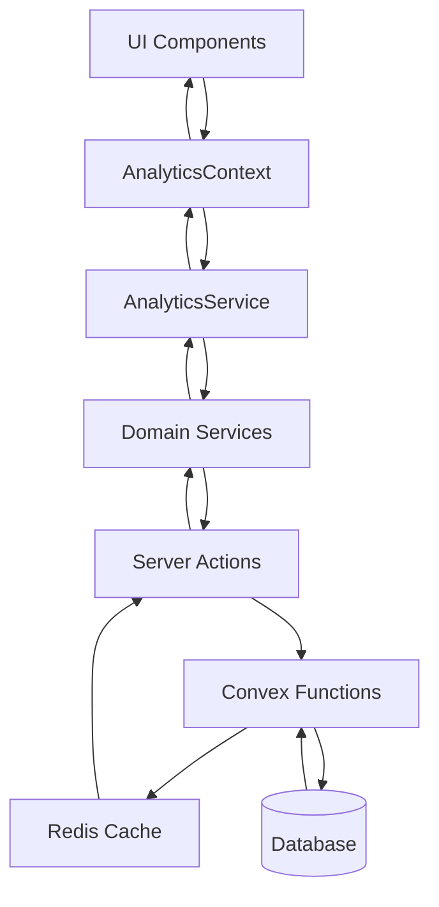

# Domain Refactoring Lessons Learned

## Overview

This document captures key lessons learned from refactoring the monolithic analytics system into a domain-driven architecture. The refactoring involved separating analytics concerns by domain (campaigns, domains, mailboxes, leads, templates, billing) while maintaining backward compatibility and improving performance.

## Architectural Lessons

### Domain-Driven Design Benefits

**Lesson**: Separating analytics by domain significantly improves maintainability and team productivity.

**Before**: Monolithic analytics service with 2000+ lines of code handling all domains

```typescript
// Single massive service handling everything
class AnalyticsService {
  getCampaignMetrics() {
    /* 200 lines */
  }
  getDomainHealth() {
    /* 150 lines */
  }
  getMailboxPerformance() {
    /* 300 lines */
  }
  getLeadEngagement() {
    /* 250 lines */
  }
  // ... 15+ more methods
}
```

**After**: Domain-specific services with clear boundaries

```typescript
// Focused, maintainable services
class CampaignAnalyticsService {
  getPerformanceMetrics() {
    /* 50 lines */
  }
  getTimeSeriesData() {
    /* 40 lines */
  }
  getSequenceAnalytics() {
    /* 60 lines */
  }
}

class DomainAnalyticsService {
  getDomainHealth() {
    /* 45 lines */
  }
  getReputationTrends() {
    /* 35 lines */
  }
  getDeliverabilityMetrics() {
    /* 40 lines */
  }
}
```

**Benefits Realized**:

- **Reduced complexity**: Each service has single responsibility
- **Improved testability**: Isolated domain logic easier to test
- **Team scalability**: Multiple developers can work on different domains simultaneously
- **Faster development**: Smaller, focused codebases are easier to understand and modify

### Service Composition Patterns

**Lesson**: Use composition over inheritance for analytics services.

```typescript
// ✅ Good - Composition pattern
interface AnalyticsService {
  campaigns: CampaignAnalyticsService;
  domains: DomainAnalyticsService;
  mailboxes: MailboxAnalyticsService;
  leads: LeadAnalyticsService;
  templates: TemplateAnalyticsService;
  billing: BillingAnalyticsService;
}

class AnalyticsServiceImpl implements AnalyticsService {
  constructor(
    public campaigns: CampaignAnalyticsService,
    public domains: DomainAnalyticsService,
    public mailboxes: MailboxAnalyticsService,
    public leads: LeadAnalyticsService,
    public templates: TemplateAnalyticsService,
    public billing: BillingAnalyticsService
  ) {}

  // Cross-domain operations
  async getOverviewMetrics(
    filters: AnalyticsFilters
  ): Promise<OverviewMetrics> {
    const [campaignMetrics, domainMetrics, mailboxMetrics] = await Promise.all([
      this.campaigns.getPerformanceMetrics(undefined, filters),
      this.domains.getDomainHealth(undefined, filters),
      this.mailboxes.getMailboxPerformance([], filters),
    ]);

    return aggregateOverviewMetrics(
      campaignMetrics,
      domainMetrics,
      mailboxMetrics
    );
  }
}
```

**Benefits**:

- **Flexibility**: Easy to swap out individual domain services
- **Testing**: Mock individual services for unit testing
- **Reusability**: Domain services can be used independently
- **Maintenance**: Changes to one domain don't affect others

### Data Flow Architecture

**Lesson**: Implement clear data flow patterns for analytics processing.



**Key Principles**:

1. **Unidirectional data flow**: Data flows down, events flow up
2. **Layer separation**: Each layer has specific responsibilities
3. **Caching integration**: Cache at the appropriate layer (server actions)
4. **Error boundaries**: Handle errors at each layer appropriately

## Performance Optimization Lessons

### Parallel Domain Loading

**Lesson**: Load domain analytics in parallel to improve perceived performance.

```typescript
// ✅ Good - Parallel loading
export function AnalyticsDashboard({ companyId }: { companyId: string }) {
  const analyticsService = useAnalyticsService();

  // All domains load in parallel
  const campaignMetrics = useQuery(['campaigns', companyId], () =>
    analyticsService.campaigns.getPerformanceMetrics()
  );

  const domainHealth = useQuery(['domains', companyId], () =>
    analyticsService.domains.getDomainHealth()
  );

  const mailboxPerformance = useQuery(['mailboxes', companyId], () =>
    analyticsService.mailboxes.getMailboxPerformance([])
  );

  // Show progressive loading
  return (
    <div className="analytics-dashboard">
      <CampaignMetricsCard data={campaignMetrics.data} loading={campaignMetrics.isLoading} />
      <DomainHealthCard data={domainHealth.data} loading={domainHealth.isLoading} />
      <MailboxPerformanceCard data={mailboxPerformance.data} loading={mailboxPerformance.isLoading} />
    </div>
  );
}
```

**Performance Improvements**:

- **Reduced total loading time**: From 3-4 seconds sequential to 1-2 seconds parallel
- **Better user experience**: Progressive loading shows data as it becomes available
- **Improved perceived performance**: Users see partial data immediately

### Intelligent Caching Strategies

**Lesson**: Implement domain-specific caching strategies based on data characteristics.

```typescript
// Domain-specific cache TTL based on data volatility
const CACHE_STRATEGIES = {
  campaigns: {
    performance: 300, // 5 minutes - changes frequently during active campaigns
    historical: 3600, // 1 hour - historical data changes less frequently
  },
  domains: {
    health: 900, // 15 minutes - reputation changes slowly
    authentication: 86400, // 24 hours - DNS records rarely change
  },
  mailboxes: {
    realtime: 60, // 1 minute - warmup status changes frequently
    performance: 600, // 10 minutes - performance metrics update regularly
  },
  templates: {
    usage: 1800, // 30 minutes - usage patterns change moderately
    effectiveness: 3600, // 1 hour - effectiveness metrics are more stable
  },
};

// Implementation
export class CampaignAnalyticsService {
  async getPerformanceMetrics(
    campaignIds?: string[],
    filters?: AnalyticsFilters
  ): Promise<CampaignPerformanceMetrics> {
    const cacheKey = this.generateCacheKey("performance", campaignIds, filters);
    const ttl = this.isHistoricalData(filters)
      ? CACHE_STRATEGIES.campaigns.historical
      : CACHE_STRATEGIES.campaigns.performance;

    return await this.cacheManager.getOrSet(
      cacheKey,
      () => this.fetchPerformanceMetrics(campaignIds, filters),
      ttl
    );
  }
}
```

### Progressive Data Loading

**Lesson**: Implement progressive loading for better user experience.

```typescript
// Progressive loading pattern
export function useProgressiveAnalytics(companyId: string) {
  const [loadingStage, setLoadingStage] = useState<'overview' | 'details' | 'complete'>('overview');

  // Stage 1: Load overview metrics first (fastest)
  const overviewMetrics = useQuery(
    ['analytics', 'overview', companyId],
    () => analyticsService.getOverviewMetrics({ companyId }),
    { enabled: loadingStage ==view' }
  );

  // Stage 2: Load detailed metrics after overview
  const detailedMetrics = useQuery(
    ['analytics', 'detailed', companyId],
    () => analyticsService.getDetailedMetrics({ companyId }),
    { enabled: loadingStage === 'details' && overviewMetrics.isSuccess }
  );

  // Stage 3: Load time series data last (slowest)
  const timeSeriesData = useQuery(
    ['analytics', 'timeseries', companyId],
    () => analyticsService.getTimeSeriesData({ companyId }),
    { enabled: loadingStage === 'complete' && detailedMetrics.isSuccess }
  );

  // Progress through stages automatically
  useEffect(() => {
    if (overviewMetrics.isSuccess && loadingStage === 'overview') {
      setLoadingStage('details');
    } else if (detailedMetrics.isSuccess && loadingStage === 'details') {
      setLoadingStage('complete');
    }
  }, [overviewMetrics.isSuccess, detailedMetrics.isSuccess, loadingStage]);

  return {
    overview: overviewMetrics.data,
    detailed: detailedMetrics.data,
    timeSeries: timeSeriesData.data,
    isLoading: loadingStage !== 'complete' || timeSeriesData.isLoading
  };
}
```

## Context Management Lessons

### Simplified State Management

**Lesson**: Keep context focused on UI state, not data fetching.

```typescript
// ✅ Good - Context handles UI state only
interface AnalyticsContextState {
  // UI state management
  filters: AnalyticsFilters;
  selectedDomains: AnalyticsDomain[];
  loading: Record<AnalyticsDomain, boolean>;
  errors: Record<AnalyticsDomain, string | null>;

  // Filter management
  updateFilters: (filters: Partial<AnalyticsFilters>) => void;
  resetFilters: () => void;

  // Service access (not data)
  services: AnalyticsService;
}

// ❌ Bad - Context trying to manage data
interface BadAnalyticsContextState {
  // Too much data in context
  campaignMetrics: CampaignMetrics[];
  domainHealth: DomainHealth[];
  mailboxPerformance: MailboxPerformance[];
  // ... lots of data

  // Complex data management
  refreshCampaigns: () => Promise<void>;
  refreshDomains: () => Promise<void>;
  // ... many refresh functions
}
```

**Benefits of Simplified Context**:

- **Better performance**: Less re-renders due to data changes
- **Clearer separation**: UI state vs. server state
- **Easier testing**: Mock services instead of complex context state
- **Better caching**: React Query handles data caching optimally

### Filter State Management

**Lesson**: Implement centralized filter management with URL synchronization.

```typescript
export function useAnalyticsFilters() {
  const [searchParams, setSearchParams] = useSearchParams();

  // Parse filters from URL
  const filters = useMemo(
    () => ({
      dateRange:
        (searchParams.get("dateRange") as DateRangePreset) || "last30d",
      granularity:
        (searchParams.get("granularity") as DataGranularity) || "day",
      campaigns:
        searchParams.get("campaigns")?.split(",").filter(Boolean) || [],
      mailboxes:
        searchParams.get("mailboxes")?.split(",").filter(Boolean) || [],
      domains: searchParams.get("domains")?.split(",").filter(Boolean) || [],
    }),
    [searchParams]
  );

  // Update filters and URL
  const updateFilters = useCallback(
    (newFilters: Partial<AnalyticsFilters>) => {
      const updatedFilters = { ...filters, ...newFilters };

      const params = new URLSearchParams();
      params.set("dateRange", updatedFilters.dateRange);
      params.set("granularity", updatedFilters.granularity);

      if (updatedFilters.campaigns.length > 0) {
        params.set("campaigns", updatedFilters.campaigns.join(","));
      }

      if (updatedFilters.mailboxes.length > 0) {
        params.set("mailboxes", updatedFilters.mailboxes.join(","));
      }

      if (updatedFilters.domains.length > 0) {
        params.set("domains", updatedFilters.domains.join(","));
      }

      setSearchParams(params);
    },
    [filters, setSearchParams]
  );

  return { filters, updateFilters };
}
```

**Benefits**:

- **Shareable URLs**: Users can bookmark and share filtered views
- **Browser navigation**: Back/forward buttons work correctly
- **Persistence**: Filters persist across page reloads
- **Deep linking**: Direct links to specific filtered views

## Error Handling and Resilience

### Graceful Degradation by Domain

**Lesson**: Implement domain-specific error handling to prevent total failure.

```typescript
export function AnalyticsDashboard() {
  const { services } = useAnalyticsContext();

  return (
    <div className="analytics-dashboard">
      <ErrorBoundary
        fallback={<CampaignMetricsError />}
        onError={(error) => logError('campaigns', error)}
      >
        <CampaignMetricsSection service={services.campaigns} />
      </ErrorBoundary>

      <ErrorBoundary
        fallback={<DomainHealthError />}
        onError={(error) => logError('domains', error)}
      >
        <DomainHealthSection service={services.domains} />
      </ErrorBoundary>

      <ErrorBoundary
        fallback={<MailboxPerformanceError />}
        onError={(error) => logError('mailboxes', error)}
      >
        <MailboxPerformanceSection service={services.mailboxes} />
      </ErrorBoundary>
    </div>
  );
}

// Domain-specific error components
function CampaignMetricsError() {
  return (
    <div className="error-card">
      <h3>Campaign Metrics Unavailable</h3>
      <p>Unable to load campaign analytics. Other metrics are still available.</p>
      <button onClick={() => window.location.reload()}>Retry</button>
    </div>
  );
}
```

### Retry Strategies

**Lesson**: Implement domain-specific retry strategies based on error types.

```typescript
export class DomainAnalyticsService {
  private retryConfig = {
    maxRetries: 3,
    baseDelay: 1000,
    maxDelay: 10000,
    retryableErrors: ["NETWORK_ERROR", "TIMEOUT", "SERVICE_UNAVAILABLE"],
  };

  async getDomainHealth(
    domainIds?: string[],
    filters?: AnalyticsFilters
  ): Promise<DomainHealthMetrics> {
    return await this.withRetry(
      () => this.fetchDomainHealth(domainIds, filters),
      this.retryConfig
    );
  }

  private async withRetry<T>(
    operation: () => Promise<T>,
    config: RetryConfig
  ): Promise<T> {
    let lastError: Error;

    for (let attempt = 0; attempt <= config.maxRetries; attempt++) {
      try {
        return await operation();
      } catch (error) {
        lastError = error as Error;

        // Don't retry non-retryable errors
        if (!this.isRetryableError(error, config.retryableErrors)) {
          throw error;
        }

        // Don't retry on last attempt
        if (attempt === config.maxRetries) {
          break;
        }

        // Calculate delay with exponential backoff
        const delay = Math.min(
          config.baseDelay * Math.pow(2, attempt),
          config.maxDelay
        );

        await new Promise((resolve) => setTimeout(resolve, delay));
      }
    }

    throw lastError;
  }
}
```

## Testing Lessons

### Domain-Specific Testing

**Lesson**: Test each domain service independently with focused test suites.

```typescript
// Campaign analytics service tests
describe("CampaignAnalyticsService", () => {
  let service: CampaignAnalyticsService;
  let mockConvexHelper: jest.Mocked<ConvexQueryHelper>;

  beforeEach(() => {
    mockConvexHelper = createMockConvexHelper();
    service = new CampaignAnalyticsService(mockConvexHelper);
  });

  describe("getPerformanceMetrics", () => {
    it("should return performance metrics for specific campaigns", async () => {
      const mockData = createMockCampaignMetrics();
      mockConvexHelper.query.mockResolvedValue(mockData);

      const result = await service.getPerformanceMetrics([
        "campaign-1",
        "campaign-2",
      ]);

      expect(result).toEqual(mockData);
      expect(mockConvexHelper.query).toHaveBeenCalledWith(
        api.campaigns.getPerformanceMetrics,
        { campaignIds: ["campaign-1", "campaign-2"] }
      );
    });

    it("should handle empty campaign list", async () => {
      const mockData = createMockCampaignMetrics();
      mockConvexHelper.query.mockResolvedValue(mockData);

      const result = await service.getPerformanceMetrics([]);

      expect(result).toEqual(mockData);
      expect(mockConvexHelper.query).toHaveBeenCalledWith(
        api.campaigns.getPerformanceMetrics,
        { campaignIds: [] }
      );
    });

    it("should handle service errors gracefully", async () => {
      mockConvexHelper.query.mockRejectedValue(
        new Error("Service unavailable")
      );

      await expect(
        service.getPerformanceMetrics(["campaign-1"])
      ).rejects.toThrow("Service unavailable");
    });
  });
});
```

### Integration Testing

**Lesson**: Test cross-domain interactions and service composition.

```typescript
describe("AnalyticsService Integration", () => {
  let analyticsService: AnalyticsService;

  beforeEach(() => {
    analyticsService = createTestAnalyticsService();
  });

  it("should aggregate overview metrics from all domains", async () => {
    // Mock data from each domain service
    mockCampaignService.getPerformanceMetrics.mockResolvedValue(
      mockCampaignMetrics
    );
    mockDomainService.getDomainHealth.mockResolvedValue(mockDomainHealth);
    mockMailboxService.getMailboxPerformance.mockResolvedValue(
      mockMailboxPerformance
    );

    const result = await analyticsService.getOverviewMetrics({
      dateRange: "last30d",
      granularity: "day",
    });

    expect(result).toMatchObject({
      totalEmailsSent: expect.any(Number),
      overallOpenRate: expect.any(Number),
      overallClickRate: expect.any(Number),
      activeCampaigns: expect.any(Number),
      activeMailboxes: expect.any(Number),
      totalDomains: expect.any(Number),
    });
  });

  it("should handle partial failures gracefully", async () => {
    // Campaign service fails, others succeed
    mockCampaignService.getPerformanceMetrics.mockRejectedValue(
      new Error("Campaign service down")
    );
    mockDomainService.getDomainHealth.mockResolvedValue(mockDomainHealth);
    mockMailboxService.getMailboxPerformance.mockResolvedValue(
      mockMailboxPerformance
    );

    const result = await analyticsService.getOverviewMetrics({
      dateRange: "last30d",
      granularity: "day",
    });

    // Should still return metrics from working services
    expect(result.totalDomains).toBeGreaterThan(0);
    expect(result.activeMailboxes).toBeGreaterThan(0);
    // Campaign-related metrics should be 0 or null
    expect(result.activeCampaigns).toBe(0);
  });
});
```

## Migration Strategy Lessons

### Backward Compatibility

**Lesson**: Maintain backward compatibility during the transition period.

```typescript
// Legacy analytics service (deprecated but functional)
export class LegacyAnalyticsService {
  constructor(private newAnalyticsService: AnalyticsService) {}

  // Legacy method - delegates to new service
  async getCampaignMetrics(campaignIds: string[]): Promise<any> {
    console.warn(
      "getCampaignMetrics is deprecated. Use campaigns.getPerformanceMetrics instead."
    );

    return await this.newAnalyticsService.campaigns.getPerformanceMetrics(
      campaignIds,
      { dateRange: "last30d", granularity: "day" }
    );
  }

  // Legacy method - delegates to new service
  async getDomainHealth(domainIds: string[]): Promise<any> {
    console.warn(
      "getDomainHealth is deprecated. Use domains.getDomainHealth instead."
    );

    return await this.newAnalyticsService.domains.getDomainHealth(domainIds, {
      dateRange: "last30d",
      granularity: "day",
    });
  }
}

// Provide both old and new interfaces during transition
export function createAnalyticsService(): {
  analytics: AnalyticsService;
  legacyAnalytics: LegacyAnalyticsService;
} {
  const analytics = new AnalyticsServiceImpl(/* ... */);
  const legacyAnalytics = new LegacyAnalyticsService(analytics);

  return { analytics, legacyAnalytics };
}
```

### Gradual Migration

**Lesson**: Migrate components gradually, one domain at a time.

```typescript
// Migration phases
const MIGRATION_PHASES = {
  PHASE_1: ["campaigns"], // Start with most stable domain
  PHASE_2: ["campaigns", "domains"], // Add domains
  PHASE_3: ["campaigns", "domains", "mailboxes"], // Add mailboxes
  PHASE_4: ["campaigns", "domains", "mailboxes", "leads"], // Add leads
  PHASE_5: ["campaigns", "domains", "mailboxes", "leads", "templates"], // Add templates
  PHASE_6: [
    "campaigns",
    "domains",
    "mailboxes",
    "leads",
    "templates",
    "billing",
  ], // Complete
};

// Feature flag controlled migration
export function useAnalyticsService() {
  const currentPhase = useFeatureFlag("analytics-migration-phase", "PHASE_1");
  const enabledDomains = MIGRATION_PHASES[currentPhase];

  return useMemo(() => {
    const services = createAnalyticsService();

    // Wrap services to use legacy fallback for disabled domains
    return {
      campaigns: enabledDomains.includes("campaigns")
        ? services.analytics.campaigns
        : createLegacyCampaignService(),
      domains: enabledDomains.includes("domains")
        ? services.analytics.domains
        : createLegacyDomainService(),
      // ... other domains
    };
  }, [currentPhase, enabledDomains]);
}
```

## Key Takeaways

1. **Domain Separation**: Separating analytics by domain dramatically improves maintainability and team productivity
2. **Service Composition**: Use composition over inheritance for flexible, testable service architecture
3. **Parallel Loading**: Load domain analytics in parallel for better performance and user experience
4. **Progressive Loading**: Implement progressive data loading to show value quickly
5. **Intelligent Caching**: Use domain-specific caching strategies based on data volatility
6. **Graceful Degradation**: Implement domain-specific error handling to prevent total system failure
7. **Simplified Context**: Keep React context focused on UI state, not data management
8. **URL Synchronization**: Synchronize filters with URL for better user experience
9. **Independent Testing**: Test each domain service independently for better test coverage
10. **Gradual Migration**: Use feature flags and backward compatibility for safe, gradual migration

These lessons provide a roadmap for successfully refactoring complex analytics systems while maintaining system reliability and team productivity throughout the transition.
