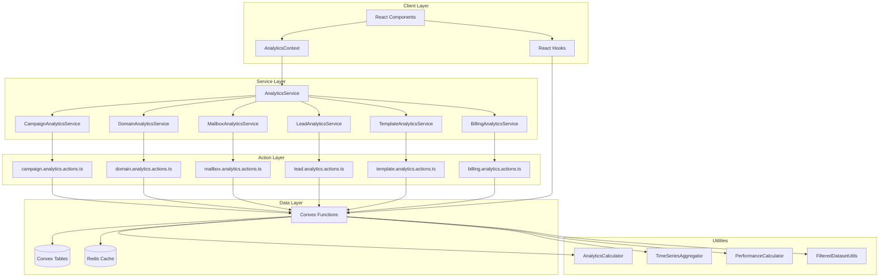

# Analytics Architecture Documentation

## Overview

The analytics system has been refactored from a monolithic approach to a scalable, domain-driven architecture. This document provides a comprehensive overview of the new architecture, its components, and how they work together.

## Architecture Principles

### 1. Domain Separation

Analytics are organized by business domains:

- **Campaigns**: Email campaign performance and sequence analytics
- **Domains**: Email domain reputation and authentication status
- **Mailboxes**: Individual mailbox performance and warmup tracking
- **Leads**: Lead engagement and conversion analytics
- **Templates**: Template usage and effectiveness metrics
- **Billing**: Usage tracking and cost analytics

### 2. Data-UI Separation

Clear separation between data concerns and UI concerns:

- **Data Types** (`types/analytics/core.ts`, `types/analytics/domain-specific.ts`): Raw data structures with no UI formatting
- **UI Types** (`types/analytics/ui.ts`): Display-specific interfaces for components and interactions
- **Calculation Layer** (`lib/utils/analytics-calculator.ts`): Standardized calculation utilities

### 3. Real-time Architecture

Built on Convex for real-time updates:

- **Server-side Computation**: Heavy analytics processing in Convex functions
- **Real-time Subscriptions**: Live updates via Convex subscriptions
- **Intelligent Caching**: Upstash Redis for performance optimization
- **Progressive Loading**: Skeleton loaders and optimistic updates

## System Architecture



## Core Components

### 1. Analytics Types System

#### Core Types (`types/analytics/core.ts`)

- **PerformanceMetrics**: Raw count data (sent, delivered, opened_tracked, etc.)
- **CalculatedRates**: Computed rates (all as decimals 0.0-1.0)
- **TimeSeriesDataPoint**: Time-based analytics data
- **AnalyticsFilters**: Database query filters
- **FilteredDataset**: Filtered data with metadata

#### Domain-Specific Types (`types/analytics/domain-specific.ts`)

- **CampaignAnalytics**: Campaign performance data
- **DomainAnalytics**: Domain reputation and authentication
- **MailboxAnalytics**: Mailbox performance and warmup status
- **LeadAnalytics**: Lead engagement metrics
- **TemplateAnalytics**: Template usage and effectiveness
- **BillingAnalytics**: Usage and cost tracking

#### UI Types (`types/analytics/ui.ts`)

- **AnalyticsUIFilters**: UI filter state management
- **KPIDisplayConfig**: Dashboard card configuration
- **ChartDataPoint**: Chart-ready data format
- **AnalyticsLoadingState**: Progressive loading states

### 2. Calculation Utilities

#### AnalyticsCalculator (`lib/utils/analytics-calculator.ts`)

Core calculation utilities with standardized methods:

```typescript
// Rate calculations (all return decimals 0.0-1.0)
AnalyticsCalculator.calculateOpenRate(opened_tracked, delivered);
AnalyticsCalculator.calculateClickRate(clicked_tracked, delivered);
AnalyticsCalculator.calculateReplyRate(replied, delivered);
AnalyticsCalculator.calculateBounceRate(bounced, sent);

// Comprehensive calculations
AnalyticsCalculator.calculateAllRates(metrics);
AnalyticsCalculator.calculateHealthScore(metrics);
AnalyticsCalculator.calculateKPIMetrics(metrics);

// Data formatting
AnalyticsCalculator.formatRateAsPercentage(rate);
AnalyticsCalculator.formatNumber(number);

// Data validation
AnalyticsCalculator.validateMetrics(metrics);
```

#### TimeSeriesAggregator

Handles time-based data aggregation:

```typescript
// Aggregate by time periods
TimeSeriesAggregator.aggregateByGranularity(dataPoints, "day");
TimeSeriesAggregator.fillMissingPeriods(dataPoints, startDate, endDate, "week");

// Advanced analytics
TimeSeriesAggregator.calculateMovingAverage(
  dataPoints,
  windowSize,
  "opened_tracked"
);
TimeSeriesAggregator.calculateGrowthRates(dataPoints, "sent");
```

#### PerformanceCalculator

Advanced performance analysis:

```typescript
// Comparative analysis
PerformanceCalculator.calculateComparativePerformance(current, previous);

// Benchmarking
PerformanceCalculator.calculatePerformanceBenchmarks(metrics);
```

#### FilteredDatasetUtils

Data filtering and preparation:

```typescript
// Create filtered datasets
FilteredDatasetUtils.createFilteredDataset(
  data,
  filters,
  totalCount,
  queryTime
);

// Apply filters
FilteredDatasetUtils.applyDateRangeFilter(data, dateRange);
FilteredDatasetUtils.applyEntityFilter(data, entityIds);

// Compute analytics on filtered data
FilteredDatasetUtils.computeAnalyticsOnFilteredData(filteredDataset, options);
```

### 3. Service Architecture

#### Base Service Pattern

All domain services follow a consistent pattern:

```typescript
interface BaseDomainService {
  // Standard analytics with optional filters
  getPerformanceMetrics(entityIds?: string[], filters?: AnalyticsFilters): Promise<PerformanceMetrics>;

  // Time series data
  getTimeSeriesData(entityIds?: string[], filters?: AnalyticsFilters): Promise<TimeSeriesDataPoint[]>;
 Filtered data analytics
  computeAnalyticsForFilteredData(
    filteredData: any[],
    computeOptions: AnalyticsComputeOptions
  ): Promise<any>;
}
```

#### Domain Services

Each domain has a dedicated service:

- **CampaignAnalyticsService**: Campaign performance, sequence analytics, lead engagement
- **DomainAnalyticsService**: Domain health, reputation trends, authentication status
- **MailboxAnalyticsService**: Mailbox performance, warmup tracking, health scores
- **LeadAnalyticsService**: Lead engagement, conversion funnels, segmentation
- **TemplateAnalyticsService**: Template performance, usage analytics, effectiveness
- **BillingAnalyticsService**: Usage metrics, cost analytics, plan utilization

### 4. Data Flow

#### 1. Data Storage (Convex)

Analytics data is stored in Convex tables with standardized schemas:

```typescript
// Example: Campaign Analytics Table
campaignAnalytics: defineTable({
  campaignId: v.id("campaigns"),
  date: v.string(),
  sent: v.number(),
  delivered: v.number(),
  opened_tracked: v.number(),
  clicked_tracked: v.number(),
  replied: v.number(),
  bounced: v.number(),
  unsubscribed: v.number(),
  spamComplaints: v.number(),
  companyId: v.string(),
  updatedAt: v.number(),
});
```

#### 2. Server Computation (Convex Functions)

Heavy analytics computations happen server-side:

```typescript
// Example: Campaign Analytics Query
export const getCampaignAnalytics = query({
  args: {
    campaignIds: v.optional(v.array(v.id("campaigns"))),
    dateRange: v.optional(
      v.object({
        start: v.string(),
        end: v.string(),
      })
    ),
    companyId: v.string(),
  },
  handler: async (ctx, args) => {
    // Server-side filtering and computation
    const analytics = await ctx.db
      .query("campaignAnalytics")
      .withIndex("by_company_date", (q) => q.eq("companyId", args.companyId))
      .filter(/* date and entity filters */)
      .collect();

    // Aggregate and calculate metrics server-side
    return processAnalyticsData(analytics);
  },
});
```

#### 3. Caching Layer (Upstash Redis)

Intelligent caching with structured keys:

```typescript
// Cache key structure
const cacheKey = `analytics:${domain}:${operation}:${entityIds}:${filters}:${timestamp}`;

// Example: Campaign performance cache
const cacheKey =
  "analytics:campaigns:performance:campaign123,campaign456:last30d:20241201";

// Cache with appropriate TTL
await redis.setex(cacheKey, CACHE_TTL.RECENT, JSON.stringify(result));
```

#### 4. Real-time Updates (Convex Subscriptions)

Live updates via Convex subscriptions:

```typescript
// React hook for real-time campaign analytics
export function useCampaignAnalytics(campaignId: string) {
  const analytics = useQuery(api.analytics.getCampaignAnalytics, {
    campaignIds: [campaignId],
    companyId: getCurrentCompanyId(),
  });

  // Automatically updates when data changes in Convex
  return {
    analytics,
    loading: analytics === undefined,
    rates: analytics ? AnalyticsCalculator.calculateAllRates(analytics) : null,
  };
}
```

## Key Features

### 1. Standardized Field Names

All analytics use consistent field names:

- `opened_tracked` (not `opens`)
- `clicked_tracked` (not `clicks`)
- `spamComplaints` (not `spamFlags`)
- `bounced` (not `bounces`)

### 2. Calculated Rates

Rates are never stored, always calculated on-demand:

- All rates are decimals (0.0-1.0)
- Consistent calculation methods across domains
- Validation and error handling built-in

### 3. Progressive Loading

Optimized user experience:

- Skeleton loaders during server computation
- Progressive domain loading
- Optimistic updates for interactions
- Error boundaries for resilience

### 4. Cross-Domain Analytics

Coordinated analytics across domains:

- Filter propagation between domains
- Aggregated overview metrics
- Cross-domain comparisons
- Unified error handling

## Performance Optimizations

### 1. Server-Side Computation

Heavy calculations happen in Convex functions:

- Reduces client-side processing
- Consistent results across clients
- Better caching opportunities
- Real-time update efficiency

### 2. Intelligent Caching

Multi-layer caching strategy:

- **Redis Cache**: Long-term storage for expensive computations
- **Convex Cache**: Built-in query result caching
- **React Query Cache**: Client-side caching with automatic invalidation

### 3. Efficient Queries

Optimized database queries:

- Filter at database level before computation
- Indexed queries for performance
- Batch operations where possible
- Pagination for large datasets

### 4. Real-time Efficiency

Optimized real-time updates:

- Selective subscriptions based on user context
- Throttled updates to prevent UI thrashing
- Optimistic updates for immediate feedback
- Graceful degradation when offline

## Error Handling

### 1. Domain Isolation

Errors in one domain don't affect others:

- Independent error states per domain
- Graceful degradation strategies
- Fallback to cached data when available
- Clear error messages with recovery options

### 2. Validation

Comprehensive data validation:

- Input validation at service boundaries
- Metric validation before calculations
- Type safety throughout the system
- Runtime checks for data integrity

### 3. Resilience

Built-in resilience patterns:

- Retry logic with exponential backoff
- Circuit breaker patterns for external services
- Timeout handling for long-running operations
- Monitoring and alerting for system health

## Migration Strategy

The architecture supports gradual migration:

1. **Backward Compatibility**: Old types marked as deprecated but still functional
2. **Incremental Adoption**: New services can be adopted domain by domain
3. **Data Migration**: Utilities provided for migrating existing data
4. **Testing Support**: Comprehensive test utilities for validation

## Best Practices

### 1. Type Safety

- Always use the standardized types
- Validate data at service boundaries
- Use TypeScript strict mode
- Leverage compile-time error checking

### 2. Performance

- Calculate rates on-demand, don't store them
- Use appropriate caching strategies
- Implement progressive loading
- Monitor performance metrics

### 3. Maintainability

- Follow domain separation principles
- Use shared utilities for calculations
- Implement comprehensive error handling
- Write tests for all critical paths

### 4. User Experience

- Implement skeleton loaders
- Provide meaningful error messages
- Use optimistic updates where appropriate
- Ensure responsive design patterns

## Monitoring and Observability

### 1. Performance Metrics

- Query execution times
- Cache hit/miss ratios
- Real-time subscription performance
- Error rates by domain

### 2. Business Metrics

- Analytics calculation accuracy
- Data freshness indicators
- User engagement with analytics features
- System reliability metrics

### 3. Alerting

- Performance threshold violations
- High error rates
- Cache performance degradation
- Data inconsistency detection

This architecture provides a scalable, maintainable foundation for analytics that can grow with the application's needs while maintaining excellent performance and user experience.
