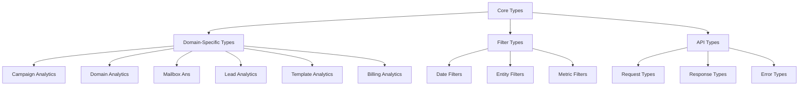

# Analytics Type System

## Overview

This directory contains all TypeScript type definitions for the analytics system, organized by domain and functionality. The type system provides end-to-end type safety from database queries through UI components, ensuring data consistency and developer productivity.

## Architecture

### Type Organization

```
types/analytics/
├── README.md                    # This file
├── type-limitations.md         # Analytics-specific type constraints
├── core.ts                     # Core analytics types and interfaces
├── domain-specific.ts          # Domain-specific analytics types
├── filters.ts                  # Filter and query parameter types
├── charts.ts                   # Chart and visualization types
├── components.ts               # Component prop types
├── api.ts                      # API request/response types
├── convex.ts                   # Convex-specific type definitions
└── utils.ts                    # Utility and helper types
```

### Type Hierarchy



## Core Types

### Base Analytics Types

```typescript
// types/analytics/core.ts

/**
 * Base performance metrics used across all analytics domains
 */
export interface PerformanceMetrics {
  /** Total number of emails sent */
  sent: number;
  /** Number of emails successfully delivered */
  delivered: number;
  /** Number of emails opened (tracked) */
  opened_tracked: number;
  /** Number of emails clicked (tracked) */
  clicked_tracked: number;
  /** Number of replies received */
  replied: number;
  /** Number of emails bounced */
  bounced: number;
  /** Number of unsubscribes */
  unsubscribed: number;
  /** Number of spam complaints */
  spamComplaints: number;

  // Calculated rates (as decimals, e.g., 0.25 for 25%)
  /** Delivery rate (delivered / sent) */
  deliveryRate: number;
  /** Open rate (opened / delivered) */
  openRate: number;
  /** Click rate (clicked / delivered) */
  clickRate: number;
  /** Reply rate (replied / delivered) */
  replyRate: number;
  /** Bounce rate (bounced / sent) */
  bounceRate: number;
  /** Unsubscribe rate (unsubscribed / delivered) */
  unsubscribeRate: number;
  /** Spam rate (spam complaints / delivered) */
  spamRate: number;
}

/**
 * Time series data point for analytics charts
 */
export interface TimeSeriesDataPoint {
  /** Date in YYYY-MM-DD format */
  date: string;
  /** Display label for the data point */
  label: string;
  /** Metric values for this time period */
  metrics: Record<string, number>;
  /** Additional metadata */
  metadata?: Record<string, unknown>;
}

/**
 * Analytics filters for querying data
 */
export interface AnalyticsFilters {
  /** Date range preset or custom range */
  dateRange: DateRangePreset | CustomDateRange;
  /** Data granularity for time series */
  granularity: DataGranularity;
  /** Campaign IDs to filter by */
  campaigns?: string[];
  /** Mailbox IDs to filter by */
  mailboxes?: string[];
  /** Domain IDs to filter by */
  domains?: string[];
  /** Lead list IDs to filter by */
  leads?: string[];
  /** Template IDs to filter by */
  templates?: string[];
  /** Additional custom filters */
  customFilters?: Record<string, unknown>;
}

/**
 * Date range presets
 */
export type DateRangePreset =
  | "today"
  | "yesterday"
  | "last7d"
  | "last30d"
  | "last90d"
  | "thisMonth"
  | "lastMonth"
  | "thisQuarter"
  | "lastQuarter"
  | "thisYear"
  | "lastYear";

/**
 * Custom date range
 */
export interface CustomDateRange {
  /** Start date in YYYY-MM-DD format */
  start: string;
  /** End date in YYYY-MM-DD format */
  end: string;
}

/**
 * Data granularity for time series
 */
export type DataGranularity =
  | "hour"
  | "day"
  | "week"
  | "month"
  | "quarter"
  | "year";

/**
 * Analytics domain types
 */
export type AnalyticsDomain =
  | "campaigns"
  | "domains"
  | "mailboxes"
  | "leads"
  | "templates"
  | "billing";

/**
 * Generic analytics result wrapper
 */
export interface AnalyticsResult<T> {
  /** The analytics data */
  data: T;
  /** Metadata about the query */
  metadata: {
    /** Query execution time in milliseconds */
    executionTime: number;
    /** Total number of records before filtering */
    totalRecords: number;
    /** Number of records after filtering */
    filteredRecords: number;
    /** Cache hit/miss status */
    cacheStatus: "hit" | "miss";
    /** Query timestamp */
    timestamp: string;
  };
}
```

## Domain-Specific Types

### Campaign Analytics Types

```typescript
// types/analytics/domain-specific.ts

/**
 * Campaign analytics data
 */
export interface CampaignAnalytics extends PerformanceMetrics {
  /** Campaign identifier */
  campaignId: string;
  /** Campaign name */
  campaignName: string;
  /** Campaign status */
  status: CampaignStatus;
  /** Number of leads in campaign */
  leadCount: number;
  /** Number of active leads */
  activeLeads: number;
  /** Number of completed leads */
  completedLeads: number;
  /** Sequence step analytics */
  sequenceSteps: SequenceStepAnalytics[];
  /** Campaign start date */
  startDate: string;
  /** Campaign end date (if completed) */
  endDate?: string;
}

/**
 * Campaign status
 */
export type CampaignStatus =
  | "draft"
  | "active"
  | "paused"
  | "completed"
  | "archived";

/**
 * Sequence step analytics
 */
export interface SequenceStepAnalytics extends PerformanceMetrics {
  /** Step identifier */
  stepId: string;
  /** Step number in sequence */
  stepNumber: number;
  /** Step type */
  stepType: "email" | "wait" | "action";
  /** Email subject (for email steps) */
  subject?: string;
  /** Wait duration in hours (for wait steps) */
  waitDuration?: number;
  /** Template ID (for email steps) */
  templateId?: string;
}

/**
 * Campaign comparison data
 */
export interface CampaignComparison {
  /** Campaigns being compared */
  campaigns: CampaignAnalytics[];
  /** Comparison metrics */
  comparison: {
    /** Best performing campaign ID */
    bestPerforming: string;
    /** Metric used for comparison */
    comparisonMetric: keyof PerformanceMetrics;
    /** Performance differences */
    differences: Record<string, number>;
  };
}
```

### Domain Analytics Types

```typescript
/**
 * Domain analytics data
 */
export interface DomainAnalytics {
  /** Domain identifier */
  domainId: string;
  /** Domain name */
  domainName: string;
  /** Domain reputation score (0-100) */
  reputation: number;
  /** Overall health score (0-100) */
  healthScore: number;
  /** Authentication status */
  authentication: DomainAuthentication;
  /** Deliverability metrics */
  deliverability: DeliverabilityMetrics;
  /** Performance metrics */
  performance: PerformanceMetrics;
  /** Reputation trend data */
  reputationTrend: ReputationTrendData[];
}

/**
 * Domain authentication status
 */
export interface DomainAuthentication {
  /** SPF record status */
  spf: AuthenticationStatus;
  /** DKIM record status */
  dkim: AuthenticationStatus;
  /** DMARC record status */
  dmarc: AuthenticationStatus;
  /** Overall authentication score */
  overallScore: number;
}

/**
 * Authentication status for individual records
 */
export interface AuthenticationStatus {
  /** Whether the record is properly configured */
  configured: boolean;
  /** Whether the record is verified */
  verified: boolean;
  /** Record value */
  value?: string;
  /** Any errors or warnings */
  issues?: string[];
}

/**
 * Deliverability metrics
 */
export interface DeliverabilityMetrics {
  /** Inbox placement rate */
  inboxRate: number;
  /** Spam folder rate */
  spamRate: number;
  /** Bounce rate */
  bounceRate: number;
  /** Block rate */
  blockRate: number;
  /** Missing rate (emails not delivered anywhere) */
  missingRate: number;
}

/**
 * Reputation trend data point
 */
export interface ReputationTrendData {
  /** Date */
  date: string;
  /** Reputation score */
  reputation: number;
  /** Health score */
  healthScore: number;
  /** Volume sent */
  volume: number;
}
```

### Mailbox Analytics Types

```typescript
/**
 * Mailbox analytics data
 */
export interface MailboxAnalytics extends PerformanceMetrics {
  /** Mailbox identifier */
  mailboxId: string;
  /** Email address */
  email: string;
  /** Domain name */
  domain: string;
  /** Email provider */
  provider: string;
  /** Mailbox status */
  status: MailboxStatus;
  /** Warmup status */
  warmupStatus: WarmupStatus;
  /** Warmup progress (0-100) */
  warmupProgress: number;
  /** Health score (0-100) */
  healthScore: number;
  /** Daily sending limit */
  dailyLimit: number;
  /** Current daily volume */
  currentVolume: number;
  /** Reputation factors */
  reputationFactors: ReputationFactors;
}

/**
 * Mailbox status
 */
export type MailboxStatus = "active" | "inactive" | "suspended" | "warming";

/**
 * Warmup status
 */
export type WarmupStatus =
  | "not_started"
  | "warming"
  | "warmed"
  | "paused"
  | "failed";

/**
 * Reputation factors affecting mailbox health
 */
export interface ReputationFactors {
  /** Deliverability score (0-100) */
  deliverabilityScore: number;
  /** Spam score (0-100, lower is better) */
  spamScore: number;
  /** Bounce score (0-100, lower is better) */
  bounceScore: number;
  /** Engagement score (0-100) */
  engagementScore: number;
  /** Warmup score (0-100) */
  warmupScore: number;
}

/**
 * Warmup analytics data
 */
export interface WarmupAnalytics {
  /** Mailbox identifier */
  mailboxId: string;
  /** Total warmup emails sent */
  totalWarmups: number;
  /** Spam flags received */
  spamFlags: number;
  /** Replies received */
  replies: number;
  /** Progress percentage */
  progressPercentage: number;
  /** Daily warmup statistics */
  dailyStats: DailyWarmupStats[];
}

/**
 * Daily warmup statistics
 */
export interface DailyWarmupStats {
  /** Date */
  date: string;
  /** Warmup emails sent */
  sent: number;
  /** Replies received */
  replies: number;
  /** Spam flags */
  spamFlags: number;
  /** Success rate */
  successRate: number;
}
```

## Filter Types

```typescript
// types/analytics/filters.ts

/**
 * Date range filter options
 */
export interface DateRangeFilter {
  /** Filter type */
  type: "preset" | "custom";
  /** Preset value (if type is 'preset') */
  preset?: DateRangePreset;
  /** Custom range (if type is 'custom') */
  custom?: CustomDateRange;
}

/**
 * Entity filter for campaigns, mailboxes, etc.
 */
export interface EntityFilter {
  /** Entity type */
  type: AnalyticsDomain;
  /** Selected entity IDs */
  ids: string[];
  /** Include all entities */
  includeAll: boolean;
}

/**
 * Metric filter for specific metrics
 */
export interface MetricFilter {
  /** Metrics to include */
  include: (keyof PerformanceMetrics)[];
  /** Metrics to exclude */
  exclude: (keyof PerformanceMetrics)[];
  /** Whether to include calculated rates */
  includeRates: boolean;
}

/**
 * Advanced filter options
 */
export interface AdvancedFilters {
  /** Minimum volume threshold */
  minVolume?: number;
  /** Maximum volume threshold */
  maxVolume?: number;
  /** Minimum performance threshold */
  minPerformance?: Partial<PerformanceMetrics>;
  /** Maximum performance threshold */
  maxPerformance?: Partial<PerformanceMetrics>;
  /** Status filters */
  statusFilters?: {
    campaigns?: CampaignStatus[];
    mailboxes?: MailboxStatus[];
  };
}
```

## Chart and Visualization Types

```typescript
// types/analytics/charts.ts

/**
 * Chart configuration
 */
export interface ChartConfig {
  /** Chart type */
  type: ChartType;
  /** Chart title */
  title: string;
  /** Chart dimensions */
  dimensions: ChartDimensions;
  /** Chart colors */
  colors: string[];
  /** Whether to show legend */
  showLegend: boolean;
  /** Whether to show grid */
  showGrid: boolean;
  /** Animation settings */
  animation: AnimationConfig;
}

/**
 * Supported chart types
 */
export type ChartType =
  | "line"
  | "bar"
  | "area"
  | "pie"
  | "doughnut"
  | "scatter"
  | "heatmap";

/**
 * Chart dimensions
 */
export interface ChartDimensions {
  /** Chart width */
  width: number | string;
  /** Chart height */
  height: number | string;
  /** Responsive behavior */
  responsive: boolean;
}

/**
 * Animation configuration
 */
export interface AnimationConfig {
  /** Whether animation is enabled */
  enabled: boolean;
  /** Animation duration in milliseconds */
  duration: number;
  /** Animation easing function */
  easing: "linear" | "ease" | "ease-in" | "ease-out" | "ease-in-out";
}

/**
 * Chart data series
 */
export interface ChartSeries {
  /** Series name */
  name: string;
  /** Series data points */
  data: ChartDataPoint[];
  /** Series color */
  color?: string;
  /** Series type (for mixed charts) */
  type?: ChartType;
}

/**
 * Chart data point
 */
export interface ChartDataPoint {
  /** X-axis value */
  x: string | number | Date;
  /** Y-axis value */
  y: number;
  /** Additional metadata */
  metadata?: Record<string, unknown>;
}
```

## Component Prop Types

```typescript
// types/analytics/components.ts

/**
 * Base analytics component props
 */
export interface BaseAnalyticsProps {
  /** Component class name */
  className?: string;
  /** Loading state */
  loading?: boolean;
  /** Error state */
  error?: Error | null;
  /** Retry function */
  onRetry?: () => void;
}

/**
 * Metrics card component props
 */
export interface MetricsCardProps extends BaseAnalyticsProps {
  /** Metrics data */
  data?: PerformanceMetrics;
  /** Card title */
  title: string;
  /** Whether to show rates */
  showRates?: boolean;
  /** Comparison data */
  comparison?: PerformanceMetrics;
}

/**
 * Chart component props
 */
export interface ChartComponentProps extends BaseAnalyticsProps {
  /** Chart data */
  data: TimeSeriesDataPoint[];
  /** Chart configuration */
  config: ChartConfig;
  /** Metrics to display */
  metrics: string[];
  /** Chart height */
  height?: number;
}

/**
 * Filter component props
 */
export interface FilterComponentProps {
  /** Current filter values */
  value: AnalyticsFilters;
  /** Filter change handler */
  onChange: (filters: Partial<AnalyticsFilters>) => void;
  /** Available options */
  options?: FilterOptions;
  /** Whether filters are disabled */
  disabled?: boolean;
}

/**
 * Filter options
 */
export interface FilterOptions {
  /** Available campaigns */
  campaigns?: { id: string; name: string }[];
  /** Available mailboxes */
  mailboxes?: { id: string; email: string }[];
  /** Available domains */
  domains?: { id: string; name: string }[];
  /** Available date ranges */
  dateRanges?: DateRangePreset[];
}
```

## API Types

```typescript
// types/analytics/api.ts

/**
 * Analytics API request
 */
export interface AnalyticsRequest {
  /** Request filters */
  filters: AnalyticsFilters;
  /** Requested metrics */
  metrics?: (keyof PerformanceMetrics)[];
  /** Include time series data */
  includeTimeSeries?: boolean;
  /** Include comparison data */
  includeComparison?: boolean;
}

/**
 * Analytics API response
 */
export interface AnalyticsResponse<T> {
  /** Response data */
  data: T;
  /** Response metadata */
  metadata: ResponseMetadata;
  /** Pagination info (if applicable) */
  pagination?: PaginationInfo;
}

/**
 * Response metadata
 */
export interface ResponseMetadata {
  /** Request timestamp */
  timestamp: string;
  /** Query execution time */
  executionTime: number;
  /** Data freshness */
  dataAge: number;
  /** Cache status */
  cached: boolean;
  /** API version */
  version: string;
}

/**
 * Pagination information
 */
export interface PaginationInfo {
  /** Current page */
  page: number;
  /** Page size */
  pageSize: number;
  /** Total pages */
  totalPages: number;
  /** Total records */
  totalRecords: number;
  /** Has next page */
  hasNext: boolean;
  /** Has previous page */
  hasPrevious: boolean;
}

/**
 * API error response
 */
export interface AnalyticsError {
  /** Error type */
  type:
    | "validation"
    | "authentication"
    | "authorization"
    | "not_found"
    | "server"
    | "rate_limit";
  /** Error message */
  message: string;
  /** Error code */
  code: string;
  /** Field-specific errors */
  fieldErrors?: Record<string, string[]>;
  /** Additional error details */
  details?: Record<string, unknown>;
}
```

## Utility Types

```typescript
// types/analytics/utils.ts

/**
 * Make all properties of T optional recursively
 */
export type DeepPartial<T> = {
  [P in keyof T]?: T[P] extends object ? DeepPartial<T[P]> : T[P];
};

/**
 * Extract metric keys from PerformanceMetrics
 */
export type MetricKey = keyof PerformanceMetrics;

/**
 * Extract rate keys from PerformanceMetrics
 */
export type RateKey = Extract<MetricKey, `${string}Rate`>;

/**
 * Extract count keys from PerformanceMetrics
 */
export type CountKey = Exclude<MetricKey, RateKey>;

/**
 * Create a type with only the specified keys from T
 */
export type Pick<T, K extends keyof T> = {
  [P in K]: T[P];
};

/**
 * Create a type with all keys from T except the specified keys
 */
export type Omit<T, K extends keyof T> = Pick<T, Exclude<keyof T, K>>;

/**
 * Make specified properties required
 */
export type RequireFields<T, K extends keyof T> = T & Required<Pick<T, K>>;

/**
 * Analytics data with loading state
 */
export type AnalyticsDataState<T> = {
  data: T | null;
  loading: boolean;
  error: Error | null;
  lastUpdated: Date | null;
};

/**
 * Function type for analytics service methods
 */
export type AnalyticsServiceMethod<TArgs extends any[], TReturn> = (
  ...args: TArgs
) => Promise<TReturn>;

/**
 * Extract return type from analytics service method
 */
export type ServiceMethodReturn<T> =
  T extends AnalyticsServiceMethod<any[], infer R> ? R : never;
```

## Type Guards and Validators

```typescript
// Type guards for runtime type checking
export function isPerformanceMetrics(obj: unknown): obj is PerformanceMetrics {
  return (
    typeof obj === "object" &&
    obj !== null &&
    typeof (obj as any).sent === "number" &&
    typeof (obj as any).delivered === "number" &&
    typeof (obj as any).opened_tracked === "number"
  );
}

export function isAnalyticsFilters(obj: unknown): obj is AnalyticsFilters {
  return (
    typeof obj === "object" &&
    obj !== null &&
    "dateRange" in obj &&
    "granularity" in obj
  );
}

export function isTimeSeriesDataPoint(
  obj: unknown
): obj is TimeSeriesDataPoint {
  return (
    typeof obj === "object" &&
    obj !== null &&
    typeof (obj as any).date === "string" &&
    typeof (obj as any).metrics === "object"
  );
}
```

## Best Practices

1. **Use strict types** - Always prefer specific types over `any` or `unknown`
2. **Document interfaces** - Add JSDoc comments for all public interfaces
3. **Use discriminated unions** - For types with multiple variants, use discriminated unions
4. **Prefer composition** - Build complex types by composing simpler ones
5. **Use utility types** - Leverage TypeScript utility types for transformations
6. **Validate at boundaries** - Use type guards when receiving external data
7. **Keep types DRY** - Avoid duplicating type definitions across files
8. **Use branded types** - For IDs and other string types that need distinction
9. **Export selectively** - Only export types that are used outside the module
10. **Version your types** - Consider versioning for breaking changes to public APIs

This type system provides a solid foundation for building type-safe analytics applications while maintaining flexibility for future enhancements and domain-specific requirements.
